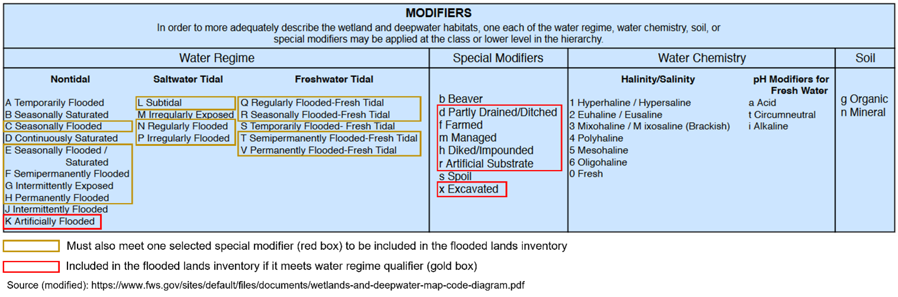

# <!--SETUP-->
```{r setup, message=FALSE, include=FALSE}
# Load libraries and print session info to facilitate reproducibility.  
# This was run on DMAP memory intensive 16xLarge (64 cpus, 512GB) instance.


knitr::opts_chunk$set(echo=FALSE, warning=FALSE, message=FALSE)

library(tidyverse)
library(sf)
library(USA.state.boundaries) # state map
library(tigris) # shift_geometry for AK, HI, and PR
library(mapsf) # For mapping AK, HI, and PR
library(openxlsx2)
library(readxl)
library(cowplot) # plot_grid
library(fitdistrplus) # uncertainty analysis
library(triangle) # uncertainty analysis
library(EnvStats) # uncertainty analysis
library(tictoc) # calculation times
library(furrr) # future map
library(progressr) # future_map progress bar
library(janitor)
library(gt)
library(gtExtras)
library(lwgeom) # st_astext: extract spatial data from sf object

library(conflicted) # manage MASS::select and dplyr::select conflict
conflict_prefer("select", "dplyr")
conflict_prefer("filter", "dplyr")


# Print R session info
print(sessionInfo())
```

```{r final_year, message=FALSE, warning=FALSE, results="hide"}

# Assign final year of report to a variable for use in code and text
# Final year = current year minus one
final_year <- year(Sys.Date())-1

```

# <!--PRIMARY CALCULATIONS--NOT INCLUDED IN REPORT-->

## <!--Flooded Lands Data Sources-->

<!--Flooded Lands in the US are derived from the [U.S. Army Corps of Engineers National Inventory of Dams](https://nid.sec.usace.army.mil/ords/f?p=105:1::::::), Navigable Waterways dataset maintained by the Department of Homeland security, the [National Wetlands Inventory]() and the [National Hydrography Data (NHD)](https://www.usgs.gov/core-science-systems/ngp/national-hydrography) maintained by the USGS.  Several screening tools were used to discriminate natural water bodies from Flooded Lands in these data sets.-->

<!--Load this file and skip to `Set Up Time Series Infrastructure` (line 418) or run all code below.-->

```{r flooded_lands_data_processed, message=FALSE, warning=FALSE, results="hide"}
#fl.sf <- st_read("output/2023_Flooded_Lands_Inventory_Subset_Final_121923.gpkg")
```

<!--Below we read in the layers created by Alex.  Layers are then combined into a single sf object.  A simple check shows that all rows were preserved in the merge.-->

```{r flooded_lands_data_sources, message=FALSE, warning=FALSE, results="hide"}

# ALL DATA
# Alex Hall prepared the GIS data for the 1990-2023 inventory.  Data are
# presented as a single layer (FloodedLands_2024) in the SQLite.gpkg and shared
# shared via OneDrive. A copy was downloaded to local clone of this 
# RStudio project, uploaded to newftp.epa.gov, downloaded to mounted memory on
# RStudio instance on DMAP using sftp (see "C:\Users\JBEAULIE\OneDrive -      
# Environmental Protection Agency
# (EPA)\Profile\Documents\Documents\research\statistics\R\DMAP\download from
# ftp to DMAP.docx"). Turns out that Jake's laptop has sufficient RAM and DMAP
# wasn't used much.

# These data have been intersected with a layer of US state and territory boundaries
# (from USABoundaries package: inputData/us_states.shp) and the IPCC climate aggregated
# climate layer ("inputData/climateMap", layer = "ipcc_zones_2017_names_dissolve") %>%
# select(fldd_zn) 
# All area calculations were performed in Goode Homolosine Land
# "ESRI:54052" projection.  All layers projected to WGS84.

# read layers
# st_layers("~/shared/jbeaulie/inputData/SQLite.gpkg")
st_layers("inputData/SQLite.gpkg") # Flooded_Lands_2024

# read first row
# sf::st_read("~/shared/jbeaulie/inputData/SQLite.gpkg",
#             query="select * from \"FloodedLands_2024\" limit 1") %>%
#   print(n=Inf)
sf::st_read("inputData/SQLite.gpkg",
            # only first line
            query="select * from \"FloodedLands_2024\" limit 1") %>% 
  print(n=Inf)


# READ ALL DATA-----------------------
tic()
# fl.sf <- sf::st_read("~/shared/jbeaulie/inputData/Flooded_Lands_090424.gpkg",
#                    layer = "Flooded_Lands_2024") %>%
fl.sf <- sf::st_read("inputData/SQLite.gpkg",
                   layer = "FloodedLands_2024") %>%
  janitor::clean_names() %>%
  st_sf() %>% # here rename doesn't work after clean_names, st_sf fixes whatever janitor broke
  rename(area_meters = intersect_area_meters,
         stusps = state_abr,
         climate = fldd_zn) 
toc() # 444 seconds on laptop

# subsample for fast knitting
#fl.sf <- fl.sf %>% slice_sample(prop = 0.3)

table(st_geometry_type(fl.sf)) # all MULTIPOLYGON

st_crs(fl.sf) # 9001, NAD83. In previous years we used 4326, WGS84
fl.sf <- fl.sf %>% st_transform(4326)
nrow(fl.sf) # 6,291,175

# Do all polygons have original area, new area, state and climate?
# Yes
fl.sf %>% 
  st_drop_geometry() %>% # expedite calcs
  summarize(original.area.na = sum(is.na(original_area_meters)),
            new.area.na = sum(is.na(area_meters)),
            climate.na = sum(is.na(climate)),
            state.na = sum(is.na(stusps)))

# how many have dam construction year?
fl.sf %>% st_drop_geometry() %>% # expedite calcs
  summarize(dam.n = sum(!is.na(year_completed)), #55,806
            modified.n = sum(!is.na(years_modified))) # 5,007 with years_modified

# Do all polygons have original area, new area, state and climate? YES!
fl.sf %>% st_drop_geometry() %>% # expedite calcs
  summarize(original.area.na = sum(is.na(original_area_meters)),
            new.area.na = sum(is.na(area_meters)),
            climate.na = sum(is.na(climate)),
            state.na = sum(is.na(stusps)))


format(utils::object.size(fl.sf), units = "GB") #9.4 GB
```

### <!--Fix Year of Dam Construction-->
```{r fix_year, results="hide"}
## inspect years_modified and year_completed
# both are character
fl.sf %>% 
  select(contains("year")) %>% 
  str() # both are character
table(fl.sf$year_completed, useNA = "ifany") # looks good
table(fl.sf$years_modified, useNA = "ifany") # ok, multiple years for some rows.

# Need to extract numeric values from years_modified, then select smallest value.
# This represents earliest modification date
fl.sf <- fl.sf %>% 
  mutate(year_completed = as.numeric(year_completed),
         years_modified = gsub('[ABCDEFGHIJKLMNOPQRSTUVWXYZ]', # remove any capital letters
                               "", # replace with nothing
                               years_modified)) %>% 
  # now grab minimum years_modified value per row
  #https://stackoverflow.com/questions/75096933/how-to-find-the-max-and-min-values-of-string-rows-of-a-dataframe-in-r
  mutate(str_split(years_modified, ";") |> # split multiple observations based on ; separator. Dumps into list
           map(as.numeric) |> # convert list elements to numeric
           map(min) |> # select minimum value
           map_dfr(setNames, "years_modified")) %>% # define variable name 
  mutate(years_modified = replace(years_modified, 
                                  years_modified %in% c(-1, 9999), # replace 9999 and -1
                                  NA)) # with NA

# double check results
table(fl.sf$years_modified, useNA = "ifany")
table(fl.sf$year_completed, useNA = "ifany")

# Now that year_completed and years_modified are fixed, calculate best year value
fl.sf <-  fl.sf %>% 
  mutate(year = case_when(
    # if year_completed is known, then use year_completed
    !is.na(year_completed) ~ year_completed,
    
    # if year_completed is not know, but years_modified indicates dam was at least 20 years old
    # in 1990 (beginning of time series), then use years_modified. The result is that
    # dam will be >20 years old throughout the time series
    is.na(year_completed) & years_modified <= 1970 ~ years_modified,
    
    # if year_completed is not know, but years_modified indicates the dam was modified sometime
    # after 1970, lets set year to NA. My code will then assume the dam was built
    # prior to 1970 and the system is > 20 years old throughout the time series.
    # This will prevent a "new" dam from showing up in the time series based on 
    # years_modified when the dam has actually been in existence throughout the
    # time series.
    is.na(year_completed) & years_modified > 1970 ~ NA_integer_,
    
    # if no information, then NA
    is.na(year_completed) & is.na(years_modified) ~ NA_integer_,
    TRUE ~ 999999999)) # check for this value as an error flag 

# Now how many with an estimate of construction year?
fl.sf %>% st_drop_geometry() %>% # expedite calcs
  summarize(dam.n = sum(!is.na(year))) # 55,854.

table(fl.sf$year) # no 9999999999, good


# FIX OTHERS WITH INCORRECT YEAR----------------------
# I inspected most of the large reservoirs that transitioned from LCFL to FLRFL
# between 1990 and 2021 and found a few errors in the year data.  Below
# are the corrections. 

fixYear <- tribble(
  ~unique_id, ~year, 
  1662753, 1953, # Lake Sakakawea
  1632041, 1953, # Lake Sakakawea
  1390603, 1954, # Francis-Case, SD
  5496640, 1963, # Lake Sharpe, SD
  3860171, 1970) # Robert S Kerr Reservoir and Webbers Falls Reservoir in OK

# dplyr::rows_update should provide an efficient method for updating the
# values but sf objects are not yet supported. See https://github.com/tidyverse/dplyr/issues/5906
# fl.sf <- rows_update(fl.sf, fixYear, by = "unique_id")

# Lets just fix manually
fl.sf <- fl.sf %>%
  mutate(year = case_when(unique_id == fixYear[1,1] %>% pull ~ fixYear[1,2] %>% pull,
                          unique_id == fixYear[2,1] %>% pull ~ fixYear[2,2] %>% pull,
                          unique_id == fixYear[3,1] %>% pull ~ fixYear[3,2] %>% pull,
                          unique_id == fixYear[4,1] %>% pull ~ fixYear[4,2] %>% pull,
                          unique_id == fixYear[5,1] %>% pull ~ fixYear[5,2] %>% pull,
                          TRUE ~ year))

nrow(fl.sf) # 6,291,174


# select only needed columns
names(fl.sf)
fl.sf <- fl.sf %>% select(area_meters, original_area_meters,
                          nid_id, comid, unique_id, resolution,
                          stusps, climate,
                          year,
                          ditch)
```

### <!--NID Updates-->
<!--The NID is updated continuously and new downloads are used each Inventory cycle. The code below aummarizes changes-->
```{r NID, message=FALSE, warning=FALSE, results="hide"}
# current inventory
nid_1990_2023 <- st_read("inputData/NID_for_1990_2023.gpkg", quiet = TRUE) 

# last year inventory
nid_1990_2022 <- st_read("inputData/NID_for_1990_2022.gpkg", quiet = TRUE)

dim(nid_1990_2023) # 92,193
dim(nid_1990_2022) # 91,673

# dams in current NID not in previous year
new.dams <- sum(!(nid_1990_2023$nidId %in% nid_1990_2022$nidId)) # 610 new dams


```

### <!--Area Representation-->

#### <!--Climate-->

<!--These features have been intersected with a layer of US state and territory boundaries (from USABoundaries package: inputData/us_states.shp) and the IPCC climate aggregated climate layer.  IPCC emission factors are aggregated into six climate zones.  The original 12 IPCC climate zones were aggregated per Table 7A.2 in Lovelock et al. Flooded Lands Methodology.  See C:\Users\JBEAULIE\OneDrive - Environmental Protection Agency (EPA)\Profile\Documents\Documents\research\IPCC\methodology2019\methodology2019.Rproj for details.-->

```{r climate_map, message=FALSE, warning=FALSE, results="hide"}

# SharePoint                          
climate <- 
  sf::st_read("inputData/climateMap", layer = "ipcc_zones_2017_names_dissolve") %>%
  # sf::st_read("~/shared/jbeaulie/inputData/climateMap", layer = "ipcc_zones_2017_names_dissolve") %>%  
  select(fldd_zn) %>% # pull out Flooded Lands climate zone
  rename(climate = fldd_zn) # rename

climate <- st_cast(climate, "MULTIPOLYGON")
climate <- st_make_valid(climate) # correct any issues with invalid geometry
st_crs(climate) # 4326, WGS84

#plot(climate)
```

#### <!--Areas and State Names-->

<!--All area calculations were performed in Goode Homolosine Land "ESRI:54052" projection.  All layers were projected to WGS84 after the area calculations. The area of the polygons prior to intersection with state and climate is in 'original_area_meters', but converted to 'area_ha_original' below. This area is used to determine if the polygon is a pond or reservoir. Area of the intersected polygons is in 'area_meters', but converted to 'area_ha_new' below.  State postal code is in 'stusps'.  Full state name is mutated into 'name' below.-->

```{r area_and_state, message=FALSE, warning=FALSE, results="hide"}
names(fl.sf)

fl.sf <- fl.sf %>%
 mutate(area_ha_original = original_area_meters / 10000,
        area_ha_new = area_meters / 10000)

# Do all polygons have original and new area in ha? YES!
fl.sf %>% st_drop_geometry() %>% # expedite calcs
  summarize(original.area.na = sum(is.na(area_ha_original)),
            new.area.na = sum(is.na(area_ha_new)))

# Set up to convert state abbreviations to full name.  Need to add DC and PR
st_crosswalk <- tibble(name = state.name) %>%  # state.name is base R
  bind_cols(tibble(stusps = state.abb)) %>% # state.abb is base R
  bind_rows(tibble(name = c("District of Columbia", "Puerto Rico", # add DC and PR
                            "Guam and CNMI", "US Virgin Islands"),  # add DC and PR
                   stusps = c("DC", "PR", "GU", "VQ")))

# Add full state name.  ~1.5 minutes
fl.sf <- fl.sf %>%
  left_join(., st_crosswalk, by = "stusps") # left_join will bring in name column
table(fl.sf$name, useNA = "ifany") # no NA's, good!

# Remove unnecessary columns
fl.sf <- fl.sf %>% select(-area_meters, -original_area_meters)

```

#### <!--Omit Guam and Virgin Islands-->

<!--Alex included Guam and Virgin Islands, but the Excel file isn't ready to accommodate them.  Omitting for now.-->

```{r guam, results="hide"}
fl.sf <- fl.sf %>% filter(!(stusps %in% c("GU", "VQ")))
table(fl.sf$stusps) # no GU or VQ, good
nrow(fl.sf) # 6,291,174 down to 6,290,831
```


### <!--Define Flooded Land Type and Subtype-->

<!--Per figure 7.2 in methodology, <8 ha is pond.  Canal/Ditch derived from FTYPE values.-->

```{r type, results="hide"}
# Define size threshold for ponds.
# watch out for ditches. They are flagged as Yes and YES!!!!
fl.sf <- fl.sf %>% mutate(subtype = case_when(grepl("yes", ditch, ignore.case = TRUE) ~ "canals and ditches",
                                              area_ha_original < 8 ~ "freshwater pond",
                                             TRUE ~ "reservoir"),
                         type = case_when(subtype == "reservoir" ~ "reservoir",
                                          TRUE ~ "other constructed waterbodies"))
table(fl.sf$type, useNA = "ifany") # no NA, good!
table(fl.sf$subtype, useNA = "ifany") # no NA, good!

# number of reservoirs pulled from NWI, NHD, and NAV.
# this is useful for SuRGE work
# NHD derived polygons
fl.sf %>% st_drop_geometry() %>% 
  group_by(resolution) %>%
 summarise(n.resolution = n(), area.resolution = sum(area_ha_new))

# we can remove resolution now
fl.sf <- fl.sf %>%
  select(-resolution)

# write flooded land inventory to disk
#st_write(fl.sf, "output/2023_Flooded_Lands_Inventory_Final_121923.gpkg", append = FALSE)
```

### <!--Set Up Time Series Infrastructure-->

<!--Emissions/removals must be calculated for each year in the time series.  Reservoir age is extracted from NID.  When age not available we assume > 20.-->

```{r time_series, results="hide"}
# grab spatial data for future use (about 2 minutes)
fl.geom <- tibble(geom = lwgeom::st_astext(fl.sf), # extract geom to text.
                  unique_id = fl.sf$unique_id)  #  add unique_id to facilitate merge later

# drop geometry to simplify things are reduce memory
fl.df <- fl.sf %>% st_drop_geometry() 
format(object.size(fl.df), units = "GB") # 0.5GB
nrow(fl.df) # 6,290,831 good

# EACH YEAR AS LIST ELEMENT
# Need to calculate emission separately for each year in time series
# Put copy of data frame version sf object into 33 separate list elements.  Each element represents
# one calculation year.
fl <- map(.x = rep("fl.df", 34), .f = get) %>% # `get` will find all instances of X, map dumps into list
  set_names(1990:2023)

format(object.size(fl), units = "auto") # 17.7 GB as dataframe!

# add calculation year as a column in each list element
for (i in 1: length(fl)) { # do all elements simultaneously
  fl[[i]]$calc_year = as.numeric(names(fl[i]))  
}


# Calculate waterbody age for each calculation year
# More recent years should have more waterbodies due to recent construction.
# First, how many records per list element now
lapply(fl, function(x) nrow(x)) # 6,290,831 rows

# with list elements as dataframes.  
# lapply takes 1.5 min
# future_map doesn't make any progress.
# map takes 1.7 minutes

# with list elements as sf objects.  
# lapply: quit after 75 minutes
# future_map doesn't make any progress.
# map takes [6% complete at 6 minutes = ~ 100 minutes to complete]

tic() # 1.7 minutes
with_progress({ # add progress bar
  p <- progressor(steps = length(fl))
  
  fl <- map(fl, ~{ # calculate age per calculation year
    p()
    .x %>% mutate(age = calc_year - year) %>%
      # only keep reservoirs that existed in particular calc_year.  Lots
      # of systems with no age info, lets keep all of those.
      filter(age >= 0 | is.na(age)) %>% # removes years with negative age
      mutate(lu = ifelse(age >= 20 | is.na(age), #if no age, then assume old
                         "Flooded Land Remaining Flooded Land",
                         "Land Converted to Flooded Land"))
  })
})
toc()

lapply(fl, function(x) nrow(x)) #6,290,831 in 2023, fewer in earlier years, good


```

### <!--Emission and Removal Emission Factors-->

<!--IPCC default emission factors are based on Flooded Land age, Flooded Land size, and climate zone.  Flooded Lands greater than 20 years old are considered "Flooded Lands Remaining Flooded Lands", whereas Flooded Lands less than 20 years old are classified as "Lands Converted to Flooded Lands".-->

#### <!--Land Converted to Flooded Land-->

##### <!--Reservoirs-->

<!--The CH~4~ emission factor is greater for Land Converted to Flooded Land than for Flooded Lands Remaining Flooded Lands.  CO~2~ emissions are also estimated for this land use category, but not for Flooded Lands Remaining Flooded Lands.  Emission factors are dissagregated by the six major climate zones.-->

##### <!--Other Constructed Waterbodies-->

<!--No emission factors are provided for 'Other Constructed Waterbodies' in this land-use category.  IPCC guidance says to use Flooded Land Remaining Flooded Land values for CH4.  IPCC guidance says to use use `Land Converted to Flooded Land - reservoirs` CO2 emission factors for freshwater pond CO2 emission factors, but provides no guidance for other constructed water bodies.-->

#### <!--Flooded Land Remaining Flooded Land-->

##### <!--Reservoirs-->

<!--CO~2~ emissions are not estimated for Flooded Land Remaining Flooded Land.  CH~4~ emission factors are dissagregated by the six major climate zones present in the US.-->

##### <!--Other Constructed Waterbodies-->

<!--Flooded Lands less than 8 Ha are classified as freshwater ponds for this inventory and have a single emission factor.  Canals and ditches,  derived from NHD FTYPE and shape, have a singe emission factor.  No downstream emissions for this category.-->

## <!--Calculate emissions-->

### <!--All polygons-->

```{r, results="hide"}
# Read in emission factors
#ef <- readxl::read_excel("~/shared/jbeaulie/inputData/defaultEmissionFactors.xlsx") %>%
ef <- readxl::read_excel("inputData/defaultEmissionFactors.xlsx") %>%
  select(subtype, lu, climate, co2.tonnes.ha.y, ch4.tonnes.ha.y)

# record nrow of fl list prior to merge.  Should be identical after merge.
n.row.prior <- map_dbl(fl, function(x) nrow(x))

# Merge emission factors with each list element.
# join is faster than merge
tic() # 2 minutes
with_progress({ # add progress bar
  p <- progressor(steps = length(fl))
  fl.e <- map(fl, ~{
    p()
    .x %>% left_join(., ef)
  })
})
toc()


# Make sure no records were lost during merge
# LOOKS GOOD
if (all(n.row.prior == map_dbl(fl.e, function(x) nrow(x)))) {
  print("ALL GOOD")
} else {
  print("STOP, ERROR MERGING EFs")
}


# Calculate emissions
# Downstream emissions are calculated as 9% of surface emissions.
tic() # 35 seconds
with_progress({ # add progress bar
  p <- progressor(steps = length(fl.e)) 
  fl.e <- map(fl.e, ~{
    p()
    .x %>% mutate(co2.tonnes.y = area_ha_new * co2.tonnes.ha.y,
                  ch4.surface.tonnes.y = area_ha_new * ch4.tonnes.ha.y,
                  ch4.dn.tonnes.y = case_when(type == "other constructed waterbodies" ~ 0, # no DN for 'other'
                                              type == "reservoir" ~ ch4.surface.tonnes.y * 0.09, # reservoirs
                                              TRUE ~ 99999999), # if I screwed up, then 9999999, check for this value 
                  ch4.total.tonnes.y = ch4.surface.tonnes.y + ch4.dn.tonnes.y)
  })
})
toc()

map_dbl(fl.e, ~sum(.x$ch.dn.tonnes.y == 99999999)) # no 99999999, GOOD!
```

### <!--Write .gpkg for gridded data product-->
```{r, eval=FALSE, results="hide"}

imap(fl.e[as.character(2012:2020)], ~ .x %>% 
       #slice_sample(., n=600) %>% # subsample for practice
       left_join(., fl.geom) %>% #
  sf::st_as_sf(wkt = "geom", crs = 4326) %>%
      select(climate, area_ha_new, name, lu, type, subtype, ch4.total.tonnes.y) %>%
      st_write(dsn = "output/flooded_lands_.gpkg", layer = .y, append = FALSE))

# check resulting .gpkg
st_layers("output/flooded_lands_.gpkg")

# inspect 2020 as an example
fl_2020 <- st_read(dsn = "output/flooded_lands_.gpkg", layer = "2020")

# compares perfectly to number in report
fl_2020 %>%
  st_drop_geometry %>%
  group_by(lu, subtype) %>%
  summarize(ch4_tot = sum(ch4.total.tonnes.y/1000))


```


## <!--Uncertainty analysis-->

### <!--Define distributions for EFs-->
```{r rd, results="hide", fig.show="hide"}
# Read in raw data used to calculate Rd value used in methodology
rd <- readxl::read_excel("inputData/ipccDegassingReview.xlsx", sheet = "summary")
names(rd) = gsub(pattern = c("\\(| |#|)|/|-|\\+"),
                 replacement = ".", x = names(rd))

# Filter out observations from Maeck et al. 2013.  These contain some outliers
# and are lock and dam systems, not reflective of most reservoir surfaces.
rd.no.maeck <- filter(rd, !grepl(pattern = "Maeck", x = rd$citation))

# visualize distribution
fitdistrplus::plotdist(rd.no.maeck$Rd) # appears somewhat log-normal
fitdistrplus::descdist(rd.no.maeck$Rd, boot = 1000) # suggest beta, but this requires value 0-1

# Attempted to fit beta, lnorm, weibull, and gamma distributions, but all failed,
# likely due to zeroes in data.  Add small positive number and retry
rd <- rd.no.maeck %>%
  mutate(Rd = replace(Rd, Rd == 0, 0.00001))
# descdist(rd$Rd, boot = 1000) # suggest beta
# fitdist(rd$Rd, "beta") # beta requires values 0-1
flnorm <- fitdist(rd$Rd, "lnorm") # this seems to work
# denscomp(flnorm) # bad fit
# qqcomp(flnorm) # bad fit
# cdfcomp(flnorm) # not bad
# ppcomp(flnorm) # not bad

# Generate simulated data using fitted distribution and compare to original data
simData <- rlnorm(100, meanlog = flnorm$estimate[[1]], sdlog = flnorm$estimate[[2]])
data <- data.frame(rd = c(rd$Rd, simData), source = c(rep("ipcc", length(rd$Rd)), rep("sim", 100)))
# the fit looks OK.
ggplot(data, aes(x=rd, color = source)) +
  geom_histogram()
# but when used in uncertainty simulation generates much too large numbers.
# how about triangle distribution as discussed in IPCC 2006 CH.3
triangle::rtriangle(n = 100, a = 0.05, b = 0.22, c = 0.09)# 2019, table 7.1
## view the distribution
tri <- rtriangle(n = 10000, a = 0.05, b = 0.22, c = 0.09)
hist(tri, breaks=100, main="Triangle Distribution", xlab="x")
# triangle distribution also generates far too large numbers in simulation

# How about truncated log normal?
EnvStats::rlnormTrunc(100,
                      meanlog = flnorm[1]$estimate[[1]],
                      sdlog = flnorm[1]$estimate[[2]],
                      min = 0.05, max = 0.22) %>% summary()
# still too big.
# can I define a log-normal distribution that approximates what is reported in
# IPCC 2019 Table 7.10?  After trying all these variations, sim0.085 was the
# only one that produced a confidence interval containing the mean.
sim1.3 <- rlnorm(100, meanlog = log(0.09), sdlog = log(1.3))
sim1.4 <- rlnorm(100, meanlog = log(0.09), sdlog = log(1.4))
sim1.5 <- rlnorm(100, meanlog = log(0.09), sdlog = log(1.5))
sim1.6 <- rlnorm(100, meanlog = log(0.09), sdlog = log(1.6))
sim0.085 <- rlnorm(100, meanlog = log(0.085), sdlog = log(1.5))
summary(sim1.3);summary(sim1.4);summary(sim1.5);summary(sim1.6)
summary(sim0.085)

```

### <!--Uncertainty Simulations-->

```{r error_sim, results="hide", message=NA}
# Read in emission factors
ef.error <- readxl::read_excel("inputData/defaultEmissionFactors.xlsx") %>%
  # 95% CI EF for ponds is asymmetrical around the mean, causing the 95% CI
  # of total emissions to not include the mean.  Here I'm expanding the CI
  # of the EF to force symmetry around mean.
  # Calculating CH4 emission factor standard deviation from 95% CI and n reported in guidance.
  # This will allow parameter distribution to be defined using rnorm, the preferred IPCC method.
  # No N reported for CO2, so using uniform distribution.
  # https://stats.stackexchange.com/questions/30402/how-to-calculate-mean-and-standard-deviation-in-r-given-confidence-interval-and
  mutate(ch4.tonnes.ha.y.upr = replace(ch4.tonnes.ha.y.upr,
                                       subtype == "freshwater pond",
                                       0.248),
         ch4.sd = ((ch4.tonnes.ha.y.upr - ch4.tonnes.ha.y)/sqrt(n.ch4)) * 1.96)

# put 1990 and 2023 data into a list 
fl <- list("1990" = fl.e$`1990` %>%
             select(type, subtype, climate, area_ha_new, lu, age) %>%
             mutate(calc_year = 1990),
           "2023" = fl.e$`2023` %>%
             select(type, subtype, climate, area_ha_new, lu, age) %>%
             mutate(calc_year = 2023)) %>%
  map(., ~ filter(.x, age > 0 | is.na(age)))


# record nrow of fl list prior to merge.  Should be identical after merge.
n.row.prior <- lapply(fl[c("1990", "2023")], nrow) #6,532,206 and 6,535,552

# Merge emission factors with 1990 and 2023 area inventory.
tic() # 4 minutes with merge, 1.7 seconds with left join!
fl <- lapply(fl[c("1990", "2023")], function(x) {  # first and last year
  left_join(x, ef.error)})
toc()

# Make sure no records were lost during merge
# LOOKS GOOD
unlist(n.row.prior) == unlist(lapply(fl, nrow))

# Calculate emissions i times and aggregate by subtype and type
fl.error.sim.subtype <- list()
fl.error.sim.type <- list()
set.seed(3452) # make it reproducible


tic() # map: 85 seconds for 10 simulations, 1000 = 142 minutes, 10,000 = 23 hours, much longer with future_map

# Simulations take hours to run, so we save them as a data object and load into environment 

# Define filpath for the save simulations 
sims_file_path <- "simulations.rds" 

# Check if simulations file exists
if (file.exists(sims_file_path)) {
  # If it exists, load it
  fl.error.sim.i <- readRDS(sims_file_path)
  message("Data object loaded from file.")
  # If it doesn't exist, then run the simulations
} else {
for (i in 1:10) { #
  message(i)

  fl.error.sim.i <- map(fl, function(x) { x %>%
      mutate(co2.tonnes.ha.y = runif(nrow(x), co2.tonnes.ha.y.lwr, co2.tonnes.ha.y.upr),
             ch4.tonnes.ha.y = rnorm(nrow(x), mean = ch4.tonnes.ha.y, sd = ch4.sd),
             # using rlnorm for downstream, see above.  mean of 0.085 needed to get lower
             # confidence interval less than mean estimate.  true mean is 0.09
             dn.ef = rlnorm(nrow(x), meanlog = log(0.085), sdlog = log(1.5)),
             area_ha_new = runif(nrow(x), #15% error in area
                                 min = area_ha_new - (area_ha_new*0.15),
                                 max = area_ha_new + (area_ha_new*0.15)),
             co2.tonnes.y = area_ha_new * co2.tonnes.ha.y,
             ch4.surface.tonnes.y = area_ha_new * ch4.tonnes.ha.y,
             ch4.dn.tonnes.y = ifelse(type == "other constructed waterbodies", # no DN for 'other'
                                      0,
                                      ch4.surface.tonnes.y * dn.ef),
             ch4.total.tonnes.y = ch4.surface.tonnes.y + ch4.dn.tonnes.y)
  })
}
  # Save the simulations data object as 'simulations.rds'
  saveRDS(fl.error.sim.i, file = sims_file_path)
  message("Simulations data object saved to file.")
}

  # Aggregate by subtype
  fl.error.sim.subtype[[i]] <- map(fl.error.sim.i, function(x) { x %>%
      # Sum emissions for each iteration of simulation.  Only keep summed data.  This reduces memory demands.
      group_by(lu, subtype) %>%
      summarize(ch4.surface.mmt.co2.eq.y = (sum(ch4.surface.tonnes.y , na.rm = TRUE)/1000000)*28, # surface CH4
                ch4.dn.mmt.co2.eq.y = (sum(ch4.dn.tonnes.y, na.rm = TRUE)/1000000)*28, # downstream CH4
                ch4.total.mmt.co2.eq.y = (sum(ch4.total.tonnes.y, na.rm = TRUE)/1000000)*28, # total CH4
                co2.mmt.co2.eq.y = sum(co2.tonnes.y, na.rm = TRUE)/1000000, # total CO2
                year = unique(calc_year)) %>%
      mutate(ghg.total.mmt.co2.eq.y = co2.mmt.co2.eq.y + ch4.total.mmt.co2.eq.y)
  })

  # Aggregate by type
  fl.error.sim.type[[i]] <- map(fl.error.sim.i, function(x) {x %>%
      mutate(type = case_when(subtype == "inundation area" ~ "reservoir", # combine for total row
                              subtype %in% c("canals and ditches", "freshwater pond") ~ "other constructed waterbodies",
                              TRUE ~ subtype)) %>%
      group_by(lu, type) %>%
      summarize(ch4.surface.mmt.co2.eq.y = (sum(ch4.surface.tonnes.y , na.rm = TRUE)/1000000)*28, # surface CH4
                ch4.dn.mmt.co2.eq.y = (sum(ch4.dn.tonnes.y, na.rm = TRUE)/1000000)*28, # downstream CH4
                ch4.total.mmt.co2.eq.y = (sum(ch4.total.tonnes.y, na.rm = T)/1000000)*28, # total CH4
                co2.mmt.co2.eq.y = sum(co2.tonnes.y, na.rm = TRUE)/1000000, # total CO2
                year = unique(calc_year)) %>%
      mutate(ghg.total.mmt.co2.eq.y = co2.mmt.co2.eq.y + ch4.total.mmt.co2.eq.y)
  })
}
toc()


# Warning message:
# Problem with `mutate()` column `co2.tonnes.ha.y`.
# i `co2.tonnes.ha.y = runif(nrow(fl.error), co2.tonnes.ha.y.lwr, co2.tonnes.ha.y.upr)`.
# i NAs produced
# expected because ef.error contains NA values for co2.tonnes.ha.y.lwr and co2.tonnes.ha.y.upr

# Each iteration of the loop above creates a list of two elements (one for each year).
# This list gets assigned to one element of fl.error.sim, thus fl.error.sim has lists
# nested within a list.  flatten() unnests the lists
length(fl.error.sim.subtype) # 10000 elements
fl.error.sim.subtype <- flatten(fl.error.sim.subtype)
length(fl.error.sim.subtype) # 20000 elements

length(fl.error.sim.type) # 10,000 elements
fl.error.sim.type <- flatten(fl.error.sim.type)
length(fl.error.sim.type) # 20,000 elements


```

### <!--Table:: Uncertainty-->


```{r error_tables, results="hide"}


# STEP 1: COLLAPSE LIST INTO DF
# ch4.co2 uncertainty table by subtype.  ~8 minutes on memory intensive DMAP
ch4.co2.uncertainty.table <-  fl.error.sim.subtype %>% # ch4.co2.uncertainty
  reduce(bind_rows) %>% # collapse all elements of list into single df.
  group_by(lu, subtype, year) %>% # group by subtype
  summarize(across(everything(), list(min = min,
                                      max = max))) %>%
  ungroup() %>%
  arrange(year, lu, subtype) 


# ch4.co2 uncertainty table by type (subtypes nested in types)
tic() # 56 minutes with 10,000 iterations
ch4.co2.uncertainty.table.total <- fl.error.sim.type %>%
  reduce(full_join) %>% # merge all elements of list into single df. could use bind rows
  group_by(lu, type, year) %>% # group by type
  summarize(across(everything(), list(min = min,
                                      max = max))) %>%
  ungroup() %>%
  arrange(year, lu, type)
toc()

# STEP 2:  CALCULATE MEAN EMISSIONS TO COMBINE WITH UNCERTAINTY ESTIMATES
# Bring in mean flux estimates for 1990 and 2023.  Reported in `Table::FLRFL-reservoirs CH4
# emissions by mechanism (dn, surface), type (inundation, reservoir), and state' above,
# but recalculated here to merge with uncertainty results.

# List with emissions from 1990 and 2023.  Assume these are "mean" values
fl.for.mean <- list("1990" = fl.e$`1990` %>%
                      select(lu, type, subtype, climate, age, area_ha_new, contains("tonnes.y")),

                    "2023" = fl.e$`2023` %>%
                      select(lu, type, subtype, climate, age, area_ha_new, contains("tonnes.y"))) %>%
  map(., ~ filter(.x, age > 0 | is.na(age)))


# ch4.co2 mean fluxes by subtype
ch4.co2.mean.table <- fl.for.mean %>%  # first and last year
  lapply(., function(x) {
    x %>%
      select(lu, subtype, ch4.surface.tonnes.y, ch4.dn.tonnes.y,
             ch4.total.tonnes.y, co2.tonnes.y) %>%
      group_by(lu, subtype) %>% # subtype
      summarize(ch4.surface.mmt.co2.eq.y = (sum(ch4.surface.tonnes.y, na.rm = TRUE)/1000000)*28,
                ch4.dn.mmt.co2.eq.y = (sum(ch4.dn.tonnes.y, na.rm = TRUE)/1000000)*28,
                ch4.total.mmt.co2.eq.y = (sum(ch4.total.tonnes.y, na.rm = TRUE)/1000000)*28,
                co2.mmt.co2.eq.y = sum(co2.tonnes.y, na.rm = TRUE)/1000000,
                ghg.total.mmt.co2.eq.y = co2.mmt.co2.eq.y + ch4.total.mmt.co2.eq.y)
  }) %>%
  purrr::imap(., ~mutate(.x, year = as.numeric(.y))) %>%  # add calculation year as a column in each list element
  map_dfr(., bind_rows) %>% # collapse into DF
  ungroup() # to be safe


# ch4.co2 mean fluxes total!
ch4.co2.mean.table.total <- fl.for.mean %>%  # first and last year
  lapply(., function(x) {
    x %>%
      select(lu, type, ch4.surface.tonnes.y, ch4.dn.tonnes.y,
             ch4.total.tonnes.y, co2.tonnes.y) %>%
      group_by(lu, type) %>% # type
      summarize(ch4.surface.mmt.co2.eq.y = (sum(ch4.surface.tonnes.y)/1000000)*28,
                ch4.dn.mmt.co2.eq.y = (sum(ch4.dn.tonnes.y)/1000000)*28,
                ch4.total.mmt.co2.eq.y = (sum(ch4.total.tonnes.y)/1000000)*28,
                co2.mmt.co2.eq.y = sum(co2.tonnes.y)/1000000,
                ghg.total.mmt.co2.eq.y = co2.mmt.co2.eq.y + ch4.total.mmt.co2.eq.y)
  }) %>%
  purrr::imap(., ~mutate(.x, year = as.numeric(.y))) %>%  # add calculation year as a column in each list element
  map_dfr(., bind_rows) %>% # collapse into DF
  ungroup()  # to be safe


# STEP 3: COMBINE MEAN AND UNCERTAINTY ESTIMATES
bound.perc = function(x,y){((x - y)/y) *100} # function for required fields

ch4.co2.uncertainty.mean.table <- merge(ch4.co2.uncertainty.table, ch4.co2.mean.table) %>%
  mutate(upr.perc.ch4.surface = bound.perc(ch4.surface.mmt.co2.eq.y_max,
                                           ch4.surface.mmt.co2.eq.y),
         lwr.perc.ch4.surface = bound.perc(ch4.surface.mmt.co2.eq.y_min,
                                           ch4.surface.mmt.co2.eq.y),
         upr.perc.ch4.dn = bound.perc(ch4.dn.mmt.co2.eq.y_max,
                                      ch4.dn.mmt.co2.eq.y),
         lwr.perc.ch4.dn = bound.perc(ch4.dn.mmt.co2.eq.y_min,
                                      ch4.dn.mmt.co2.eq.y),
         upr.perc.ch4.total = bound.perc(ch4.total.mmt.co2.eq.y_max,
                                         ch4.total.mmt.co2.eq.y),
         lwr.perc.ch4.total = bound.perc(ch4.total.mmt.co2.eq.y_min,
                                         ch4.total.mmt.co2.eq.y),
         upr.perc.co2 = bound.perc(co2.mmt.co2.eq.y_max,
                                   co2.mmt.co2.eq.y),
         lwr.perc.co2 = bound.perc(co2.mmt.co2.eq.y_min,
                                   co2.mmt.co2.eq.y),
         upr.perc.ghg.total = bound.perc(ghg.total.mmt.co2.eq.y_max,
                                         ghg.total.mmt.co2.eq.y),
         lwr.perc.ghg.total = bound.perc(ghg.total.mmt.co2.eq.y_min,
                                         ghg.total.mmt.co2.eq.y)) %>%
  relocate(lu, subtype, year, contains("surface"), contains("dn"), contains("total"))


ch4.co2.uncertainty.mean.table.total <- merge(ch4.co2.uncertainty.table.total, ch4.co2.mean.table.total) %>%
  mutate(upr.perc.ch4.surface = bound.perc(ch4.surface.mmt.co2.eq.y_max,
                                           ch4.surface.mmt.co2.eq.y),
         lwr.perc.ch4.surface = bound.perc(ch4.surface.mmt.co2.eq.y_min,
                                           ch4.surface.mmt.co2.eq.y),
         upr.perc.ch4.dn = bound.perc(ch4.dn.mmt.co2.eq.y_max,
                                      ch4.dn.mmt.co2.eq.y),
         lwr.perc.ch4.dn = bound.perc(ch4.dn.mmt.co2.eq.y_min,
                                      ch4.dn.mmt.co2.eq.y),
         upr.perc.ch4.total = bound.perc(ch4.total.mmt.co2.eq.y_max,
                                         ch4.total.mmt.co2.eq.y),
         lwr.perc.ch4.total = bound.perc(ch4.total.mmt.co2.eq.y_min,
                                         ch4.total.mmt.co2.eq.y),
         upr.perc.co2 = bound.perc(co2.mmt.co2.eq.y_max,
                                   co2.mmt.co2.eq.y),
         lwr.perc.co2 = bound.perc(co2.mmt.co2.eq.y_min,
                                   co2.mmt.co2.eq.y),
         upr.perc.ghg.total = bound.perc(ghg.total.mmt.co2.eq.y_max,
                                         ghg.total.mmt.co2.eq.y),
         lwr.perc.ghg.total = bound.perc(ghg.total.mmt.co2.eq.y_min,
                                         ghg.total.mmt.co2.eq.y)) %>%
  relocate(lu, type, year, contains("surface"), contains("dn"), contains("total"))


###FLRFL TABLE
# STEP 4: REPORT FOR RESERVOIR TABLE
# Reservoir part of table
ch4.co2.uncertainty.mean.table %>%
  split(., .$year) %>% # split into list
  lapply(., function(x) {
    x %>%
      select(-year) %>% # also included in list element name
      filter(lu == "Flooded Land Remaining Flooded Land",
             subtype == "reservoir") %>%
      pivot_longer(!c("lu", "subtype"), names_to = "flux.name", values_to = "flux") %>%
      mutate(surf.dn.tot = ifelse(grepl("surface", flux.name),
                                  "surface",
                                  ifelse(grepl("dn", flux.name),
                                         "downstream",
                                         ifelse(grepl("tot", flux.name),
                                                "total",
                                                ifelse(grepl("co2", flux.name), #Co2 is total, no downstream
                                                       "total",
                                                       "oops")))),
             flux.name = gsub(c(".surface|.dn|.total"), "", flux.name)) %>%
      pivot_wider(names_from = flux.name, values_from = flux) %>%
      select(-contains("ghg"), -starts_with("co2"), -lwr.perc.co2, -upr.perc.co2) %>% # ghg is combined CO2 and CH4.  no CO2 for FLRFL
      filter(surf.dn.tot != "total") %>%
      arrange(desc(subtype))
  })

#Total part of table
ch4.co2.uncertainty.mean.table.total %>%
  split(., .$year) %>% # split into list
  lapply(., function(x) {
    x %>%
      select(-year) %>% # also included in list element name
      filter(lu == "Flooded Land Remaining Flooded Land",
             type == "reservoir") %>%
      select(lu, type, contains("total")) %>%
      select(-contains("ghg"))
  })


# STEP 5: REPORT FOR OTHER CONSTRUCTED WATERBODIES TABLE
# canals and ditches / freshwater pond rows
ch4.co2.uncertainty.mean.table %>%
  split(., .$year) %>% # split into list
  lapply(., function(x) {
    x %>%
      select(-year) %>% # also included in list element name
      filter(lu == "Flooded Land Remaining Flooded Land",
             subtype %in% c("canals and ditches", "freshwater pond")) %>%
      select(subtype, contains("total")) %>%
      select(-contains("ghg"))
  })

# total row
ch4.co2.uncertainty.mean.table.total %>%
  split(., .$year) %>% # split into list
  lapply(., function(x) {
    x %>%
      select(-year) %>% # also included in list element name
      filter(lu == "Flooded Land Remaining Flooded Land",
             type == "other constructed waterbodies") %>%
      select(lu, type, contains("total")) %>%
      select(-contains("ghg"))
  })

###LCFL TABLE
# REPORT FOR RESERVOIR TABLE
# first part of table, dissagregated values
ch4.co2.uncertainty.mean.table %>%
  split(., .$year) %>% # split into list
  lapply(., function(x) {
    x %>%
      select(-year) %>%
      filter(lu == "Land Converted to Flooded Land",
             subtype == "reservoir") %>%
      pivot_longer(!c("lu", "subtype"), names_to = "flux.name", values_to = "flux") %>%
      filter(!grepl("ch4.total", flux.name)) %>% # not reporting CH4 from dn + surface
      # distinct(flux.name) %>% print(n=Inf) %>%
      mutate(surf.dn.tot = ifelse(grepl("surface", flux.name),
                                  "surface",
                                  ifelse(grepl("dn", flux.name),
                                         "downstream",
                                         ifelse(grepl("^co2", flux.name), #starts with co2
                                                "surface",
                                                ifelse(grepl("ghg", flux.name),
                                                       "total", #CH4 + CO2
                                                       #all CO2 are surface
                                                       ifelse(flux.name %in% c("upr.perc.co2", "lwr.perc.co2"),
                                                              "surface",
                                                              "oops"))))),
             flux.name = gsub(c(".surface|.dn|.total"), "", flux.name))  %>% # simplify flux name
      pivot_wider(names_from = flux.name, values_from = flux) %>%
      select(-contains("ghg")) %>% # ghg is combined CO2 and CH4.  no CO2 for FLRFL
      filter(surf.dn.tot != "total") %>%
      arrange(desc(subtype))
  })

# total part of table
ch4.co2.uncertainty.mean.table.total %>%
  split(., .$year) %>% # split into list
  lapply(., function(x) {
    x %>%
      select(-year) %>%
      filter(lu == "Land Converted to Flooded Land",
             type == "reservoir") %>% # in this object, reservoir == reservoir + inundation
      select(lu, type, contains("ghg"))
  })

# REPORT FOR OTHER CONSTRUCTED WATERBODIES
# by gas
ch4.co2.uncertainty.mean.table %>%
  split(., .$year) %>% # split into list
  lapply(., function(x) {
    x %>%
      select(-year) %>%
      filter(lu == "Land Converted to Flooded Land",
             subtype %in% c("freshwater pond", "canals and ditches")) %>%
      select(lu, subtype, contains("total"), starts_with("co2"), contains("perc")) %>%
      select(-contains("ghg")) %>%
      mutate(across(!contains("perc") & -lu & -subtype, ~ .x * 1000)) # convert to ktonnes!!!!
  })

# total part of table
ch4.co2.uncertainty.mean.table.total %>%
  split(., .$year) %>% # split into list
  lapply(., function(x) {
    x %>%
      select(-year) %>%
      filter(lu == "Land Converted to Flooded Land",
             type == "other constructed waterbodies") %>%
      select(lu, type, contains("ghg")) %>%
      mutate(across(!contains("perc") & -lu & -type, ~ .x * 1000)) # convert to ktonnes!!!!
  })

```

### <!--Tables: A. Data-->

<!--Table in Excel file.  Output from Monte Carlo simulations.  Ideally we would provide activity data (area) and EFs, but the EFs are unique for each of the >7 million waterbodies in the Inventory.  Instead, we are providing emission outputs for each land-use (LCFL, FLRFL), subtype (canal/ditch, reservoir, pond), gas (CH4, CO2), and emission mechanism (surface, downstream, total).  Data are written to Excel and formulas in cells B5:V10 will populate those cells.-->

```{r error_appendix, results="hide"}
# 1990 first---------------
A.Data.1990.l <- fl.error.sim.subtype[names(fl.error.sim.subtype) == "1990"] # subset all "1990" results from list

names(A.Data.1990.l) <- 1:length(A.Data.1990.l) # rename each list element with element position.  Each position = 1 iteration

# Add iteration number as a new column in each dataframe in list, collapse to df, format....
A.Data.1990 <- imap(A.Data.1990.l, ~mutate(.x, iteration = as.numeric(.y))) %>% # imap pulls from list element name
  bind_rows(.) %>%
  select(-year, -ghg.total.mmt.co2.eq.y) %>%
  relocate(iteration) %>%
  ungroup()

# prepare data to write to Excel
A.Data.1990.export <- A.Data.1990 %>%
  pivot_wider(names_from = c(lu, subtype),
              values_from = c(ch4.surface.mmt.co2.eq.y, ch4.dn.mmt.co2.eq.y,
                              ch4.total.mmt.co2.eq.y, co2.mmt.co2.eq.y)) %>%
  # lu * subtype combinations for which flux is not estimate (e.g. canal, downstream)
  # have a flux value of 0 in this object.  IPCC requires a value of NE for "Not Estimates"
  # Replace 0 with NE for these cases
  mutate(across(where(~sum(.) == 0), # if the sum of all values in column are 0
                ~replace(., . == 0, "NE"))) # replace the zeroes with NE

# paste into excel for formatting, then paste into Word.
file <- "output/FloodedLands-Output_90-23_clean.xlsx"
wb <- wb_load(file)
wb <- wb_add_data(wb,
                  x = A.Data.1990.export,
                  sheet = "A. Data (Base Year, 1990)",
                  row_names = FALSE, col_names = TRUE,
                  start_row = 11,
                  start_col = 2)
openxlsx2::wb_save(wb, file, overwrite = TRUE) ## save changes to excel


# 2023---------------
A.Data.2023.l <- fl.error.sim.subtype[names(fl.error.sim.subtype) == "2023"] # subset all "2023" results from list

names(A.Data.2023.l) <- 1:length(A.Data.2023.l) # rename each list element with element position.  Each position = 1 iteration

# Add iteration number as a new column in each dataframe in list, collapse to df, format....
A.Data.2023 <- imap(A.Data.2023.l, ~mutate(.x, iteration = as.numeric(.y))) %>% # imap pulls from list element name
  bind_rows(.) %>%
  select(-year, -ghg.total.mmt.co2.eq.y) %>%
  relocate(iteration) %>%
  ungroup()

# prepare data to write to excel
A.Data.2023.export <- A.Data.2023 %>%
  pivot_wider(names_from = c(lu, subtype),
              values_from = c(ch4.surface.mmt.co2.eq.y, ch4.dn.mmt.co2.eq.y,
                              ch4.total.mmt.co2.eq.y, co2.mmt.co2.eq.y)) %>%
  # lu * subtype combinations for which flux is not estimate (e.g. canal, downstream)
  # have a flux value of 0 in this object.  IPCC requires a value of NE for "Not Estimates"
  # Replace 0 with NE for these cases
  mutate(across(where(~sum(.) == 0), # if the sum of all values in column are 0
                ~replace(., . == 0, "NE"))) # replace the zeroes with NE


# paste into excel for formatting, then paste into Word.
file <- "output/FloodedLands-Output_90-23_clean.xlsx"
wb <- wb_load(file)
wb <- wb_add_data(wb,
                  x = A.Data.1990.export,
                  sheet = "A. Data (Current Year)",
                  row_names = FALSE, col_names = TRUE,
                  start_row = 11,
                  start_col = 2)
openxlsx2::wb_save(wb, file, overwrite = TRUE) ## save changes to excel


```


## <!--Aggretate as needed-->
### <!--Set up a few things-->

```{r, results="hide"}
# We want all states to have an area value for each type (res, pond, ditch), even
# if the value is 0.  Create a full matrix of type by state for joining with area calculations.
# this may not be necessary, but this way states will know their area isn't missing,
# but may have 0 for some things.

# 1. df of all states in our inventory
st_crosswalk$name 
# remove "Guam and CNMI" and "US Virgin Islands".  Could add back in, but spreadsheet
# isn't set up to accomodate these additional areas yet.
st_crosswalk_no_GU_VQ <- st_crosswalk %>% filter(!(name %in% c("Guam and CNMI", "US Virgin Islands")))

# 2. vector of unique 'type' values
types <- lapply(fl.e, function(x) unique(x$subtype)) %>%
  do.call("cbind", .) %>% as.vector(.) %>% unique()

# 3. create full grid
full.state.type.grid <- expand.grid(types, st_crosswalk_no_GU_VQ$name) %>% 
  rename(type = Var1, name = Var2) 
```

### <!--All Flooded Land Surface Area and EFs by state, climate, type, subtype, and lu-->

<!--This is written out to state specific tabs in Excel file.  See 'Write to Excel' section.-->

```{r, results="hide"}
# updated for 1990_2023

# First, write surface area and emission factor data to Excel for each state
# per Tom's request.

# Calculate area by LU, state, subtype, climate
fl.cl.area <- lapply(fl.e, function(x) {
  # calculate area by state
  x %>% dplyr::group_by(lu, subtype, name, climate) %>% # name = state
    summarize(area = sum(area_ha_new))  %>% # sum by group
    mutate(area = replace(area, is.na(area), 0),  # replace NA with 0
           # restore type column
           type = case_when(subtype %in% c("freshwater pond", "canals and ditches") ~ "other constructed waterbodies", 
                            subtype == "reservoir" ~ "reservoir",
                            TRUE ~ "FLY YOU FOOLS"))
})

# append calculation year to the name of the area variable
for (i in 1:length(fl.cl.area)) { # for each list element
  names(fl.cl.area[[i]])[names(fl.cl.area[[i]]) == "area"] = paste0("area", names(fl.cl.area[i])) # combine "area" with list element name (which is calculation year)
}


# FL area table with climate and emission factor
fl.cl.area.state.type <- fl.cl.area %>%
  reduce(full_join) %>% # merge all elements of list into single df.
  merge(., ef %>% rename(CO2.emission.factor.tonnes.co2.ha.y = co2.tonnes.ha.y,
                         CH4.emission.factor.tonnes.ch4.ha.y = ch4.tonnes.ha.y)) %>%
  mutate(across(contains("area"), ~replace(.x, is.na(.x), 0))) %>% # replace NA with 0
  arrange(lu, name, type, subtype, climate) %>% # sort rows
  relocate(lu, name, type, subtype, climate) %>% # move columns
  as.data.frame() # remove tibble stuff, messes with writing to excel

unique(fl.cl.area.state.type$type) # no FLY YOU FOOLS, so good!

```

### <!--Flooded Land Remaining Flooded Land CH4 flux National Summary Table By subtype and Flux Type-->

<!--This table is written 7.3.1_FLRFL_summary tab of Excel document in "Write to Excel" section below.  Does not appear in text.-->

```{r, results="hide"}
# updated for 1990-2023

# National summary table for state by state Excel file
flrfl.ch4.national.subtype.l <- 
  lapply(fl.e, function(x) {
    x %>% 
      filter(lu == "Flooded Land Remaining Flooded Land") %>%
      select(-ch4.tonnes.ha.y) %>% # remove emission factor column, makes across() below easier
      group_by(subtype) %>%
      summarise(across(contains("ch4"), ~sum(.x)/1000)) %>% # scale to ktonnes ch4
      # rename to ktonnes ch4
      rename_with(~sub(pattern = "tonnes", replacement = "ktonnes", x = .), .cols = contains("tonnes"))
  })

# append calculation year to the name of the area variable
for (i in 1:length(flrfl.ch4.national.subtype.l)) { # for each list element
  # select column names containing 'ch4'
  names(flrfl.ch4.national.subtype.l[[i]])[grepl("ch4", names(flrfl.ch4.national.subtype.l[[i]]))] =
    # append name with list element name (calculation year)
    paste0(names(flrfl.ch4.national.subtype.l[[i]])[grepl("ch4", names(flrfl.ch4.national.subtype.l[[i]]))],
           names(flrfl.ch4.national.subtype.l[i])) 
}


# FLRFL national emissions table
# ch4 in ktonnes.year
flrfl.ch4.national.subtype <- flrfl.ch4.national.subtype.l %>% 
  reduce(full_join) %>% # merge all elements of list into single df.
  pivot_longer(!subtype, names_to = "flux.type", values_to = "flux") %>%
  mutate(year = substr(flux.type, 
                       start = nchar(flux.type) - 3, 
                       stop = nchar(flux.type)),
         flux.type = ifelse(grepl("dn", flux.type),
                            "downstream",
                            ifelse(grepl("surface", flux.type),
                                   "surface",
                                   ifelse(grepl("total", flux.type),
                                          "total",
                                          "oops!")))) %>%
  pivot_wider(names_from = year, values_from = flux) %>%
  arrange(desc(subtype), desc(flux.type)) %>%
  mutate(Activity = paste(subtype, flux.type) %>% # creating column to match 8/27/21 wirth e-mail
           ifelse(grepl("total", .), # if total in Activity
                  substr(x = ., start = 1, stop = nchar(.) - 6), #" .*$", "", .), # grab everything before " total"
                  .) %>% # else dont change anything
           ifelse(grepl("surface", .),
                  "surface",
                  .) %>%
           ifelse(grepl("downstream", .),
                  "downstream",
                  .)) %>%
  relocate(Activity)

unique(flrfl.ch4.national.subtype$flux.type) # no "oops!", good
```

### <!--Land Converted to Flooded Land GHG flux National Summary Table By subtype and Flux Type-->

<!--This table is written to 7.3.2_LCFL_summary tab of Excel document  in "Write to Excel" section below.  Does not appear in text.-->

```{r, results="hide"}

# Updated for 1990-2023

# Execute on list first, then collapse to df below
lcfl.ghg.national.subtype.l <-
  lapply(fl.e, function(x) {
    x %>%
      filter(lu == "Land Converted to Flooded Land") %>%
      select(-ch4.tonnes.ha.y, -co2.tonnes.ha.y) %>% # remove emission factor column, makes across() below easier
      group_by(subtype) %>%
      summarise(across(contains("ch4"), ~sum(.x)/1000), # scale to ktonnes ch4
                co2.mmt.y = sum(co2.tonnes.y)/1000000, # scale to MMT CO2
                co2.mmtc. = (sum(co2.tonnes.y)/1000000)*(12/44)) %>% # scale to MMT CO2-C
      # rename to ktonnes
      rename_with(~sub(pattern = "tonnes", replacement = "ktonnes", x = .), .cols = contains("tonnes"))
  })

# append calculation year to the name of the flux variables
for (i in 1:length(lcfl.ghg.national.subtype.l)) { # for each list element
  # select column names containing 'ch4'
  names(lcfl.ghg.national.subtype.l[[i]])[grepl(c("ch4|co2"), names(lcfl.ghg.national.subtype.l[[i]]))] =
    # append name with list element name (calculation year)
    paste0(names(lcfl.ghg.national.subtype.l[[i]])[grepl(c("ch4|co2"), names(lcfl.ghg.national.subtype.l[[i]]))],
           names(lcfl.ghg.national.subtype.l[i]))
}


# lcfl national emissions table
# ch4 and CO2 in ktonnes.year
lcfl.ghg.national.subtype <- lcfl.ghg.national.subtype.l %>%
  reduce(full_join) %>% # merge all elements of list into single df.
  pivot_longer(!subtype, names_to = "flux.type", values_to = "flux") %>%
  mutate(year = substr(flux.type,
                       start = nchar(flux.type) - 3,
                       stop = nchar(flux.type)),
         gas = ifelse(grepl("co2", flux.type),
                      "co2",
                      ifelse(grepl("ch4", flux.type),
                             "ch4",
                             "oops")),
         units = ifelse(grepl("ktonnes", flux.type),
                        "ktonnes",
                        ifelse(grepl("mmt.", flux.type, fixed = TRUE), # fixed needed or '.' is ignored
                               "mmt",
                               ifelse(grepl("mmtc", flux.type),
                                      "mmtc",
                                      "oops!"))),
         flux.type = ifelse(grepl("dn", flux.type),
                            "downstream",
                            ifelse(grepl(c("surface|co2"), flux.type),
                                   "surface",
                                   ifelse(grepl("total", flux.type),
                                          "total",
                                          "oops!")))) %>%
  pivot_wider(names_from = year, values_from = flux) %>%
  arrange(desc(subtype), gas, desc(flux.type)) %>%
  # creating column to match 8/27/21 wirth e-mail
  mutate(Activity = paste(subtype, flux.type) %>% # piped into ifelse()
           ifelse(grepl("total", .), # if total in Activity
                  substr(x = ., start = 1, stop = nchar(.) - 6), #" .*$", "", .), # grab everything before " total"
                  .) %>% # else dont change anything
           ifelse(grepl("surface", .),
                  "surface",
                  .) %>%
           ifelse(grepl("downstream", .),
                  "downstream",
                  .)) %>%
  relocate(Activity)

unique(lcfl.ghg.national.subtype$flux.type) # no "oops!", good
unique(lcfl.ghg.national.subtype$gas) # no "oops!", good
unique(lcfl.ghg.national.subtype$units) # no "oops!", good

```


## <!--Write to Excel-->

```{r, results="hide", echo = FALSE}
# Write data to Excel

# The comment below was developed for 1990-2021 inventory when using
# openxlsx.  Upgrading to openxlsx2 cleared up many issues when writing to
# Excel, not sure if step below is still required.

# Lots of hidden objects and external workbook links in sheets provided by
# OAR.  These must be deleted or they complicate `openxlsx` functions.  Use 
# macro at https://support.microsoft.com/en-us/office/
# hidden-names-found-7934441b-9eda-4d6c-bd46-a11a2e148e7b?ui=en-us&rs=en-us&ad=us
# clean the file.

# Read excel file where output should be placed.
file <- "output/FloodedLands-Output_90-23_clean.xlsx"
wb <- wb_load(file)
sheets <- openxlsx2::wb_get_sheet_names(wb)

# 1. WRITE SURFACE AREAS AND EFs FOR FLRFL AND LCFL TO STATE SPECIFIC SHEETS
# Before running this, delete values from A6:AM19, A31:AM41 in each state tab

# Sheet names states in inventory
stateNames <- st_crosswalk_no_GU_VQ %>% 
  rename(state_abbr = stusps) %>%
  arrange(name)

# openxlsx2
for (i in 1:nrow(stateNames)){ # very fast
  
  sheet.i <- sheets[endsWith(sheets, stateNames$state_abbr[i])]
  
  # write FLRFL
  wb$add_data(
    sheet = sheet.i,
    x = fl.cl.area.state.type %>% 
      filter(lu == "Flooded Land Remaining Flooded Land",
             name == stateNames$name[i]) %>%
      select(-contains("co2")),  
    row_names = FALSE, col_names = FALSE,
    start_row = 6, start_col = 1,
    with_filter = FALSE)
  # openxlsx2::wb_add_data(wb,
  #                       sheet = sheet.i,
  #                       x = fl.cl.area.state.type %>% 
  #                         filter(lu == "Flooded Land Remaining Flooded Land",
  #                                name == stateNames$name[i]) %>%
  #                         select(-contains("co2")),  
  #                       row_names = FALSE, col_names = FALSE,
  #                       start_row = 6, start_col = 1,
  #                       with_filter = FALSE)
  
  # write LCFL
  wb$add_data(sheet = sheet.i, # pull name from list
              x = fl.cl.area.state.type %>% 
                filter(lu == "Land Converted to Flooded Land",
                       name == stateNames$name[i]) %>%
                # CO2 emission factor after CH4 emission factor to be 
                # consistent with Excel templates.
                relocate(CO2.emission.factor.tonnes.co2.ha.y, .after = last_col()),
              row_names = FALSE, col_names = FALSE,
              start_row = 31, # Will be below longest FLRFL table
              start_col = 1,
              with_filter = FALSE)
  
  print(paste0("data_added-", i)) # progress updates
}


# 2. WRITE FLOODED LAND REMAINING FLOODED LAND NATIONAL CH4 FLUX TABLE
# To be conservative, delete values from B13:AJ25 before running
# openxlsx2
wb$add_data(sheet = "7.3.1_FLRFL_summary",
            x = flrfl.ch4.national.subtype %>%
              select(-flux.type, -subtype), 
            row_names = FALSE, col_names = TRUE,
            start_row = 13, 
            start_col = 2)

# 3. WRITE LAND CONVERTED TO FLOODED LAND NATIONAL CH4 FLUX TABLE
# To be conservative, delete values from B13:AJ22 before running
# openxlsx2
wb$add_data(sheet = "7.3.2_LCFL_summary",
            x = lcfl.ghg.national.subtype %>%
              filter(gas == "ch4") %>%
              select(-flux.type, -subtype, -gas, -units),
            row_names = FALSE, col_names = TRUE,
            start_row = 13, 
            start_col = 2)

# 4. WRITE LAND CONVERTED TO FLOODED LAND NATIONAL CO2 FLUX TABLE
# To be conservative, delete values from B46:AJ49 before running
# openxlsx2
wb$add_data(sheet = "7.3.2_LCFL_summary",
            x = lcfl.ghg.national.subtype %>%
              filter(gas == "co2", units == "mmt", 
                     subtype != "canals and ditches") %>% # no CO2 for canals and ditches
              select(-flux.type, -Activity, -gas, -units) %>%
              rename(Activity = subtype),
            row_names = FALSE, col_names = TRUE,
            start_row = 46, 
            start_col = 2)

openxlsx2::wb_save(wb, "output/FloodedLands-Output_90-23_clean.xlsx", overwrite = TRUE) ## save changes to excel


```

# <!--TEXT FOR REPORT-->

# Flooded Land Remaining Flooded Land

Flooded lands are defined as water bodies where human activities have 1) caused changes in the amount of surface area covered by water, typically through water level regulation (e.g., constructing a dam), 2) waterbodies where human activities have changed the hydrology of existing natural waterbodies thereby altering water residence times and/or sedimentation rates, in turn causing changes to the natural emission of greenhouse gases, and 3) waterbodies that have been created by excavation, such as canals, ditches and ponds [@IPCC2019Refinement]. Flooded lands include waterbodies with seasonally variable degrees of inundation, but these waterbodies would be expected to retain some inundated area throughout the year under normal conditions.

Flooded lands are broadly classified as “reservoirs” or “other constructed waterbodies” [@IPCC2019Refinement]. Reservoirs are defined as flooded land greater than 8 ha. Other constructed waterbodies include canals/ditches and ponds. Ponds are defined as flooded land that is not a canal/ditch with surface area \<8 ha. IPCC guidance [@IPCC2019Refinement] provides default emission factors for reservoirs and other constructed waterbodies.

Land that has been flooded for greater than 20 years is defined as flooded land remaining flooded land. Land flooded for 20 years or less is defined as land converted to flooded land. The distinction is based on literature reports that CH~4~ and CO~2~ emissions are relatively high immediately following flooding but decline to a steady background level approximately 20 years after flooding [@abril2005carbon; @barros2011carbon; @teodoru2012net]. Emissions of CH~4~ are estimated for flooded land remaining flooded land, but CO~2~ emissions are not included as they are primarily the result of decomposition of organic matter entering the waterbody from the catchment or contained in inundated soils and are captured in Chapter 6, Land Use, Land-Use Change, and Forestry.

Nitrous oxide emissions from flooded lands are largely related to input of organic or inorganic nitrogen from the watershed. These inputs from runoff/leaching/deposition are largely driven by anthropogenic activities such as land-use change, wastewater disposal or fertilizer application in the watershed or application of fertilizer or feed in aquaculture. These emissions are not included here to avoid double-counting of N~2~O emissions which are captured in other source categories, such as indirect N~2~O emissions from managed soils (Section 5.4, Agricultural Soil Management) and wastewater management (Section 7.2, Wastewater Treatment and Discharge).

## Emissions from Flooded Land Remaining Flooded Land-Reservoirs
Reservoirs are designed to store water for a wide range of purposes including hydropower, flood control, drinking water, and irrigation. In `r final_year`, the United States and Puerto Rico contained `r fl.cl.area.state.type %>% filter(lu == "Flooded Land Remaining Flooded Land", type == "reservoir") %>% select(area2023) %>% summarize(tot.area = sum(.) / 1000000) %>% pull() %>% round(., 1)` million hectares of reservoirs in the flooded land remaining flooded land category. These reservoirs are distributed across all `r fl.cl.area.state.type %>% filter(lu == "Flooded Land Remaining Flooded Land", type == "reservoir")  %>% summarize(climate.zones = length(unique(climate))) %>% pull() %>% round(., 1)` of the aggregated climate zones used to define flooded land emission factors (Figure 6-10)[@IPCC2019Refinement].


### <!--FIGURE: Climate zone and Flooded lands map-->

**Figure 6-10: U.S. Reservoirs (black polygons) in the Flooded Land Remaining Flooded Land Category in `r final_year`**

```{r, results="hide"}

# MAPSF APPROACH------------------
# load the map
us <- tigris::states(cb = TRUE) %>% # coarse resolution
  janitor::clean_names() %>%
  select(name) %>%
  # filter geographies not in Inventory
  filter(!name %in% c("Commonwealth of the Northern Mariana Islands",
                      "Guam", "United States Virgin Islands", "American Samoa"))

# get the CRS information
st_crs(us)

# State boundaries for overlay
sb <- us %>%
  st_cast("MULTILINESTRING")

# Colors for climate zones
cz.colors <- data.frame(zone = c("boreal","cool temperate","tropical dry/montane",
                                 "tropical moist/wet", "warm temperate dry","warm temperate moist"),
                        color = c("#1b9e77","#66a61e","#e7298a","#7570b3","#d95f02","#e6ab02"))

# Import Climate Zones
climate <- climate %>%
  st_transform(st_crs(us)) %>%
  st_make_valid() %>%
  left_join(cz.colors, by = c("climate"="zone"))

# Intersect Climate zone with states
us.cz <- st_intersection(us, climate) %>%
  st_collection_extract("POLYGON") # intersection creates weird geometries for AK. Extract ploygons

# BREAK GEOGRAPHIES FOR INSETS AND PROJECT-
# Define FLRFL in 2023
flrfl.2023 <- fl.sf %>% 
  mutate(age = 2023 - year, # 2023 year
         # lu in 2023
         lu = case_when(age > 20 | is.na(age) ~ "Flooded Land Remaining Flooded Land", # keep NA
                        TRUE ~ "Land Converted to Flooded Land")) %>% 
  filter(type == "reservoir", # only reservoirs for this piece
         lu == "Flooded Land Remaining Flooded Land") 


# CONUS
conus <- us.cz %>% # state + climate polygons.  plots with color = NA to hide border lines
  filter(!name %in% c("Puerto Rico","Alaska","Hawaii"))%>%
  st_transform(5070)

conus.lines <- sb %>% # state border lines, no border lines for climate
  filter(!name %in% c("Puerto Rico","Alaska","Hawaii"))%>%
  st_transform(5070)

conus.fl <- flrfl.2023 %>%  # flooded lands
  filter(!name %in% c("Puerto Rico","Alaska","Hawaii"))%>%
  st_transform(5070) 

# Alaska
alaska <- us.cz %>%
  filter(name == "Alaska")%>%
  st_transform(3467)

alaska.lines <- sb %>%
  filter(name == "Alaska") %>%
  st_transform(3467) %>%
  st_cast("MULTILINESTRING")

alaska.fl <- flrfl.2023 %>%
  filter(name == "Alaska") %>%
  st_transform(3467)

# Hawaii
hawaii <- us.cz %>%
  filter(name == "Hawaii")%>%
  st_transform(crs = 32604)

hawaii.lines <- sb %>%
  filter(name == "Hawaii") %>%
  st_transform(crs = 32604) %>%
  st_cast("MULTILINESTRING")

hawaii.fl <- flrfl.2023 %>%
  filter(name == "Hawaii")%>%
  st_transform(crs = 32604)

# Puerto Rico
pr <- us.cz %>%
  filter(name == "Puerto Rico") %>%
  st_transform(crs = 32619)

pr.lines <- sb %>%
  filter(name == "Puerto Rico") %>%
  st_transform(crs = 32619) %>%
  st_cast("MULTILINESTRING")

pr.fl <- flrfl.2023 %>%
  filter(name == "Puerto Rico") %>%
  st_transform(crs = 32619)


# MAKE MAP MFMAP---
## Create a theme
mf_theme(
  #bg = "#a19e9d", 
  bg = NA,
  fg = "#000000", 
  mar = c(0,0,0,0), 
  tab = FALSE, inner = TRUE, line = 3, pos = "center", 
  cex = 2, font = 3)


mf_export(x = conus,
          filename = "output/figures/climateMapFLRFL.png",
          width = 1200, expandBB = c(.3,.3,0.1,.1))
# mf_shadow(cs, add = TRUE,col = "grey50")

# CONUS
mf_inset_on(x = conus, fig = c(.2,.99,.02,.99)) #c(X1,X2,Y1,Y2)
mf_map(conus, var = "climate", type = "typo",
       border = NA, # don't include outline of climate zone
       pal = unique(conus$color), # duplicate color records per climate zone, must use unique
       leg_pos = NA)
mf_map(x = conus.lines,
       type = "base",
       col = "black",
       add = TRUE,
       lwd = 2)
mf_map(x = conus.fl,
       type = "base",
       col = "black",
       add = TRUE)
# Scale Bar
mf_scale(size = 500, pos = "bottomright", scale_units = "mi",
         cex = 1.5)
mf_inset_off()

# Hawaii
mf_inset_on(x = hawaii, fig = c(.35,.5,.02,.27)) #c(X1,X2,Y1,Y2)
mf_map(hawaii, var = "climate", type = "typo",
       border = NA, # don't include outline of climate zone
       pal = hawaii$color,
       leg_pos = NA)
mf_map(x = hawaii.lines,
       type = "base",
       col = "black",
       add = TRUE,
       lwd = 2)
mf_map(hawaii.fl,
       type = "base",
       col = "black",
       add = TRUE)

# Title inset
mf_title("Hawaii", 
         bg = NA,
         pos = "left",
         tab = TRUE,
         cex = 1.5,
         line = 1,
         inner = TRUE)
# Scale Bar
mf_scale(size = 500, pos = "bottomleft", scale_units = "mi",
         cex = 1.5)

mf_inset_off()


# Puerto Rico
mf_inset_on(x = pr, fig = c(0.65, 0.77, 0.02, 0.2)) # Where is the inset on the map?
# display the target municipality
mf_map(pr, var = "climate", type = "typo",
       border = NA, # don't include outline of climate zone
       pal = pr$color,
       leg_pos = NA)
mf_map(x = pr.lines,
       type = "base",
       col = "black",
       add = TRUE,
       lwd = 2)
mf_map(pr.fl,
       type = "base",
       col = "black",
       add = TRUE)

# Title inset?
mf_title("Puerto Rico", 
         bg = NA,
         pos = "left",
         tab = TRUE,
         cex = 1.5,
         line = 1,
         inner = TRUE)
# Scale Bar
mf_scale(size = 100, pos = "bottomleft", scale_units = "mi",
         cex = 1.5)

# close the inset
mf_inset_off()

# Add Alaska
mf_inset_on(x = alaska, fig = c(.02,.3,.08,0.42)) #c(X1,X2,Y1,Y2)
mf_map(alaska, var = "climate", type = "typo",
       border = NA, # don't include outline of climate zone
       pal = alaska$color,
       leg_pos = NA)
mf_map(x = alaska.lines,
       type = "base",
       col = "black",
       add = TRUE,
       lwd = 2)
mf_map(alaska.fl,
       type = "base",
       col = "black",
       add = TRUE)

# Title inset?
mf_title("Alaska",
         bg = NA,
         pos = "center",
         tab = TRUE,
         cex = 1.5,
         line = 1,
         inner = TRUE)

# Scale Bar
mf_scale(size = 1000, pos = "bottomleft", scale_units = "mi",
         cex = 1.5)

mf_inset_off()

# Add Map Title
# mf_title("Climate Zones of the U.S.",cex = 2)

# Add Credits
# mf_credits(txt = paste0("Generated on: ",Sys.Date(),", Data Sources: IPCC, U.S. EPA"),
#            pos = "bottomright", cex = 1)

mf_inset_on(us, fig = c(0,0.3,0.45,0.9))

mf_legend(type = "typo", pos = "left",
          val = cz.colors$zone, pal = cz.colors$color,
          title = "Climate Zone",
          val_cex = 1.5, title_cex = 2)
mf_inset_off()

dev.off()

```

```{r, fig.cap='Note: Colors represent climate zone used to derive IPCC default emission factors.'}
# Load figure and render in markdown
knitr::include_graphics("output/figures/climateMapFLRFL.png")

```

Methane is produced in reservoirs through the microbial breakdown of organic matter. Per unit area, CH~4~ emission rates tend to scale positively with temperature and system productivity (i.e., abundance of algae), but negatively with system size (i.e., depth, surface area). Methane produced in reservoirs can be emitted from the reservoir surface or exported from the reservoir when CH~4~-rich water passes through the dam. This exported CH~4~ can be released to the atmosphere as the water passes through hydropower turbines or the downstream river channel. Methane emitted to the atmosphere via this pathway is referred to as “downstream emissions.”

Table 6-80 and Table 6-81 below summarize nationally aggregated CH~4~ emissions from reservoirs. The increase in CH~4~ emissions through the time series is attributable to reservoirs matriculating from the land converted to flooded land category into the flooded land remaining flooded land category.

### <!--TABLE::  CH~4~ Emissions from Flooded Land Remaining Flooded Land—Reservoirs-->

<!--Total CH~4~ emissions from reservoirs in FLRFL are shown in the text in both kt CH~4~ and MMT CH~4~-CO~2~-eq. These tables are knit into the document below, but are also calculated in the "tables" tab of the Excel spreadsheet. Double check against Excel to confirm calculations.-->

```{r}
# PERFECT MATCH TO EXCEL TABLE.  HOORAY!!!!

# MMT CO2-eq
flrfl.ch4.national.subtype.co2.gt <-  
  flrfl.ch4.national.subtype %>% 
  filter(subtype == "reservoir", Activity != "reservoir") %>% # "reservoir" row not needed
  select(Activity, subtype, flux.type, "1990", "2005", "2019", "2020", "2021", "2022", "2023") %>%
  mutate(flux.type = factor(flux.type, c("surface", "downstream", "total")), # for preferred row arrangement
         across(where(is.numeric), ~./1000)*28) %>% # convert to MMT CO2-eq
  arrange(flux.type) %>%
  select(-subtype, -flux.type)


gt(flrfl.ch4.national.subtype.co2.gt,
   rowname_col = "Activity") %>%
  tab_header(title = md(
    "Table 6-80: CH<sub>4</sub> Emissions from Flooded Land Remaining Flooded Land—Reservoirs (MMT CO<sub>2</sub> Eq.)")) %>% 
  tab_stub_indent(
    rows = everything(),
    indent = 3) %>%
  rows_add(Activity = "Reservoirs", .before = 1) %>%
  tab_stubhead(label = "Source") %>%
  opt_vertical_padding(2) %>%
  cols_align(align = "left") %>%
  fmt_number(decimals = 1) %>%
  sub_missing(missing_text = " ") %>%
  tab_options(
    heading.border.bottom.style = "solid", 
    heading.border.bottom.color = "black", 
    column_labels.border.bottom.style = "solid", 
    column_labels.border.bottom.color = "black", 
    column_labels.border.bottom.width = 3, 
    stub.text_transform = "capitalize",
    stub.border.style = "none",
    grand_summary_row.border.style = "solid",
    grand_summary_row.border.color = "black",
    grand_summary_row.border.width = 3, 
    grand_summary_row.background.color = "gray") %>%
  grand_summary_rows(
    columns = where(is.numeric), 
    fmt = ~ fmt_number(., decimals = 1), 
    fns = list(Total ~ sum(., na.rm = TRUE))) %>%
  text_replace(
    locations = cells_stub(),
    pattern = "surface",
    replacement = "Surface Emissions") %>%  
  text_replace(
    locations = cells_stub(),
    pattern = "downstream",
    replacement = "Downstream Emissions") %>%
  tab_style(style = cell_text(weight = "bold", color = "black"), 
            locations = list(cells_grand_summary(), cells_stubhead(), 
                             cells_title(), cells_stub_grand_summary(), 
                             cells_row_groups(),
                             cells_stub(1), 
                             cells_column_labels())) %>%
  tab_style(style = cell_borders(sides = "right", 
                                 color = "dimgray", weight = px(8)),
            locations = list(cells_body(columns = c('1990', '2005')),
                             cells_grand_summary(columns = c('1990', '2005')),
                             cells_column_labels(columns = c('1990', '2005')))) %>%
  tab_style(style = cell_fill(color = "lightgray"),
            locations = list(
              cells_column_labels(), cells_stubhead(), 
              cells_grand_summary(), cells_stub_grand_summary(),
              cells_stub(
                rows = seq(2, nrow(flrfl.ch4.national.subtype.co2.gt), by = 2)),
              cells_body(
                rows = seq(2, nrow(flrfl.ch4.national.subtype.co2.gt), by = 2)))) %>%
  tab_style(style = cell_text(align = "center"), 
            location = list(cells_body(), cells_column_labels(), 
                            cells_grand_summary())) %>%
  tab_footnote(footnote = "Note: Totals may not sum due to independent rounding.") 

# kt CH4
flrfl.ch4.national.subtype.kt.ch4.gt <- 
  flrfl.ch4.national.subtype %>% 
  filter(subtype == "reservoir", Activity != "reservoir") %>% # "reservoir" row not needed
  select(Activity, subtype, flux.type, "1990", "2005", "2019", "2020", "2021", "2022", "2023") %>%
  mutate(flux.type = factor(flux.type, c("surface", "downstream", "total"))) %>% # for preferred row arrangement 
  arrange(flux.type) %>%
  select(-subtype, -flux.type) 


gt(flrfl.ch4.national.subtype.kt.ch4.gt, 
   rowname_col = "Activity") %>%
  tab_header(title = md(
    "Table 6-81: CH<sub>4</sub> Emissions from Flooded Land Remaining Flooded Land—Reservoirs (kt CH<sub>4</sub>)")) %>% 
  tab_stub_indent(
    rows = everything(),
    indent = 3) %>%
  rows_add(Activity = "Reservoirs", .before = 1) %>%
  tab_stubhead(label = "Source") %>%
  # opt_row_striping() %>%
  opt_vertical_padding(2) %>%
  cols_align(align = "left") %>%
  fmt_number(decimals = 0) %>%
  sub_missing(missing_text = " ") %>%
  tab_options(
    heading.border.bottom.style = "solid", 
    heading.border.bottom.color = "black",
    column_labels.border.bottom.style = "solid", 
    column_labels.border.bottom.color = "black", 
    column_labels.border.bottom.width = 3, 
    stub.text_transform = "capitalize",
    stub.border.style = "none",
    grand_summary_row.border.style = "solid",
    grand_summary_row.border.color = "black",
    grand_summary_row.border.width = 3) %>%
  grand_summary_rows(
    columns = where(is.numeric), 
    fmt = ~ fmt_number(., decimals = 0), 
    fns = list(Total ~ sum(., na.rm = TRUE))) %>%
  text_replace(
    locations = cells_stub(),
    pattern = "surface",
    replacement = "Surface Emissions") %>%  
  text_replace(
    locations = cells_stub(),
    pattern = "downstream",
    replacement = "Downstream Emissions") %>%
  tab_style(style = cell_text(weight = "bold", color = "black"), 
            locations = list(cells_grand_summary(), cells_stubhead(), 
                             cells_title(), cells_stub_grand_summary(), 
                             cells_row_groups(),
                             cells_stub(1), 
                             cells_column_labels())) %>%
  tab_style(style = cell_borders(sides = "right", 
                                 color = "dimgray", weight = px(8)),
            locations = list(cells_body(columns = c('1990', '2005')),
                             cells_grand_summary(columns = c('1990', '2005')),
                             cells_column_labels(columns = c('1990', '2005')))) %>%
  tab_style(style = cell_fill(color = "lightgray"),
            locations = list(
              cells_column_labels(), cells_stubhead(), 
              cells_grand_summary(), cells_stub_grand_summary(),
              cells_stub(
                rows = seq(2, nrow(flrfl.ch4.national.subtype.kt.ch4.gt), by = 2)),
              cells_body(
                rows = seq(2, nrow(flrfl.ch4.national.subtype.kt.ch4.gt), by = 2)))) %>%
  tab_style(style = cell_text(align = "center"), 
            location = list(cells_body(), cells_column_labels(), 
                            cells_grand_summary())) %>%
  tab_footnote(footnote = "Note: Totals may not sum due to independent rounding.") 

```


```{r tx_fl_la_ch4}
# calculate proportion of total attributed to texas, florida, and louisiana. This object is called in in-line code in paragraph immediately below

tx_fl_la_prop_ch4 <- 
  ( # capture quotient in ()
    ( # open numerator
      fl.e$`2023` %>%  
        filter(type == "reservoir",
               lu == "Flooded Land Remaining Flooded Land") %>%
        select(name, ch4.total.tonnes.y) %>%
        group_by(name) %>%
        summarize(ch4.total.tonnes.y = sum(ch4.total.tonnes.y)) %>% 
        ungroup() %>%
        filter(name %in% c("Texas", "Florida", "Louisiana")) %>%
        summarize(ch4.tot = sum(ch4.total.tonnes.y)) %>% pull()
    ) / # close numerator
      ( # open denominator
        flrfl.ch4.national.subtype.kt.ch4.gt %>%
          summarize(ch4.total.tonnes.y = sum(`2023`) * 1000) %>%
          pull()
      ) # close denominator
  ) * # close quotient
  100 # multiply by 100 to convert to percent
```

Methane emissions from reservoirs in Texas, Florida, and Louisiana (Figure 6-11, Table 6-82) compose `r round(tx_fl_la_prop_ch4, 1)` percent of national CH~4~ emissions from reservoirs in `r final_year`. Emissions from these states are particularly high due to 1) the large expanse of reservoirs in these states (Table 6-85) and 2) the high CH~4~ emission factor for the tropical dry/montane and topical moist climate zones which encompass a majority of the flooded land area in these states (Figure 6-10, Table 6-83).


Methane emissions from reservoirs in flooded land remaining flooded land increased `r ((( flrfl.ch4.national.subtype.kt.ch4.gt  %>% janitor::clean_names() %>% summarize(ch4.total.tonnes.y = sum(x2023) * 1000) %>% pull() ) / ( flrfl.ch4.national.subtype.kt.ch4.gt  %>% janitor::clean_names() %>% summarize(ch4.total.tonnes.y = sum(x1990) * 1000) %>% pull() ) ) - 1) %>% "*"(100) %>% round(1)` percent from 1990 to `r final_year` due to the matriculation of reservoirs in land converted to flooded land to flooded land remaining flooded land.

### <!--FIGURE::  Aggregated reservoir emissions plotted by state-->

**Figure 6-11: Total CH~4~ Emissions (Downstream + Surface) from Reservoirs in Flooded Land Remaining Flooded Land in `r final_year` (kt CH~4~)**

```{r, results="hide"}
# Calculate total reservoir CH4 emissions by state for 2023
flrfl.total.ch4.2023.reservoir <- fl.e$`2023` %>% 
  filter(lu == "Flooded Land Remaining Flooded Land",
         type == "reservoir") %>%
  dplyr::group_by(name) %>% 
  summarize(ch4.total.tonnes.y = sum(ch4.total.tonnes.y, na.rm = T))  %>% # sum by group
  full_join(., st_crosswalk_no_GU_VQ %>% select(name)) %>% # expand to include every state, even if area is NA (which means 0)
  mutate(ch4.total.tonnes.y = replace(ch4.total.tonnes.y, is.na(ch4.total.tonnes.y), 0), # replace NA with 0
         ch4.total.ktonnes.y = ch4.total.tonnes.y / 1000) %>% # unit conversion
  arrange(name)


# Creating palette function based on rColorBrewer "Blues".  This should allow us to extract
# hexidecimal color when applied to continuous emission data
# https://www.color-hex.com/color-palette/17597
# https://stackoverflow.com/questions/60260193/r-getting-hex-colors-from-numeric-values-how-to-define-midpoint-in-gradient-s
pal.blues <- scales::gradient_n_pal(colours = c("#eff3ff", "#bdd7e7", "#6baed6", "#2171b5"))


flrfl.total.ch4.2023.reservoir <- flrfl.total.ch4.2023.reservoir %>%
  mutate(color = pal.blues(scales::rescale(ch4.total.ktonnes.y))) # must rescale from 0-1

# add emissions and color data to object
us.plot.flrfl.total.ch4.2023.reservoir <- merge(us, 
                                                flrfl.total.ch4.2023.reservoir) 
# preview colors
# us.plot.flrfl.total.ch4.2023.reservoir %>% select(name, color, contains("ktonn")) %>% arrange(ch4.total.ktonnes.y) %>% st_drop_geometry() 


# CONUS
conus <- us.plot.flrfl.total.ch4.2023.reservoir %>% # state + CH4
  filter(!name %in% c("Puerto Rico","Alaska","Hawaii"))%>%
  st_transform(5070)

# Alaska
alaska <- us.plot.flrfl.total.ch4.2023.reservoir %>%
  filter(name == "Alaska")%>%
  st_transform(3467)

# Hawaii
hawaii <- us.plot.flrfl.total.ch4.2023.reservoir %>%
  filter(name == "Hawaii")%>%
  st_transform(crs = 32604)

# Puerto Rico
pr <- us.plot.flrfl.total.ch4.2023.reservoir %>%
  filter(name == "Puerto Rico") %>%
  st_transform(crs = 32619)


# MAKE MAP MFMAP---
## Create a theme
mf_theme(
  #bg = "#a19e9d", 
  bg = NA,
  fg = "#000000", 
  mar = c(0,0,0,0), 
  tab = FALSE, inner = TRUE, line = 3, pos = "center", 
  cex = 2, font = 3)


mf_export(x = conus,
          filename = "output/figures/FLRFL.reservoir.2023.Tch4.png",
          width = 1200, expandBB = c(.3,.3,0.1,.1))
#mf_shadow(cs, add = TRUE,col = "grey50")

# CONUS
mf_inset_on(x = conus, fig = c(.2,.99,.02,.99)) #c(X1,X2,Y1,Y2)
mf_map(conus, var = "name", type = "typo",
       border = "black", # state borders
       pal = conus$color, # pallete used in 1990-2020
       leg_pos = NA)
# Scale Bar
mf_scale(size = 500, pos = "bottomright", scale_units = "mi",
         cex = 1.5)
mf_inset_off()


# Hawaii
mf_inset_on(x = hawaii, fig = c(.35,.5,.02,.27)) #c(X1,X2,Y1,Y2)
mf_map(hawaii, var = "ch4.total.ktonnes.y", type = "typo",
       border = "black", # state borders
       pal = hawaii$color, # pallete used in 1990-2020
       leg_pos = NA)
# Title inset
mf_title("Hawaii", 
         bg = NA,
         pos = "left",
         tab = TRUE,
         cex = 1.5,
         line = 1,
         inner = TRUE)
# Scale Bar
mf_scale(size = 500, pos = "bottomleft", scale_units = "mi",
         cex = 1.5)

mf_inset_off()


# Puerto Rico
mf_inset_on(x = pr, fig = c(0.65, 0.77, 0.02, 0.2)) # Where is the inset on the map?
# display the target municipality
mf_map(pr, var = "ch4.total.ktonnes.y", type = "typo",
       border = "black", # state borders
       pal = pr$color, # pallete used in 1990-2020
       leg_pos = NA)

# Title inset
mf_title("Puerto Rico", 
         bg = NA,
         pos = "left",
         tab = TRUE,
         cex = 1.5,
         line = 1,
         inner = TRUE)
# Scale Bar
mf_scale(size = 100, pos = "bottomleft", scale_units = "mi",
         cex = 1.5)

# close the inset
mf_inset_off()


# Add Alaska
mf_inset_on(x = alaska, fig = c(.02,.3,.08,0.42)) #c(X1,X2,Y1,Y2)
mf_map(alaska, var = "ch4.total.ktonnes.y", type = "typo",
       border = "black", # state border
       pal = alaska$color, # pallete used in 1990-2020
       leg_pos = NA)

# Title inset
mf_title("Alaska", 
         bg = NA,
         pos = "center",
         tab = TRUE,
         cex = 1.5,
         line = 1,
         inner = TRUE)

# Scale Bar
mf_scale(size = 1000, pos = "bottomleft", scale_units = "mi",
         cex = 1.5)

mf_inset_off()

# Add Map Title
# mf_title("Climate Zones of the U.S.",cex = 2)

# Add Credits
# mf_credits(txt = paste0("Generated on: ",Sys.Date(),", Data Sources: IPCC, U.S. EPA"),
#            pos = "bottomright", cex = 1)

# Add legend
mf_inset_on(us, fig = c(0.02,0.3,0.45,0.9))

val.legend <-  seq(0, max(us.plot.flrfl.total.ch4.2023.reservoir$ch4.total.ktonnes.y), by = 20)
pal.legend <- scales::rescale(val.legend)

mf_legend(type = "choro", pos = "left",
          val = val.legend, 
          pal = pal.blues(pal.legend), # range of palette
          val_rnd = 0,
          title = expression(kt~CH[4]~y^-1),
          val_cex = 1.5, title_cex = 1.5)
mf_inset_off()

dev.off()

# ggplot(us.plot.flrfl.total.ch4.2021.reservoir) +
#   geom_sf(aes(fill = ch4.total.ktonnes.y)) +
#   scale_fill_distiller(expression(kt~CH[4]~y^-1), 
#                        palette = "Blues", direction = 1) +
#   coord_sf(datum = NA) + # this removes grid lines.
#   theme(panel.background = element_blank())
# 
# ggsave("output/figures/FLRFL.reservoir.2021.Tch4.tiff")
```

```{r}

# Load and render figure in markdown
knitr::include_graphics("output/figures/FLRFL.reservoir.2023.Tch4.png")

```

### <!--TABLE:: FLRFL-reservoirs CH~4~ emissions by mechanism (dn, surface) and state-->

<!--This table was previously written to "inventoryReportTablesFormattedFromR.xlsx", sheet = "FLRFL.res.ch4.by.stat", formatted, then pasted as table 6-75 in the report. Here we knit directly into the report.-->

<!--Check the totals calculated by Excel against the top table in the tables tab of FloodedLands-Output_90-22_write_to_from_R.xlsx.-->

```{r}
flrfl.ch4.2023.reservoir.state.gt <- 
  fl.e$`2023` %>%  
  filter(type == "reservoir",
         lu == "Flooded Land Remaining Flooded Land") %>%
  select(name, ch4.surface.tonnes.y, ch4.dn.tonnes.y) %>%
  group_by(name) %>%
  summarize(ch4.surface.tonnes.y = sum(ch4.surface.tonnes.y), 
            ch4.dn.tonnes.y = sum(ch4.dn.tonnes.y)) %>%
  mutate(ch4.total.tonnes.y = ch4.surface.tonnes.y + ch4.dn.tonnes.y) %>%
  mutate(across(where(is.numeric), ~./1000)) %>% # convert to kt
  rename_with(~sub(pattern = "tonnes", replacement = "ktonnes", x = .), 
              .cols = contains("tonnes")) 

# Create GT table of data
gt(flrfl.ch4.2023.reservoir.state.gt, rowname_col = "Source") %>%
  tab_header(title = md(paste0("Table 6-82: Surface and Downstream CH<sub>4</sub> Emissions from Reservoirs in Flooded Land Remaining Flooded Land in", final_year, "(kt CH<sub>4</sub>)"))) %>%
  cols_label(name = "State", 
             ch4.surface.ktonnes.y = "Surface", 
             ch4.dn.ktonnes.y = "Downstream", 
             ch4.total.ktonnes.y = "Total") %>%
  sub_missing(missing_text = " ") %>%
  sub_small_vals(threshold = 0.5, small_pattern = "+") %>%
  fmt_number (decimals = 0) %>%
  tab_options(
    heading.border.bottom.style = "solid", 
    heading.border.bottom.color = "black",
    column_labels.border.bottom.style = "solid", 
    column_labels.border.bottom.color = "black", 
    column_labels.border.bottom.width = 3) %>%
  tab_style(style = cell_fill(color = "lightgray"),
            locations = list(
              cells_column_labels(), 
              cells_body(
                rows = seq(2, nrow(flrfl.ch4.2023.reservoir.state.gt), by = 2)))) %>%
  tab_style(style = cell_text(weight = "bold", color = "black"), 
            locations = list(cells_title(), 
                             cells_column_labels())) %>%
  # tab_style(style = cell_text(align = "left"), 
  #           location = list(cells_column_labels())) %>%
  tab_footnote(footnote = "+ Indicates values less than 0.5 kt.") 


```

### Methodology and Time-Series Consistency

Estimates of CH~4~ emission for reservoirs in flooded land remaining flooded land follow the Tier 1 methodology in the 2019 Refinement to the 2006 IPCC Guidelines [@IPCC2019Refinement]. Methane emissions are calculated as the product of flooded land surface area and a climate-specific emission factor (Table 6-83). Downstream emissions are calculated as nine percent of the surface emission (Tier 1 default). Total CH~4~ emissions from reservoirs are calculated as the sum of surface and downstream emissions. National emissions are calculated as the sum of state emissions.

The IPCC default surface emission factors used in the Tier 1 methodology are derived from model-predicted (G-res model, [@prairie2017ghg]) emission rates for all reservoirs in the Global Reservoir and Dam (GRanD) database [@lehner2011global]. Predicted emission rates were aggregated by the 11 IPCC climate zones ([@IPCC2019Refinement], Table 7A.2) which were collapsed into six climate zones using a regression tree approach. All six aggregated climate zones are present in the United States.

#### <!--TABLE: default emission factors-->

```{r}
ef.gt <- ef %>%
  filter(subtype == "reservoir",
         lu == "Flooded Land Remaining Flooded Land") %>%
  select(climate, ch4.tonnes.ha.y) %>%
  # Capitalize climate types
  mutate(climate = str_to_title(climate)) 


gt(ef.gt) %>%
  tab_header(title = md(
    "Table 6-83: IPCC (2019) Default CH<sub>4</sub> Emission Factors for Surface Emission from Reservoirs in Flooded Land Remaining Flooded Land")) %>%
  cols_label(
    climate = "Climate",
    ch4.tonnes.ha.y = md("Surface emission factor (Mt CH<sub>4</sub> ha<sup>-1</sup> y<sup>-1</sup>)")) %>%
  fmt_number(decimals = 4) %>%
  tab_options(
    heading.border.bottom.style = "solid", 
    heading.border.bottom.color = "black",
    column_labels.border.bottom.style = "solid", 
    column_labels.border.bottom.color = "black", 
    column_labels.border.bottom.width = 3) %>%
  # text_replace(
  #   locations = cells_stub(),
  #   pattern = "surface",
  #   replacement = "Surface Emissions") %>%  
  # text_replace(
  #   locations = cells_stub(),
  #   pattern = "downstream",
  #   replacement = "Downstream Emissions") %>%
  tab_style(style = cell_fill(color = "lightgray"),
            locations = list(
              cells_column_labels(), 
              cells_body(
                rows = seq(2, nrow(ef.gt), by = 2)))) %>%
  tab_style(style = cell_text(align = "center"), 
            locations = list(cells_column_labels(2), cells_body(2))) %>%
  tab_style(style = cell_text(weight = "bold", color = "black"), 
            locations = list(cells_title(), 
                             cells_column_labels())) %>%
  tab_footnote(footnote = md("Note: downstream CH<sub>4</sub> emissions are calculated as 9 percent of surface emissions. Downstream emissions are not calculated for CO<sub>2</sub>.")) 

```

##### Area estimates

U.S. reservoirs were identified from the "NHDWaterbody" layer in the National Hydrography Dataset Plus V2 (NHD),[^63] the National Inventory of Dams (NID),[^64] the Hydropower Infrastructure—Lakes, Reservoirs, and Rivers (HILARRI) database,[^65]  the National Wetlands Inventory (NWI),[^66] the Navigable Waterways (NW) network,[^67] and the EPA’s Safe Drinking Water Information System (SDWIS).[^68] The NHD only covers the conterminous U.S., whereas the NID, NW and NWI also include Alaska, Hawaii, and Puerto Rico.

[^63]: See <https://www.usgs.gov/core-science-systems/ngp/national-hydrography>.

[^64]: See <https://nid.sec.usace.army.mil>.

[^65]: See <https://www.osti.gov/biblio/1960141>.

[^66]: See <https://www.fws.gov/program/national-wetlands-inventory/data-download>.

[^67]: See <https://hifld-geoplatform.opendata.arcgis.com/maps/aaa3767c7d2b41f69e7528f99cf2fb76_0/about>.

[^68]: See <https://www.epa.gov/enviro/sdwis-overview>. Not publicly available due to security concerns

Waterbodies in the "NHDWaterbody" layer that were greater than or equal to 8 ha in surface area, not identified as canal/ditch in NHD, and met any of the following criteria were considered reservoirs: 1) the waterbody was classified as “Subtype = Reservoir” in the "NHDWaterbody" layer, 2) the GNIS name in the "NHDWaterbody" layer contained the text “Reservoir”, 3) the "NHDWaterbody" or "NHDArea" layer was located in close proximity (up to 200 m) to a dam in the NID, 4) the "NHDWaterbody" GNIS name was similar to a nearby NID feature (up to a 1000 m radius), 5) the "NHDWaterbody" intersected a public drinking water intake, 6) the "NHDWaterbody" intersected an operational hydropower dam defined by the HILARRI dataset.

EPA assumes that all features included in the NW network are subject to water-level management to maintain minimum water depths required for navigation and are therefore managed flooded lands. Navigable Waterway features greater than 8 ha in surface area are defined as reservoirs.

NWI features were considered “managed” if they had a Special Modifier value indicating the presence of management activities (Figure 6-12). To be included in the flooded lands inventory, the managed flooded land had to be wet or saturated for at least one season per year (see “Water Regime” in Figure 6-12). NWI features that met these criteria, were greater than 8 ha in surface area, and were not a canal/ditch (see emissions from land converted to flooded land – other constructed waterbodies) were defined as reservoirs.

###### <!--FIGURE: NWI Criteria-->
**Figure 6-12: Selected Features from NWI that Meet Flooded Lands Criteria**
```{r}
# insert NWI table

```

Any NWI or NHD feature that intersected a drinking water intake point from SDWIS was assumed to be “managed.” The rational being that a waterbody used as a source for public drinking water is typically managed in some capacity - by flow and/or volume control.

Surface areas for identified flooded lands were taken from the NHD, NWI or NW. If features from the NHD, NWI, or NW datasets overlapped, duplicated areas were erased. The first step was to take the final NWI flooded lands features and use it to identify overlapping NHD features. If the NHD feature had its center in a NWI feature, it was removed from analysis. Next, remaining NHD features were erased from any remaining overlapping NWI features. Final selections of NHD and NWI features were used to erase any overlapping NW waterbodies.

Reservoir age was determined by assuming the waterbody was created the same year as a nearby (up to 200 m) NID feature. If two or more waterbodies were associated with the same dam (within 200 m), only the nearest waterbody was associated with a single dam. If no nearby NID feature was identified, it was assumed the waterbody was greater than 20-years old throughout the time series.

IPCC (2019) allows for the exclusion of managed waterbodies from the *Inventory* if the water surface area or residence time was not substantially changed by the construction of the dam. The guidance does not quantify what constitutes a “substantial” change, but here EPA excludes the U.S. Great Lakes based on expert judgment that neither the surface area nor water residence time was substantially altered by their associated dams.

Reservoirs were disaggregated by state (using boundaries from the 2016 U.S. Census Bureau[^69]) and climate zone. Downstream and surface emissions for cross-state reservoirs were allocated to states based on the surface area that the reservoir occupied in each state. Only the U.S. portion of reservoirs that cross country borders were included in the *Inventory*.

[^69]: See <https://www.census.gov/geographies/mapping-files/time-series/geo/carto-boundary-file.html>.

The surface area of reservoirs in flooded land remaining flooded land increased by `r fl.cl.area.state.type %>% filter(type == "reservoir", lu == "Flooded Land Remaining Flooded Land") %>% select(matches(c("1990", final_year))) %>% summarize(across(contains("area"), ~(sum(.)/1000000))) %>% mutate(percent.increase = (((area2023 - area1990)/area1990)*100)) %>% pull(percent.increase) %>% round(., 1)` percent from 1990 to `r final_year` (Table 6-84) due to reservoirs matriculating into flooded land remaining flooded land when they reached 20 years of age.

###### <!--TABLE:: National Flooded Land Area for Reservoirs-->

```{r}
# This table appears only in text.
fl.cl.area.state.type.gt <-
  fl.cl.area.state.type %>%
  filter(type == "reservoir",
         lu == "Flooded Land Remaining Flooded Land") %>%
  select(subtype, matches(c("1990|2005|2019|2020|2021|2022|2023", final_year))) %>%
  group_by(subtype) %>% # reservoir is only subtype in type == reservoir, thus not necessary
  summarize(across(contains("area"), ~sum(.)/1000000)) %>%
  arrange(desc(subtype)) %>%
  # Rename columns for the table by extracting the 4-digit year
  rename_with(~str_extract(., "\\d+"), starts_with("area")) 

# Create GT table of data
gt(fl.cl.area.state.type.gt) %>%
  tab_header(title = md(
    "Table 6-84: National Totals of Reservoir Surface Area in Flooded Land Remaining Flooded Land (millions of ha)")) %>%
  cols_label(subtype = "Surface Area (millions of ha)") %>%
  sub_missing(missing_text = " ") %>%
  fmt_number (decimals = 1) %>%
  tab_options(
    heading.border.bottom.style = "solid", 
    heading.border.bottom.color = "black",
    column_labels.border.bottom.style = "solid", 
    column_labels.border.bottom.color = "black", 
    column_labels.border.bottom.width = 3) %>%
  tab_style(style = cell_text(weight = "bold", color = "black"), 
            locations = list(cells_title(), 
                             cells_column_labels())) %>%
  tab_style(style = cell_text(transform = "capitalize"),
            locations = list(cells_body(columns = 1))) %>%
  tab_style(style = cell_fill(color = "lightgray"),
            locations = list(
              cells_column_labels())) %>%
  tab_style(style = cell_borders(sides = "right", 
                                 color = "dimgray", weight = px(8)),
            locations = list(cells_body(columns = c('1990', '2005')),
                             cells_column_labels(columns = c('1990', '2005')))) 

```

###### <!--TABLE:: Flooded Land Remaining Flooded Land Area for Reservoirs by State: abbreviated time series-->

<!--Previoulsy written to "inventoryReportTablesFormattedFromR.xlsx", sheet == FLRFL-res.area.by.state, formatted, then pasted as table 6-85 in the report. Now knitted directly into document.-->

```{r}
# appears only in text
# appears onl
# This table contains only 1990, 2005, 2019-2023.
flrfl.area.reservoir.state.gt <- 
  fl.cl.area.state.type %>%
  filter(type == "reservoir",
         lu == "Flooded Land Remaining Flooded Land") %>%
  select(name, type, matches(c("1990|2005|2019|2020|2021|2022|2023", final_year))) %>%
  group_by(name) %>% 
  summarize(across(contains("area"), ~sum(.)/1000000)) 

# Create GT table of data
gt(flrfl.area.reservoir.state.gt %>%
  # Rename columns for the table by extracting the 4-digit year
  rename_with(~str_extract(., "\\d+"), starts_with("area")), 
  rowname_col = "name") %>%
  tab_header(title = md(
    "Table 6-85: State Breakdown of Reservoir Surface Area in Flooded Land Remaining Flooded Land (millions of ha)")) %>%
  tab_stubhead(label = "State") %>%
  sub_missing(missing_text = " ") %>%
  fmt_number (decimals = 2) %>%
  sub_small_vals(threshold = 0.005, small_pattern = "+") %>%
  tab_options(
    heading.border.bottom.style = "solid", 
    heading.border.bottom.color = "black",
    column_labels.background.color = "gray",
    column_labels.border.bottom.style = "solid", 
    column_labels.border.bottom.color = "black", 
    column_labels.border.bottom.width = 3, 
    stub.border.style = "none",
        grand_summary_row.border.style = "solid",
    grand_summary_row.border.color = "black",
    grand_summary_row.border.width = 3) %>%
  grand_summary_rows(
    columns = where(is.numeric), 
    fmt = ~ sub_small_vals(., threshold = 0.005, small_pattern = "+") %>% 
      fmt_number(., decimals = 2, use_seps = TRUE),
    fns = list(Total ~ sum(., na.rm = TRUE))) %>%
  tab_style(style = cell_text(weight = "bold", color = "black"), 
            locations = list(cells_title(), cells_grand_summary(), 
                             cells_stub_grand_summary(), cells_stubhead(),
                             cells_column_labels())) %>%
    tab_style(style = cell_fill(color = "lightgray"),
            locations = list(
              cells_column_labels(), cells_stubhead(), cells_grand_summary(), 
              cells_stub_grand_summary(),
              cells_stub(
                rows = seq(2, nrow(flrfl.area.reservoir.state.gt), by = 2)),
              cells_body(
                rows = seq(2, nrow(flrfl.area.reservoir.state.gt), by = 2)))) %>%
  # tab_style(style = cell_text(align = "left"), 
  #           locations = cells_body(1)) %>%
  tab_style(style = cell_borders(sides = "right", 
                                 color = "dimgray", weight = px(8)),
            locations = list(cells_body(columns = c('1990', '2005')),
                             cells_grand_summary(columns = c('1990', '2005')), 
                             cells_column_labels(columns = c('1990', '2005')))) %>%
  tab_footnote(footnote = "+ Indicates values less than 0.005 million ha.") %>%
  tab_footnote(footnote = "Note: Totals may not sum due to independent rounding.") 

```

###### <!--TABLE:: Flooded Land Remaining Flooded Land Area for Reservoirs by State: all years-->

<!--This table is similar to that above, but contains the full time series.  This was requested by John Steller on 4/29/2024.  It will be written to "inventoryReportFloodedLandArea.xlsx", sheet == FLRFL-res.area.by.state.-->

```{r, results='hide'}
flrfl.area.reservoir.state.all <- 
  fl.cl.area.state.type %>%
  filter(type == "reservoir",
         lu == "Flooded Land Remaining Flooded Land") %>%
  select(name, type, matches(paste(1990:final_year, collapse = "|"))) %>%
  group_by(name) %>% 
  summarize(across(contains("area"), ~sum(.)/1000000)) %>%
  rename_with(~gsub("area", "", .), .cols = contains("area")) %>%
  rename(state = name) 


# paste into excel
# file <- "output/inventoryReportFloodedLandArea.xlsx"
# wb <- wb_load(file)
# openxlsx2::write_data(wb,
#                     x = flrfl.area.reservoir.state.all,
#                     sheet = "FLRFL-res.area.by.state",
#                     row_names = FALSE, col_names = TRUE,
#                       start_row = 3, 
#                       start_col = 2)
# openxlsx2::wb_save(wb, file, overwrite = TRUE) ## save changes to excel


```

##### Uncertainty

Uncertainty in estimates of CH~4~ emissions from reservoirs in flooded land remaining flooded land (Table 6-86) are developed using Monte Carlo simulations (IPCC Approach 2) and include uncertainty in the default emission factors and land areas. Each iteration of the simulation draws surface and downstream emission factors from a statistical distribution based on the mean and variance in the *2019 Refinement to the 2006 IPCC Guidelines* [@IPCC2019Refinement]. The CH~4~ emission factors for surface and downstream emissions are modeled using normal and lognormal distributions, respectively. Uncertainties in the spatial data include 1) uncertainty in area estimates from the NHD, NWI, and NW, and 2) uncertainty in the location of dams in the NID. Overall uncertainties in these spatial datasets are unknown, but uncertainty for remote sensing products is assumed to be ± 10 - 15 percent based on IPCC guidance [@tanabe2003good]. An uncertainty range of ± 15 percent for the reservoir area estimates is assumed and is based on expert judgment. Each iteration of the simulation draws a surface area for each waterbody from a uniform distribution bounded by ± 15 percent of the estimated surface area.

```{r}

# Current year for Markdown and Excel
ch4.co2.uncertainty.gt <- ch4.co2.uncertainty.mean.table.total %>%
  filter(lu == "Flooded Land Remaining Flooded Land", 
         type == "reservoir", year == final_year) %>%
  select(contains("ch4")) %>%
  pivot_longer(cols = contains("ch4"), names_to = "variable", values_to = "value") %>%
  mutate(subtype = if_else(str_detect(variable, "surface"), 
                        "Surface", "Downstream")) %>%
  filter(!str_detect(variable, "total")) %>%
  mutate(variable = case_when(
         variable == "ch4.surface.mmt.co2.eq.y" ~ "ch4_est", 
         variable == "ch4.surface.mmt.co2.eq.y_min" ~ "ch4_min", 
         variable == "ch4.surface.mmt.co2.eq.y_max" ~ "ch4_max", 
         variable == "lwr.perc.ch4.surface" ~ "ch4_low_per", 
         variable == "upr.perc.ch4.surface" ~ "ch4_up_per", 
         variable == "ch4.dn.mmt.co2.eq.y" ~ "ch4_est", 
         variable == "ch4.dn.mmt.co2.eq.y_min" ~ "ch4_min", 
         variable == "ch4.dn.mmt.co2.eq.y_max" ~ "ch4_max", 
         variable == "lwr.perc.ch4.dn" ~ "ch4_low_per", 
         variable == "upr.perc.ch4.dn" ~ "ch4_up_per")) %>%
  pivot_wider(names_from = variable, values_from = value) %>%
  relocate(ch4_est, .before = ch4_min)
  
# Base year for Excel only
ch4.co2.uncertainty.gt.base <- ch4.co2.uncertainty.mean.table.total %>%
  filter(lu == "Flooded Land Remaining Flooded Land", 
         type == "reservoir", year == 1990) %>%
  select(contains("ch4")) %>%
  pivot_longer(cols = contains("ch4"), names_to = "variable", values_to = "value") %>%
  mutate(subtype = if_else(str_detect(variable, "surface"), 
                        "Surface", "Downstream")) %>%
  filter(!str_detect(variable, "total")) %>%
  mutate(variable = case_when(
         variable == "ch4.surface.mmt.co2.eq.y" ~ "ch4_est", 
         variable == "ch4.surface.mmt.co2.eq.y_min" ~ "ch4_min", 
         variable == "ch4.surface.mmt.co2.eq.y_max" ~ "ch4_max", 
         variable == "lwr.perc.ch4.surface" ~ "ch4_low_per", 
         variable == "upr.perc.ch4.surface" ~ "ch4_up_per", 
         variable == "ch4.dn.mmt.co2.eq.y" ~ "ch4_est", 
         variable == "ch4.dn.mmt.co2.eq.y_min" ~ "ch4_min", 
         variable == "ch4.dn.mmt.co2.eq.y_max" ~ "ch4_max", 
         variable == "lwr.perc.ch4.dn" ~ "ch4_low_per", 
         variable == "upr.perc.ch4.dn" ~ "ch4_up_per")) %>%
  pivot_wider(names_from = variable, values_from = value) %>%
  relocate(ch4_est, .before = ch4_min)

# gt table for current year data
gt(ch4.co2.uncertainty.gt, 
   rowname_col = "subtype") %>%
  tab_header(title = md(
    "Table 6-86: Approach 2 Quantitative Uncertainty Estimates for CH4 Emissions from Reservoirs
in Flooded Land Remaining Flooded Land")) %>% 
  tab_stub_indent(
    rows = everything(),
    indent = 3) %>%
  cols_add(gas = "CH4", .before = ch4_est) %>%
  cols_label(gas = "",
             ch4_est = "", 
             ch4_min = "Lower Bound", 
             ch4_max = "Upper Bound", 
             ch4_up_per = "Lower Bound", 
             ch4_low_per = "Upper Bound") %>%
  tab_stubhead(label = "Source") %>%
  rows_add(subtype = "Reservoir", .before = 1) %>%
  tab_spanner(label = "Gas", columns = 1:2, level = 2) %>%
  tab_spanner(label = paste0(final_year, " Emission Estimate"), columns = 3:3, level = 2) %>%
  tab_spanner(label = "Uncertainty Range Relative to Emission Estimate", 
              columns = 4:7, level = 2, id = "range") %>%
  tab_spanner(label = "(MMT CO2 Eq.)", columns = 3:3, level = 1) %>%
  tab_spanner(label = "(MMT CO2 Eq.) ", columns = 4:5, level = 1) %>%
  tab_spanner(label = "(%)", columns = 6:7, level = 1) %>%
  opt_vertical_padding(2) %>%
  cols_align(align = "left") %>%
  fmt_number() %>%
  sub_missing(missing_text = " ") %>%
  tab_options(
    heading.border.bottom.style = "solid", 
    heading.border.bottom.color = "black",
    column_labels.border.bottom.style = "solid", 
    column_labels.border.bottom.color = "black", 
    column_labels.border.bottom.width = 3, 
    stub.text_transform = "capitalize",
    stub.border.style = "none",
    footnotes.marks = "letters",
    grand_summary_row.border.style = "solid",
    grand_summary_row.border.color = "black",
    grand_summary_row.border.width = 3) %>%
  grand_summary_rows(
    columns = where(is.numeric), 
    fmt = ~ fmt_number(.), 
    fns = list(Total ~ sum(., na.rm = TRUE))) %>%
  tab_style(cell_text(v_align = "top"), locations = cells_stubhead()) %>%
  tab_style(style = cell_text(weight = "bold", color = "black"), 
            locations = list(cells_grand_summary(), cells_stubhead(), 
                             cells_title(), cells_stub_grand_summary(), 
                             cells_row_groups(), cells_column_spanners(),
                             cells_stub(1), 
                             cells_column_labels())) %>%
  tab_style(style = cell_fill(color = "lightgray"),
            locations = list(
              cells_column_labels(), cells_stubhead(), cells_column_spanners(),
              cells_grand_summary(), cells_stub_grand_summary(), 
              cells_stub(
                rows = seq(2, nrow(ch4.co2.uncertainty.gt), by = 2)),
              cells_body(
                rows = seq(2, nrow(ch4.co2.uncertainty.gt), by = 2)))) %>%
  tab_style(style = cell_text(align = "center"), 
            location = list(cells_body(), cells_column_labels(), 
                            cells_grand_summary())) %>%
  tab_footnote(footnote = " Range of emission estimates predicted by Monte Carlo stochastic simulation for a 95 percent confidence interval.", 
               locations = cells_column_spanners(spanners = "range")) 

# Write table data (base year & current year) to Excel workbook 
file <- "output/FloodedLands-Output_90-23_clean.xlsx"
wb <- wb_load(file)
wb <- wb_add_data(wb,
                  x = ch4.co2.uncertainty.gt.base %>% 
                    janitor::adorn_totals() %>%
                    select(-subtype),
                  sheet = "C. Results (Base Year, 1990)",
                  row_names = FALSE, col_names = FALSE,
                  start_row = 14,
                  start_col = 6)
wb_save(wb, file, overwrite = TRUE) ## save changes to excel

file <- "output/FloodedLands-Output_90-23_clean.xlsx"
wb <- wb_load(file)
wb <- wb_add_data(wb,
                  x = ch4.co2.uncertainty.gt %>% 
                    janitor::adorn_totals() %>%
                    select(-subtype),
                  sheet = "C. Results (Current Year)",
                  row_names = FALSE, col_names = FALSE,
                  start_row = 15,
                  start_col = 6)
wb_save(wb, file, overwrite = TRUE) ## save changes to excel  

```

##### QA/QC and Verification

The National Hydrography Data (NHD) is managed by the USGS in collaboration with many other federal, state, and local entities. Extensive QA/QC procedures are incorporated into the curation of the NHD. The National Inventory of Dams (NID) is maintained by the U.S. Army Corps of Engineers (USACE) in collaboration with the Federal Emergency Management Agency (FEMA) and state regulatory offices. USACE resolves duplicative and conflicting data from 68 data sources, which helps obtain the more complete, accurate, and updated NID. The Navigable Waterways (NW) dataset is part of the U.S. Department of Transportation (USDOT)/Bureau of Transportation Statistics (BTS) National Transportation Atlas Database (NTAD). The NW is a comprehensive network database of the nation's navigable waterways updated on a continuing basis. U.S. Fish and Wildlife Service is the principal agency in charge of the National Wetlands Inventory (NWI). Quality and consistency of the Wetlands Layer is supported by federal wetlands mapping and classification standards, which were developed under the oversight of the Federal Geographic Data Committee (FGDC) with input by the FGDC Wetlands Subcommittee. This dataset is part of the FGDC Water-Inland Theme, which is co-chaired by the FWS and the U.S. Geological Survey. The EPA's Safe Drinking Water Information System (SDWIS) tracks information on drinking water contamination levels as required by the 1974 Safe Drinking Water Act and its 1986 and 1996 amendments.

General QA/QC procedures were applied to activity data, documentation, and emission calculations consistent with the U.S. Inventory QA/QC plan, which is in accordance with Vol. 1 Chapter 6 of the 2006 IPCC Guidelines (see Annex 8 for more details). All calculations were executed independently in Excel and R. Ten percent of state and national totals were randomly selected for comparison between the two approaches to ensure there were no computational errors.

##### Recalculations Discussion
```{r recalculations, results="hide"}
flrfl.ch4.reservoir.national.current.inventory <- flrfl.ch4.national.subtype %>% 
  filter(subtype == "reservoir", flux.type == "total") %>% 
  select(-(`2023`), -Activity, -subtype, -flux.type)

flrfl.ch4.reservoir.national.previous.inventory <- readxl::read_xlsx(path = "inputData/FloodedLands-Output_90-22_07Nov2023.xlsx", sheet = "7.3.1_FLRFL_summary", range = "C13:AI14")


# Calculate mean percent decrease in ch4 emissions
mean.change.perc <- 
  (flrfl.ch4.reservoir.national.current.inventory / 
     flrfl.ch4.reservoir.national.previous.inventory) %>%
  rowwise() %>% # rowwise operation
  mutate(mean_prop = mean( # calculate mean proportion
    c_across(everything() # across all columns (years)
    ))) %>% 
  select(mean_prop) %>%
  mutate(prop_decrease = 1-mean_prop) %>%
  pull(prop_decrease) %>%
  "*" (100) %>%
  round(.,1)


# Calculate mean change in ch4 emissions
mean.change.abs <- (flrfl.ch4.reservoir.national.current.inventory - 
    flrfl.ch4.reservoir.national.previous.inventory) %>%
  rowwise() %>% 
  mutate(mean_change = mean(c_across(everything())),
         mean_change_abs = abs(mean_change),
         mean_change_abs_mmtco2eq = (mean_change_abs / 1000) * 28) %>% 
  pull(abs(mean_change_abs_mmtco2eq))

```
The National Inventory of Dams (NID) data are updated regularly. The version of NID used for the current *Inventory* contains `r new.dams` new dams relative to the previous (1990 through 2022) *Inventory* data. Similarly, the National Wetlands Inventory (NWI) is periodically updated. The NWI version used for this *Inventory* incorporated recent New Mexico, Ohio, Maryland, Michigan, and West Virginia feature updates compared to the previous *Inventory*.

The net effect of these recalculations was an average annual decrease in CH~4~ emission estimates from reservoirs of `r  round(mean.change.abs, 2)` MMT CO~2~ Eq., or `r mean.change.perc` percent, over the time series from 1990 to 2022 compared to the previous *Inventory*.

##### Planned Improvements

The EPA recently completed a survey of greenhouse gas emissions from 108 reservoirs in the conterminous United States.[^70] The data will be used to develop country-specific emission factors for U.S. reservoirs to be used in the 1990 through 2024 *Inventory* submission. Efforts are also underway to distinguish inland wetlands from reservoirs and other types of flooded lands.

[^70]: See <https://www.epa.gov/air-research/research-emissions-us-reservoirs>.

## Emissions from Flooded Land Remaining Flooded Land-Other Constructed Waterbodies

The IPCC [@IPCC2019Refinement] provides emission factors for several types of “other constructed waterbodies” including freshwater ponds and canals/ditches. IPCC (2019) describes ponds as waterbodies that are “…constructed by excavation and/or construction of walls to hold water in the landscape for a range of uses, including agricultural water storage, access to water for livestock, recreation, and aquaculture.” Furthermore, the IPCC “Decision tree for types of Flooded Land” ([@IPCC2019Refinement], Fig. 7.2) defines a size threshold of 8 ha to distinguish reservoirs from “other constructed waterbodies.” For this *Inventory*, ponds are defined as managed flooded land that are 1) less than 8 ha in surface area, and 2) not categorized as canals/ditches. IPCC (2019) further distinguishes saline versus brackish ponds, with the former supporting lower CH~4~ emissions than the latter. Activity data on pond salinity are not uniformly available for the conterminous United States and all ponds in the inventory are assumed to be freshwater. Ponds often receive high organic matter and nutrient loadings, may have low oxygen levels, and are often sites of substantial CH~4~ emissions from anaerobic sediments.

Canals and ditches (terms are used interchangeably) are water features constructed to transport water (i.e., stormwater drainage, aqueduct), irrigate or drain land, connect two or more bodies of water, or to serve as a waterway for watercraft. The geometry and construction of canals/ditches varies widely and includes narrow earthen channels (\<1 m wide) and concrete lined aqueducts in excess of 50 m wide. Canals and ditches are typically angular, linear, follow man-made features such as roads, powerlines, and/or agricultural parcels, and much less sinuous than natural riverine systems. Canals and ditches can be extensive in both agricultural and settlement areas, and can be significant sources of emissions in some circumstances.

Methane emissions from freshwater ponds in flooded land remaining flooded land increased by `r ((flrfl.ch4.national.subtype %>% filter(subtype == "freshwater pond", flux.type == "total") %>% select(final_year) %>% pull() -  flrfl.ch4.national.subtype %>% filter(subtype == "freshwater pond", flux.type == "total") %>% select("1990") %>% pull()) /  flrfl.ch4.national.subtype %>% filter(subtype == "freshwater pond", flux.type == "total") %>% select(final_year) %>% pull()) %>% "*"(100) %>% round(1)` percent from 1990 to `r final_year`. Methane emissions from canals and ditches have remained constant throughout the time series because age data are not available for canals and ditches, thus they are assumed to be greater than 20-years old in 1990 and are included in flooded land remaining flooded land throughout the time series. Overall, CH~4~ emissions from other constructed waterbodies have remained fairly constant since 1990 (Table 6-87 and Table 6-88).

### <!--TABLE:: National level CH~4~ flux table-->

<!--Total CH4 emissions from OCWB in FLRFL are shown in the text in both kt CH4 and MMT CH4. The tables are created below and knitted into the document. These tables are also the 3rd and 4th  tables in the "tables" tab of the spreadsheet and are calculated in Excel.  Good practice to compare the tables calculated in R and Excel.-->

```{r}
# fluxes in flrfl.ch4.national.subtype are kt


# MMT CO2-eq table
flrfl.ch4.national.subtype.gt <- 
  flrfl.ch4.national.subtype %>% 
  filter(subtype != "reservoir", # NOT reservoir
         flux.type == "total") %>%
  select(Activity, subtype, matches(c("1990|2005|2019|2020|2021|2022|2023", final_year))) %>%
  # convert kt to MMT CO2 eq (using GWP of 28)
  mutate(across(where(is.numeric), ~ ./1000) * 28) %>%
  arrange(Activity) %>%
  select(-subtype) 


gt(flrfl.ch4.national.subtype.gt, rowname_col = "Activity") %>%
  tab_header(title = md(
    "Table 6-87: CH<sub>4</sub> Emissions from Other Constructed Waterbodies in Flooded Land Remaining Flooded Land (MMT CO<sub>2</sub> Eq.)")) %>% 
  tab_stub_indent(
    rows = everything(),
    indent = 3) %>%
  # Not sure why, but this causes a calculation problem if values are blank.
  # Replace NAs with zeros
  rows_add(Activity = "Other Constructed Waterbodies", .before = 1,
           !starts_with("A") ~ 0) %>%
  tab_stubhead(label = "Source") %>%
  # opt_vertical_padding(2) %>%
  cols_align(align = "left") %>%
  fmt_number(decimals = 1) %>%
  sub_missing(missing_text = " ") %>%
  # To clear zero values from the "Other Constructed..." row
  sub_zero(zero_text = " ") %>%
  text_replace(
    locations = cells_stub(),
    pattern = "canals",
    replacement = "Canals") %>%
    text_replace(
    locations = cells_stub(),
    pattern = "ditches",
    replacement = "Ditches") %>%
  tab_options(
    heading.border.bottom.style = "solid", 
    heading.border.bottom.color = "black", 
    column_labels.border.bottom.style = "solid", 
    column_labels.border.bottom.color = "black", 
    column_labels.border.bottom.width = 3, 
    stub.text_transform = "capitalize",
    stub.border.style = "none",
    grand_summary_row.border.style = "solid",
    grand_summary_row.border.color = "black",
    grand_summary_row.border.width = 3) %>%
  grand_summary_rows(
    columns = where(is.numeric), 
    fmt = ~ fmt_number(., decimals = 1), 
    fns = list(Total ~ sum(., na.rm = TRUE))) %>%
  tab_style(style = cell_text(weight = "bold", color = "black"), 
            locations = list(cells_grand_summary(), cells_stubhead(), 
                             cells_title(), cells_stub_grand_summary(), 
                             cells_row_groups(),
                             cells_stub(1), 
                             cells_column_labels())) %>%
  tab_style(style = cell_borders(sides = "right", 
                                 color = "dimgray", weight = px(8)),
            locations = list(cells_body(columns = c('1990', '2005')),
                             cells_grand_summary(columns = c('1990', '2005')),
                             cells_column_labels(columns = c('1990', '2005')))) %>%
  tab_style(style = cell_fill(color = "lightgray"),
            locations = list(
              cells_column_labels(), cells_stubhead(), 
              cells_grand_summary(), cells_stub_grand_summary(),
              cells_stub(
                rows = seq(2, nrow(flrfl.ch4.national.subtype.gt), by = 2)),
              cells_body(
                rows = seq(2, nrow(flrfl.ch4.national.subtype.gt), by = 2)))) %>%
  tab_style(style = cell_text(align = "right"), 
            location = list(cells_body(), cells_column_labels(), 
                            cells_grand_summary())) %>%
  tab_footnote(footnote = "Note: Totals may not sum due to independent rounding.") 


# kt table
flrfl.ch4.national.subtype.gt <- 
  flrfl.ch4.national.subtype %>% 
  filter(subtype != "reservoir", # NOT reservoir
         flux.type == "total") %>%
  select(Activity, subtype, matches(c("1990|2005|2019|2020|2021|2022|2023", final_year))) %>%
  arrange(Activity) %>%
  select(-subtype) 


gt(flrfl.ch4.national.subtype.gt, rowname_col = "Activity") %>%
  tab_header(title = md(
    "Table 6-88: CH<sub>4</sub> Emissions from Other Constructed Waterbodies in Flooded Land Remaining Flooded Land (kt CH<sub>4</sub>)")) %>% 
  tab_stub_indent(
    rows = everything(),
    indent = 3) %>%
  # Not sure why, but this causes a calculation problem if values are blank.
  # Replace NAs with zeros
  rows_add(Activity = "Other Constructed Waterbodies", .before = 1,
           !starts_with("A") ~ 0) %>%
  tab_stubhead(label = "Activity") %>%
  # opt_vertical_padding(2) %>%
  cols_align(align = "left") %>%
  fmt_number(decimals = 1) %>%
  sub_missing(missing_text = " ") %>%
  # To clear zero values from the "Other Constructed..." row
  sub_zero(zero_text = " ") %>%
  tab_options(
    heading.border.bottom.style = "solid", 
    heading.border.bottom.color = "black", 
    column_labels.border.bottom.style = "solid", 
    column_labels.border.bottom.color = "black", 
    column_labels.border.bottom.width = 3, 
    stub.text_transform = "capitalize",
    stub.border.style = "none",
    grand_summary_row.border.style = "solid",
    grand_summary_row.border.color = "black",
    grand_summary_row.border.width = 3) %>%
  grand_summary_rows(
    columns = where(is.numeric), 
    fmt = ~ fmt_number(., decimals = 1), 
    fns = list(Total ~ sum(., na.rm = TRUE))) %>%
  tab_style(style = cell_text(weight = "bold", color = "black"), 
            locations = list(cells_grand_summary(), cells_stubhead(), 
                             cells_title(), cells_stub_grand_summary(), 
                             cells_row_groups(),
                             cells_stub(1), 
                             cells_column_labels())) %>%
  tab_style(style = cell_borders(sides = "right", 
                                 color = "dimgray", weight = px(8)),
            locations = list(cells_body(columns = c('1990', '2005')),
                             cells_grand_summary(columns = c('1990', '2005')),
                             cells_column_labels(columns = c('1990', '2005')))) %>%
  tab_style(style = cell_fill(color = "lightgray"),
            locations = list(
              cells_column_labels(), cells_stubhead(), 
              cells_grand_summary(), cells_stub_grand_summary(),
              cells_stub(
                rows = seq(2, nrow(flrfl.ch4.national.subtype.gt), by = 2)),
              cells_body(
                rows = seq(2, nrow(flrfl.ch4.national.subtype.gt), by = 2)))) %>%
  tab_style(style = cell_text(align = "right"), 
            location = list(cells_body(), cells_column_labels(), 
                            cells_grand_summary())) %>%
  tab_footnote(footnote = "Note: Totals may not sum due to independent rounding.") 

```

Florida has the greatest methane emissions from canals and ditches in the United States (Figure 6-13, Table 6-89), with the other Gulf Cost states of Texas and Louisiana making significant contributions. The Caloosahatchee River and Lake Okeechobee drainage areas in Florida were brought into federal management by the Central and Southern Florida Project of 1948. This plexus of drainage canals and the ongoing construction of new flood control ditches represent some of the densest network of ditches and canals in the country. California has the second greatest methane emissions from canals and ditches. Canals and ditches in California primarily serve to convey water from the mountains to urban and agricultural areas. Texas, Florida, and Georgia have the greatest methane emissions from freshwater ponds, although states throughout the eastern United States make significant contributions to the national total. These patterns of emissions are in accordance with the distribution of other constructed waterbodies in the United States.

### <!--TABLE:: State level CH~4~ flux table-->

<!--State level CH4 flux tables are not compiled in Excel.-->

```{r}
# FLRFL-other constructed waterbodies ch4 total emissions table by state
# fluxes reported in ktonnes per year

# Data
flrfl.ch4.2023.ocwb.state.gt <- 
  fl.e$`2023` %>%
  select(name, subtype, type, 
         lu, ch4.total.tonnes.y) %>%  
  filter(type == "other constructed waterbodies",
         lu == "Flooded Land Remaining Flooded Land") %>%
  select(-lu, -type) %>%
  group_by(name, subtype) %>% 
  summarize(ch4.total.tonnes.y = sum(ch4.total.tonnes.y)) %>%
  pivot_wider(names_from = subtype, 
              values_from = ch4.total.tonnes.y,
              values_fill = 0, # replace NA with 0
              names_prefix = "tonnes_ch4_") %>% 
  # spaces in variable names causing problems
  rename_with(~ gsub(pattern = " ", replacement = "_", x = .x), .cols = contains("tonnes")) %>% # replace " " with "_"
  mutate(ch4.total.tonnes.y = `tonnes_ch4_canals_and_ditches` + `tonnes_ch4_freshwater_pond`) %>%
  mutate(across(where(is.numeric), ~.x/1000)) %>% # convert to kt
  rename_with(~sub(pattern = "tonnes", replacement = "ktonnes", x = .), 
              .cols = contains("tonnes")) 

# table
gt(flrfl.ch4.2023.ocwb.state.gt %>% 
     ungroup %>% 
     rename(State = name), rowname_col = "State") %>%
  tab_header(title = md(paste0(
    "Table 6-89: CH<sub>4</sub> Emissions from Other Constructed Waterbodies in Flooded Land Remaining Flooded Land in", final_year,  "(kt CH<sub>4</sub>)"))) %>%
  cols_label(ktonnes_ch4_canals_and_ditches = "Canals and Ditches",
             ktonnes_ch4_freshwater_pond	 = "Freshwater Ponds",
             ch4.total.ktonnes.y = "Total") %>%
  tab_stubhead(label = "State") %>%
  sub_missing(missing_text = " ") %>%
  sub_small_vals(threshold = 0.5, small_pattern = "+") %>%
  fmt_number (decimals = 1) %>%
  tab_options(
    heading.border.bottom.style = "solid", 
    heading.border.bottom.color = "black",
    column_labels.border.bottom.style = "solid", 
    column_labels.border.bottom.color = "black", 
    column_labels.border.bottom.width = 3, 
    stub.border.style = "none",
    grand_summary_row.border.style = "solid",
    grand_summary_row.border.color = "black",
    grand_summary_row.border.width = 3) %>%
  grand_summary_rows(
    columns = where(is.numeric), 
        fmt = ~ sub_small_vals(., threshold = 0.5, small_pattern = "+") %>% 
      fmt_number(., decimals = 1, use_seps = TRUE), 
    fns = list(Total ~ sum(., na.rm = TRUE))) %>%
  tab_style(style = cell_text(weight = "bold", color = "black"), 
            locations = list(cells_title(), cells_stubhead(), 
                             cells_grand_summary(), cells_stub_grand_summary(),
                             cells_column_labels())) %>%
  tab_style(style = cell_fill(color = "lightgray"),
            locations = list(
              cells_column_labels(), cells_stubhead(), 
              cells_grand_summary(), cells_stub_grand_summary(),
              cells_stub(
                rows = seq(2, nrow(flrfl.ch4.2023.ocwb.state.gt), by = 2)),
              cells_body(
                rows = seq(2, nrow(flrfl.ch4.2023.ocwb.state.gt), by = 2)))) %>%
  tab_style(style = cell_text(align = "center"),
            location = list(cells_body(), cells_grand_summary(), 
                            cells_column_labels())) %>%
  tab_footnote(footnote = "+ Indicates values less than 0.5 kt.") %>%
  tab_footnote(footnote = "Note: Totals may not sum due to independent rounding.") 


# FOLLOWING IS USED TO INFORM DISCUSSION. DON'T KNIT INTO TEXT DOCUMENT.
# REVISIT TO ADD TO INLINE CODE.
# 
# # discussion of relative emissions among states
# flrfl.ch4.2022.ocwb.state %>%
#   arrange(desc(ch4.total.ktonnes.y)) %>% 
#   # Create GT table of data
#   ungroup() %>%
#   gt() %>%
#   tab_header(title = md(
#     "State-level CH4 Flux"), 
#     subtitle = md("all years")) %>%
#   tab_footnote(footnote = "footnote?") %>%
#     cols_label(
#     name = "state", 
#     ktonnes_ch4_canals_and_ditches = "canals and ditches",
#     ktonnes_ch4_freshwater_pond = "freshwater ponds",
#     ch4.total.ktonnes.y = "total") %>%
#   fmt_number(decimals = 4) %>%
#   opt_stylize(style = 2, color = "red") 
# 
# flrfl.ch4.2022.ocwb.state %>%
#   arrange(desc(ktonnes_ch4_canals_and_ditches)) %>% 
#   ungroup() %>%
#   # Create GT table of data
#   gt() %>%
#   tab_header(title = md(
#     "State-level CH4 Flux"), 
#     subtitle = md("all years")) %>%
#   tab_footnote(footnote = "footnote?") %>%
#   cols_label(
#     name = "state", 
#     ktonnes_ch4_canals_and_ditches = "canals and ditches",
#     ktonnes_ch4_freshwater_pond = "freshwater ponds",
#     ch4.total.ktonnes.y = "total") %>%
#   fmt_number(decimals = 4) %>%
#   opt_stylize(style = 3, color = "gray") 
# 
# flrfl.ch4.2022.ocwb.state %>%
#   arrange(desc(ktonnes_ch4_freshwater_pond)) %>% 
#   ungroup() %>%
#   # Create GT table of data
#   gt() %>%
#   tab_header(title = md(
#     "State-level CH4 Flux"), 
#     subtitle = md("all years")) %>%
#   tab_footnote(footnote = "footnote?") %>%
#   cols_label(
#     name = "state", 
#     ktonnes_ch4_canals_and_ditches = "canals and ditches",
#     ktonnes_ch4_freshwater_pond = "freshwater ponds",
#     ch4.total.ktonnes.y = "total") %>%
#   fmt_number(decimals = 4) %>%
#   opt_stylize(style = 4, color = "pink") 


```

### <!--FIGURE: Emissions by state-->

**Figure 6-13: `r final_year` CH~4~ Emissions from A) Ditches and Canals and B) Freshwater Ponds in Flooded Land Remaining Flooded Land (kt CH~4~)**

```{r, results="hide"}
# 1.  CALCULATE TOTAL OCWB CH4 EMISSIONS BY SUBTYPE AND STATE FOR 2023------------------
flrfl.ch4.2023.ocwb.state.gt # all emissions in kt ch4 year, see above


# 2. DEFINE COLORS FOR CHLOROPETH MAP-----------------
# Creating palette function based onrColorBrewer "Blues".  This should allow us to extract
# hexidecimal color when applied to continuous emission data
# https://www.color-hex.com/color-palette/17597
# https://stackoverflow.com/questions/60260193/r-getting-hex-colors-from-numeric-values-how-to-define-midpoint-in-gradient-s
pal.blues <- scales::gradient_n_pal(colours = c("#eff3ff", "#bdd7e7", "#6baed6", "#2171b5"))

# calculate color code for each emission value by subtype.
color.ditch <- data.frame(color.ditch = pal.blues(scales::rescale(flrfl.ch4.2023.ocwb.state.gt$ktonnes_ch4_canals_and_ditches)))
color.pond <- data.frame(color.pond = pal.blues(scales::rescale(flrfl.ch4.2023.ocwb.state.gt$ktonnes_ch4_freshwater_pond)))

# should be able to calculate color code as below, but gives same color for each emission value???
# flrfl.ch4.2021.ocwb.state <- flrfl.ch4.2021.ocwb.state %>%
#   mutate(ditch.scale = scales::rescale(ktonnes_ch4_canals_and_ditches),
#          pond.scale = scales::rescale(ktonnes_ch4_freshwater_pond)) 

# add color codes to data object
flrfl.ch4.2023.ocwb.state.gt <- bind_cols(flrfl.ch4.2023.ocwb.state.gt, color.ditch, color.pond)

# add emissions and color data to object
us.plot.flrfl.ch4.2023.ocwb.state.gt <- merge(us, flrfl.ch4.2023.ocwb.state.gt)

# preview colors
us.plot.flrfl.ch4.2023.ocwb.state.gt


# 3. BREAK GEOGRAPHIES--------------
# CONUS
conus <- us.plot.flrfl.ch4.2023.ocwb.state.gt %>% # state + CH4
  filter(!name %in% c("Puerto Rico","Alaska","Hawaii"))%>%
  st_transform(5070)

# Alaska
alaska <- us.plot.flrfl.ch4.2023.ocwb.state.gt %>%
  filter(name == "Alaska")%>%
  st_transform(3467)

# Hawaii
hawaii <- us.plot.flrfl.ch4.2023.ocwb.state.gt %>%
  filter(name == "Hawaii")%>%
  st_transform(crs = 32604)

# Puerto Rico
pr <- us.plot.flrfl.ch4.2023.ocwb.state.gt %>%
  filter(name == "Puerto Rico") %>%
  st_transform(crs = 32619)


# 4. CREATE MAP THEME-----------------
mf_theme(
  #bg = "#a19e9d", 
  bg = NA,
  fg = "#000000", 
  mar = c(0,0,0,0), 
  tab = FALSE, inner = TRUE, line = 3, pos = "center", 
  cex = 2, font = 3)


# 5. MAKE CANALS AND DITCHES MAP---------------
mf_export(x = conus,
          filename = "output/figures/FLRFL.ocwb.ditch.2023.Tch4.png",
          width = 1200, expandBB = c(.3,.3,0.1,.1)) # (bottom, left, top, right)
#mf_shadow(cs, add = TRUE,col = "grey50")


# #from above
# mf_export(x = conus,
#           filename = "output/figures/FLRFL.reservoir.2023.Tch4.png",
#           width = 1200, expandBB = c(.3,.3,0.1,.1))

# CONUS
mf_inset_on(x = conus, fig = c(.2,.99,.02,.99)) #c(X1,X2,Y1,Y2)
mf_map(conus, 
       var = "name", 
       type = "typo",
       border = "black", # state borders
       pal = conus$color.ditch, # pallete used in 1990-2020
       leg_pos = NA)
# Scale Bar
mf_scale(size = 500, pos = "bottomright", scale_units = "mi",
         cex = 1)
mf_inset_off()


# Hawaii
mf_inset_on(x = hawaii, fig = c(.35,.5,.02,.27)) #c(X1,X2,Y1,Y2)
mf_map(hawaii, 
       var = "name", 
       type = "typo",
       border = "black", # state borders
       pal = hawaii$color.ditch, # pallete used in 1990-2020
       leg_pos = NA)
# Title inset
mf_title("Hawaii", 
         bg = NA,
         pos = "left",
         tab = TRUE,
         cex = 1.5,
         line = 1,
         inner = TRUE)
# Scale Bar
mf_scale(size = 500, pos = "bottomleft", scale_units = "mi",
         cex = 1.5)

mf_inset_off()


# Puerto Rico
mf_inset_on(x = pr, fig = c(0.65, 0.8, 0.02, 0.21)) # Where is the inset on the map?
# display the target municipality
mf_map(pr, var = "name", 
       type = "typo",
       border = "black", # state borders
       pal = pr$color.ditch, # pallete used in 1990-2020
       leg_pos = NA)

# Title inset
mf_title("Puerto Rico", 
         bg = NA,
         pos = "left",
         tab = TRUE,
         cex = 1.5,
         line = 1,
         inner = TRUE)
# Scale Bar
mf_scale(size = 100, pos = "bottomleft", scale_units = "mi",
         cex = 1.5)

# close the inset
mf_inset_off()


# Add Alaska
mf_inset_on(x = alaska, fig = c(.02,.3,.05,0.43)) #c(X1,X2,Y1,Y2)
mf_map(alaska, var = "name", 
       type = "typo",
       border = "black", # state border
       pal = alaska$color.ditch, # pallete used in 1990-2020
       leg_pos = NA)

# Title inset
mf_title("Alaska", 
         bg = NA,
         pos = "center",
         tab = TRUE,
         cex = 1.5,
         line = 1,
         inner = TRUE)

# Scale Bar
mf_scale(size = 1000, pos = "bottomleft", scale_units = "mi",
         cex = 1.5)

mf_inset_off()


# Add legend
mf_inset_on(us, fig = c(0.02,0.3,0.3,0.95))

val.legend <-  seq(0, round(max(us.plot.flrfl.ch4.2023.ocwb.state.gt$ktonnes_ch4_canals_and_ditches), -1), by = 10)
pal.legend <- scales::rescale(val.legend)

mf_legend(type = "choro", pos = "left",
          val = val.legend,
          pal = pal.blues(pal.legend), # range of palette
          val_rnd = 0,
          title = expression(kt~CH[4]~y^-1),
          val_cex = 1, title_cex = 1.25)
mf_inset_off()

# Add Map Title
mf_title(txt = expression(A.~CH[4]~Emissions~from~Ditches~and~Canals), 
         pos = "left",
         bg = NA,
         line = 2, # required to get full title to fit in plot space
         inner = TRUE,
         cex = 2)

dev.off()

```

```{r, results="hide"}
# 6. MAKE PONDS MAP-------------------------
mf_export(x = conus,
          filename = "output/figures/FLRFL.ocwb.pond.2023.Tch4.png",
          width = 1200, expandBB = c(.3,.3,0.1,.1)) # (bottom, left, top, right)
#mf_shadow(cs, add = TRUE,col = "grey50")

# for .png
# mf_export(x = conus,
#           filename = "output/figures/FLRFL.ocwb.pond.2023.Tch4.png",
#           width = 1200, expandBB = c(.3,.3,0.1,.1)) # (bottom, left, top, right)
# #mf_shadow(cs, add = TRUE,col = "grey50")

# CONUS
mf_inset_on(x = conus, fig = c(.2,.99,.02,.99)) #c(X1,X2,Y1,Y2)
mf_map(conus, 
       var = "name", 
       type = "typo",
       border = "black", # state borders
       pal = conus$color.pond, # pallete used in 1990-2020
       leg_pos = NA)
# Scale Bar
mf_scale(size = 500, pos = "bottomright", scale_units = "mi",
         cex = 1.5)
mf_inset_off()


# Hawaii
mf_inset_on(x = hawaii, fig = c(.35,.5,.02,.27)) #c(X1,X2,Y1,Y2)
mf_map(hawaii, 
       var = "name", 
       type = "typo",
       border = "black", # state borders
       pal = hawaii$color.pond, # pallete used in 1990-2020
       leg_pos = NA)
# Title inset
mf_title("Hawaii", 
         bg = NA,
         pos = "left",
         tab = TRUE,
         cex = 1.5,
         line = 1,
         inner = TRUE)
# Scale Bar
mf_scale(size = 500, pos = "bottomleft", scale_units = "mi",
         cex = 1.5)

mf_inset_off()


# Puerto Rico
mf_inset_on(x = pr, fig = c(0.65, 0.8, 0.02, 0.21)) # Where is the inset on the map?
# display the target municipality
mf_map(pr, var = "name", 
       type = "typo",
       border = "black", # state borders
       pal = pr$color.pond, # pallete used in 1990-2020
       leg_pos = NA)

# Title inset
mf_title("Puerto Rico", 
         bg = NA,
         pos = "left",
         tab = TRUE,
         cex = 1.5,
         line = 1,
         inner = TRUE)
# Scale Bar
mf_scale(size = 100, pos = "bottomleft", scale_units = "mi",
         cex = 1.5)

# close the inset
mf_inset_off()


# Add Alaska
mf_inset_on(x = alaska, fig = c(.02,.3,.05,0.43)) #c(X1,X2,Y1,Y2)
mf_map(alaska, var = "name", 
       type = "typo",
       border = "black", # state border
       pal = alaska$color.pond, # pallete used in 1990-2020
       leg_pos = NA)

# Title inset
mf_title("Alaska", 
         bg = NA,
         pos = "center",
         tab = TRUE,
         cex = 1.5,
         line = 1,
         inner = TRUE)

# Scale Bar
mf_scale(size = 1000, pos = "bottomleft", scale_units = "mi",
         cex = 1.5)

mf_inset_off()


# Add legend
mf_inset_on(us, fig = c(0.02,0.3,0.3,0.95))

val.legend <-  seq(0, round(max(us.plot.flrfl.ch4.2023.ocwb.state.gt$ktonnes_ch4_freshwater_pond), -1), by = 5)
pal.legend <- scales::rescale(val.legend)

mf_legend(type = "choro", pos = "left",
          val = val.legend,
          pal = pal.blues(pal.legend), # range of palette
          val_rnd = 0,
          title = expression(kt~CH[4]~y^-1),
          val_cex = 1, title_cex = 1.25)
mf_inset_off()

# Add Map Title
mf_title(txt = expression(B.~CH[4]~Emissions~from~Freshwater~Ponds), 
         pos = "left",
         bg = NA,
         line = 2, # required to get full title to fit in plot space
         inner = TRUE,
         cex = 2)

dev.off()

```

```{r, echo=FALSE, results='asis'}

# Load and render figure in markdown, side by side

cat('
|         |         |
| ------- | ------- |
| {width="57%"} | {width="57%"} |
')

```

### Methodology and Time-Series Consistency

Estimates of CH~4~ emissions for other constructed waterbodies in flooded land remaining flooded Land follow the Tier 1 IPCC methodology [@IPCC2019Refinement]. All calculations are performed at the state level and summed to obtain national estimates. Based on IPCC guidance, CH~4~ emissions from the surface of these flooded lands are calculated as the product of flooded land surface area and an emission factor (Table 6-90). Although literature data on greenhouse gas emissions from canals and ditches is relatively sparse, they have the highest default emission factor of all flooded land types (Table 6-90). Default emission factors for freshwater ponds are on the higher end of those for reservoirs. There are insufficient data to support climate-specific emission factors for ponds or canals and ditches. Downstream emissions are not inventoried for other constructed waterbodies because 1) many of these systems are not associated with dams (e.g., excavated ponds and ditches), and 2) there are insufficient data to derive downstream emission factors for other constructed waterbodies that are associated with dams [@IPCC2019Refinement].

#### <!--TABLE: default emission factors-->

```{r}
ef.gt.2 <- ef %>%
  filter(subtype %in% c("freshwater pond", "canals and ditches"),
         lu == "Flooded Land Remaining Flooded Land") %>%
  select(subtype, ch4.tonnes.ha.y) %>%
  distinct %>%
  # Capitalize subtypes
  #mutate(`Other Constructed Waterbody` = str_to_title(subtype)) %>%
  select(subtype, ch4.tonnes.ha.y) 

  
gt(ef.gt.2) %>%
  tab_header(title = md(
    "Table 6-90: IPCC (2019) Default CH<sub>4</sub> Emission Factors for Surface Emission from Other Constructed Waterbodies in Flooded Land Remaining Flooded Land")) %>%
  cols_label(
    subtype = "Other Constructed Waterbody",
    ch4.tonnes.ha.y = md("Surface Emission factor (MT CH<sub>4</sub> ha<sup>-1</sup>y<sup>-1</sup>)")) %>%
    text_replace(
    locations = cells_body(),
    pattern = "freshwater pond",
    replacement = "Freshwater ponds") %>% 
    text_replace(
    locations = cells_body(),
    pattern = "canals and ditches",
    replacement = "Canals and ditches") %>% 
  fmt_number(decimals = 3) %>%
  tab_options(
    heading.border.bottom.style = "solid", 
    heading.border.bottom.color = "black",
    column_labels.border.bottom.style = "solid", 
    column_labels.border.bottom.color = "black", 
    column_labels.border.bottom.width = 3) %>%
  tab_style(style = cell_fill(color = "lightgray"),
          locations = list(
            cells_column_labels(), 
            cells_body(
              rows = seq(2, nrow(ef.gt.2), by = 2)))) %>%
  tab_style(style = cell_text(weight = "bold", color = "black"), 
            locations = list(cells_title(), 
                             cells_column_labels())) 

```

##### Area Estimates

Other constructed waterbodies were identified from the "NHDWaterbody" layer in the National Hydrography Dataset Plus V2 (NHD),[^71] the National Inventory of Dams (NID),[^72] the National Wetlands Inventory (NWI),[^73] the Navigable Waterways (NW) network,[^74] the Hydropower Infrastructure--Lakes, Reservoirs and Rivers (HILARRI) database,[^75] and the EPA’s Safe Drinking Water Information System (SDWIS).[^76] The NHD only covers the conterminous United States, whereas the NID, NW and NWI also include Alaska, Hawaii, District of Columbia, and Puerto Rico. The following paragraphs present the criteria used to identify other constructed waterbodies in the NHD, NW, and NWI.

[^71]: See <https://www.usgs.gov/core-science-systems/ngp/national-hydrography>.

[^72]: See <https://nid.sec.usace.army.mil>.

[^73]: See <https://www.fws.gov/program/national-wetlands-inventory/data-download>.

[^74]: See <https://hifld-geoplatform.opendata.arcgis.com/maps/aaa3767c7d2b41f69e7528f99cf2fb76_0/about>.

[^75]: See <https://www.osti.gov/biblio/1960141>.

[^76]: See <https://www.epa.gov/enviro/sdwis-overview>. Not publicly available due to security concerns.

Waterbodies in the "NHDWaterbody" layer that were greater than 20-years old, less than 8 ha in surface area, not identified as canal/ditch in NHD, and met any of the following criteria were considered freshwater ponds in flooded land remaining flooded land: 1) the waterbody was classified “Reservoir” in the "NHDWaterbody" layer, 2) the waterbody name in the "NHDWaterbody" layer included “Reservoir”, 3) the waterbody in the "NHDWaterbody" layer was located in close proximity (up to 200 m) to a dam in the NID, 4) the "NHDWaterbody" GNIS name was similar to a nearby NID feature (up to a 1000 m radius), 5) the waterbody intersected a drinking water intake, or 6) the ‘'NHDWaterbody'’ intersected an operational hydropower dam defined by the HILARRI dataset.

EPA assumes that all features included in the NW are subject to water-level management to maintain minimum water depths required for navigation and are therefore managed flooded lands. NW features that were less than 8 ha in surface area and not identified as canals/ditch (see below) were considered freshwater ponds.

NWI features were considered “managed” if they had a special modifier value indicating the presence of management activities (Figure 6-12). To be included in the flooded lands inventory, the managed flooded land had to be wet or saturated for at least one season per year (see “Water Regime” in Figure 6-12). NWI features that met these criteria, were less than 8 ha in surface area, and were not a canal/ditch (see below) were defined as freshwater ponds.

Any NWI or NHD feature that intersected a drinking water intake point from SDWIS was assumed to be “managed.” The rational being that a waterbody used as a source for public drinking water is typically managed in some capacity - by flow and/or volume control.

Canals and ditches, a subset of other constructed waterbodies, were identified in the NWI by their attribute codes.[^77] The following NWI attribute codes were interpreted as canals/ditches due to their angular, linear morphology: R5UBFx, R2UBFx, R2UBHx, R4SBCx, PEM1Cx.

[^77]: See <https://www.fws.gov/program/national-wetlands-inventory/classification-codes>.

Surface areas for other constructed waterbodies were taken from NHD, NWI or the NW. If features from the NHD, NWI, or the NW datasets overlapped, these areas were erased. The first step was to take the final NWI flooded lands features and use it to identify overlapping NHD features. If the NHD feature had its center in a NWI feature, it was removed from analysis. Next, remaining NHD features were erased from any remaining overlapping NWI features. Final selections of NHD and NWI features were used to erase any overlapping NW waterbodies.

The age of other constructed waterbody features was determined by assuming the waterbody was created the same year as a nearby (up to 200 m) NID feature. If no nearby NID feature was identified, it was assumed the waterbody was greater than 20-years old throughout the time series. No canal/ditch features were associated with a nearby dam, therefore all canal/ditch features were assumed to be greater than 20-years old throughout the time series.

For the year `r final_year`, this *Inventory* contains `r fl.cl.area.state.type  %>%  filter(lu == "Flooded Land Remaining Flooded Land", subtype == "freshwater pond") %>% summarize(area2022 = sum(area2022)) %>% pull() %>% format(big.mark = ",", digits = 1, scientific = FALSE)` ha of freshwater ponds and `r fl.cl.area.state.type  %>%  filter(lu == "Flooded Land Remaining Flooded Land", subtype == "canals and ditches") %>% summarize(area2022 = sum(area2022)) %>% pull() %>% format(big.mark = ",", digits = 1, scientific = FALSE)` ha of canals and ditches in flooded land remaining flooded land. The surface area of freshwater ponds increased by `r (fl.cl.area.state.type  %>%  filter(lu == "Flooded Land Remaining Flooded Land", subtype == "freshwater pond") %>% summarize(area2022 = sum(area2022)) %>% pull() - fl.cl.area.state.type  %>%  filter(lu == "Flooded Land Remaining Flooded Land", subtype == "freshwater pond") %>% summarize(area1990 = sum(area1990)) %>% pull) %>% format(big.mark = ",", digits = 1, scientific = FALSE)` ha from 1990 to `r final_year` due to flooded lands matriculating from land converted to flooded land to flooded land remaining flooded land. All canals and ditches were assumed to be greater than 20-years old throughout the time series, thus the surface area of these flooded lands is constant throughout the time series.


###### <!--TABLE:: National Flooded Land Area for Other Constructed Waterbodies: abbreviated time series-->

<!--This table appears only in text.-->

```{r}
flrfl.ocwb.area.national.gt <- 
  fl.cl.area.state.type %>%
  filter(type == "other constructed waterbodies",
         lu == "Flooded Land Remaining Flooded Land") %>%
  select(subtype, matches(c("1990|2005|2019|2020|2021|2022|2023", final_year))) %>%
  group_by(subtype) %>%
  summarize(across(contains("area"), sum)) %>%
  arrange(subtype) 

# Create a GT table of the data
gt(flrfl.ocwb.area.national.gt %>%
     rename_with(~str_extract(., "\\d+"), starts_with("area")), 
   rowname_col = "subtype") %>% 
  tab_header(title = md(
    "Table 6-93: National Surface Area Totals in Flooded Land Remaining Flooded Land - Other Constructed Waterbodies (ha)")) %>% 
  # Not sure why, but this causes a calculation problem if values are blank.
  # Replace NAs with zeros
  opt_row_striping() %>%
  # opt_vertical_padding(2) %>%
  # cols_align(align = "left") %>%
  sub_missing(missing_text = " ") %>%
  fmt_number (decimals = 0) %>%
  tab_options(
    heading.border.bottom.style = "solid", 
    heading.border.bottom.color = "black", 
    column_labels.border.bottom.style = "solid", 
    column_labels.border.bottom.color = "black", 
    column_labels.border.bottom.width = 3, 
    stub.text_transform = "capitalize",
    stub.border.style = "none",
    grand_summary_row.border.style = "solid",
    grand_summary_row.border.color = "black",
    grand_summary_row.border.width = 3) %>%
  grand_summary_rows(
    columns = where(is.numeric), 
    fmt = ~ fmt_number(., decimals = 0, use_seps = TRUE), 
    fns = list(Total ~ sum(., na.rm = TRUE))) %>%
  tab_style(style = cell_text(weight = "bold", color = "black"), 
            locations = list(cells_grand_summary(), cells_stubhead(), 
                             cells_title(), cells_stub_grand_summary(), 
                             cells_row_groups(),
                             cells_column_labels())) %>%
  tab_style(style = cell_borders(sides = "right", 
                                 color = "dimgray", weight = px(8)),
            locations = list(cells_body(columns = c('1990', '2005')),
                             cells_grand_summary(columns = c('1990', '2005')),
                             cells_column_labels(columns = c('1990', '2005')))) %>%
  tab_style(style = cell_fill(color = "lightgray"),
            locations = list(
              cells_column_labels(), cells_stubhead(), 
              cells_grand_summary(), cells_stub_grand_summary(),
              cells_stub(
                rows = seq(2, nrow(flrfl.ocwb.area.national.gt), by = 2)),
              cells_body(
                rows = seq(2, nrow(flrfl.ocwb.area.national.gt), by = 2)))) %>%
  tab_style(style = cell_text(align = "right"), 
            location = list(cells_body(), cells_column_labels(), 
                            cells_grand_summary())) %>%
  tab_footnote(footnote = "Note: Totals may not sum due to independent rounding.") 

```


###### <!--TABLE:: National Flooded Land Area for Other Constructed Waterbodies: full time series-->

<!--This table is similar to that above, but contains the full time series.  This was requested by John Steller on 4/29/2024.  It will be written to "inventoryReportFloodedLandArea.xlsx", sheet == FLRFL.ocwb.area.national.-->

```{r}
flrfl.ocwb.area.national.all <- fl.cl.area.state.type %>%
  filter(type == "other constructed waterbodies",
         lu == "Flooded Land Remaining Flooded Land") %>%
  select(subtype, matches(paste0(1990:final_year, collapse = "|"))) %>%
  group_by(subtype) %>%
  summarize(across(contains("area"), sum)) %>%
  arrange(subtype)%>%
  rename_with(~gsub("area", "", .), .cols = contains("area"))


# paste into excel for John
# file <- "output/inventoryReportFloodedLandArea.xlsx"
# wb <- wb_load(file)
# openxlsx2::write_data(wb,
#                     x = flrfl.ocwb.area.national.all,
#                     sheet = "FLRFL.ocwb.area.national",
#                     row_names = FALSE, col_names = TRUE,
#                       start_row = 5, 
#                       start_col = 3)
# openxlsx2::wb_save(wb, file, overwrite = TRUE) ## save changes to excel


```

Canals and ditches in the conterminous U.S. are most abundant in the Gulf Coast states and California (Fig. 6-16A.). Florida contains `r (fl.cl.area.state.type %>% filter(subtype == "canals and ditches", lu == "Flooded Land Remaining Flooded Land", name == "Florida") %>% summarize(area2023 = sum(area2023)) %>% pull() / fl.cl.area.state.type %>% filter(subtype == "canals and ditches", lu == "Flooded Land Remaining Flooded Land") %>% summarize(area2023 = sum(area2023)) %>% pull()) %>% "*"(100) %>% round(1)` percent of all U.S. canals and ditch surface area, most of which were constructed in the early 1900s for drainage, flood protection, and water storage purposes. Texas has the greatest surface area of freshwater ponds, equivalent to `r (fl.cl.area.state.type %>% filter(subtype == "freshwater pond", lu == "Flooded Land Remaining Flooded Land", name == "Texas") %>% summarize(area2023 = sum(area2023)) %>% pull() / fl.cl.area.state.type %>% filter(subtype == "freshwater pond", lu == "Flooded Land Remaining Flooded Land") %>% summarize(area2023 = sum(area2023)) %>% pull()) %>% "*"(100) %>% round(1)` percent of all freshwater pond surface area in the United States, closely followed by Florida.

###### <!--FIGURE:: Flooded Land Area for Other Constructed Waterbodies by State-->

**Figure 6-16: `r final_year` Surface Area of A) Ditches and Canals and B) Freshwater Ponds in Flooded Land Remaining Flooded Land (ha)**

```{r, results="hide"}
# 1. Make other constructed waterbodies surface area table---------------
flrfl.ocwb.area <- fl.cl.area.state.type %>%
  filter(type == "other constructed waterbodies",
         lu == "Flooded Land Remaining Flooded Land") %>%
  select(name, subtype, area2023) %>%
  group_by(name, subtype) %>% # not differentiating by pond vs canals, table too long for report
  summarize(across(contains("area"), ~sum(.))) %>%
  pivot_wider(names_from = subtype, 
              values_from = area2023,
              values_fill = 0) %>%
  mutate(ocwb.area = `canals and ditches` + `freshwater pond`)


# 2. DEFINE COLORS FOR CHLOROPETH MAP--------
# Creating palette function based onrColorBrewer "Blues".  This should allow us to extract
# hexidecimal color when applied to continuous emission data
# https://www.color-hex.com/color-palette/17597
# https://stackoverflow.com/questions/60260193/r-getting-hex-colors-from-numeric-values-how-to-define-midpoint-in-gradient-s
pal.blues <- scales::gradient_n_pal(colours = c("#eff3ff", "#bdd7e7", "#6baed6", "#2171b5"))

# calculate color code for each emission value by subtype.
color.ditch <- data.frame(color.ditch = pal.blues(scales::rescale(flrfl.ocwb.area$`canals and ditches`)))
color.pond <- data.frame(color.pond = pal.blues(scales::rescale(flrfl.ocwb.area$`freshwater pond`)))

# should be able to calculate color code as below, but gives same color for each emission value???
# flrfl.ocwb.area <- flrfl.ocwb.area %>%
#   mutate(ditch.scale = scales::rescale(`canals and ditches`),
#          pond.scale = scales::rescale(`freshwater pond`))

# add color codes to data object
flrfl.ocwb.area <- bind_cols(flrfl.ocwb.area, color.ditch, color.pond)

# add emissions and color data to object
us.plot.flrfl.ocwb.area <- merge(us, flrfl.ocwb.area)

# preview colors
us.plot.flrfl.ocwb.area


# 3. BREAK GEOGRAPHIES------------------------
# CONUS
conus <- us.plot.flrfl.ocwb.area %>% # state + CH4
  filter(!name %in% c("Puerto Rico","Alaska","Hawaii"))%>%
  st_transform(5070)

# Alaska
alaska <- us.plot.flrfl.ocwb.area %>%
  filter(name == "Alaska")%>%
  st_transform(3467)

# Hawaii
hawaii <- us.plot.flrfl.ocwb.area %>%
  filter(name == "Hawaii")%>%
  st_transform(crs = 32604)

# Puerto Rico
pr <- us.plot.flrfl.ocwb.area %>%
  filter(name == "Puerto Rico") %>%
  st_transform(crs = 32619)


# 4. CREATE MAP THEME-----------------------
mf_theme(
  #bg = "#a19e9d", 
  bg = NA,
  fg = "#000000", 
  mar = c(0,0,0,0), 
  tab = FALSE, inner = TRUE, line = 3, pos = "center", 
  cex = 2, font = 3)

# 5. MAKE CANALS AND DITCHES MAP---------------
# .png vector format works, but DMAP won't render a view.  Must download to local computer, then view.
mf_export(x = conus,
          filename = "output/figures/FLRFL.ocwb.ditch.2023.area.png",
          width = 1200, expandBB = c(.3,.3,0.1,.1)) # (bottom, left, top, right)
#mf_shadow(cs, add = TRUE,col = "grey50")

# CONUS
mf_inset_on(x = conus, fig = c(.2,.99,.02,.99)) #c(X1,X2,Y1,Y2)
mf_map(conus, 
       var = "name", 
       type = "typo",
       border = "black", # state borders
       pal = conus$color.ditch, # pallete used in 1990-2020
       leg_pos = NA)
# Scale Bar
mf_scale(size = 500, pos = "bottomright", scale_units = "mi",
         cex = 1.5)
mf_inset_off()


# Hawaii
mf_inset_on(x = hawaii, fig = c(.35,.5,.02,.27)) #c(X1,X2,Y1,Y2)
mf_map(hawaii, 
       var = "name", 
       type = "typo",
       border = "black", # state borders
       pal = hawaii$color.ditch, # pallete used in 1990-2020
       leg_pos = NA)
# Title inset
mf_title("Hawaii", 
         bg = NA,
         pos = "left",
         tab = TRUE,
         cex = 1.5,
         line = 1,
         inner = TRUE)
# Scale Bar
mf_scale(size = 500, pos = "bottomleft", scale_units = "mi",
         cex = 1.5)

mf_inset_off()


# Puerto Rico
mf_inset_on(x = pr, fig = c(0.65, 0.8, 0.02, 0.21)) # Where is the inset on the map?
# display the target municipality
mf_map(pr, var = "name", 
       type = "typo",
       border = "black", # state borders
       pal = pr$color.ditch, # pallete used in 1990-2020
       leg_pos = NA)

# Title inset
mf_title("Puerto Rico", 
         bg = NA,
         pos = "left",
         tab = TRUE,
         cex = 1.5,
         line = 1,
         inner = TRUE)
# Scale Bar
mf_scale(size = 100, pos = "bottomleft", scale_units = "mi",
         cex = 1.5)

# close the inset
mf_inset_off()


# Add Alaska
mf_inset_on(x = alaska, fig = c(.02,.3,.02,0.38)) #c(X1,X2,Y1,Y2)
mf_map(alaska, var = "name", 
       type = "typo",
       border = "black", # state border
       pal = alaska$color.ditch, # pallete used in 1990-2020
       leg_pos = NA)

# Title inset
mf_title("Alaska", 
         bg = NA,
         pos = "center",
         tab = TRUE,
         cex = 1.5,
         line = 1,
         inner = TRUE)

# Scale Bar
mf_scale(size = 1000, pos = "bottomleft", scale_units = "mi",
         cex = 1.5)

mf_inset_off()


# Add legend
mf_inset_on(us, fig = c(0.02,0.3,0.3,0.95))

val.legend <-  seq(0, round(max(us.plot.flrfl.ocwb.area$`canals and ditches`), -4), # round to nearest 10,000
                   by = 50000)
pal.legend <- scales::rescale(val.legend)

mf_legend(type = "choro", pos = "left",
          val = val.legend,
          pal = pal.blues(pal.legend), # range of palette
          val_rnd = 0,
          title = "hectares",
          val_cex = 1, title_cex = 1.25)
mf_inset_off()

# Add Map Title
mf_title(txt = expression(A.~Area~of~Ditches~and~Canals), 
         pos = "left",
         bg = NA,
         line = 2, # required to get full title to fit in plot space
         inner = TRUE,
         cex = 2)

dev.off()

```

```{r, results="hide"}
# 6. MAKE PONDS MAP-------------------------
# .png vector format works, but DMAP won't render a view.  Must download to local computer, then view.
mf_export(x = conus,
          filename = "output/figures/FLRFL.ocwb.pond.2023.area.png",
          width = 1200, expandBB = c(.3,.3,0.1,.1)) # (bottom, left, top, right)
#mf_shadow(cs, add = TRUE,col = "grey50")

# CONUS
mf_inset_on(x = conus, fig = c(.2,.99,.02,.99)) #c(X1,X2,Y1,Y2)
mf_map(conus, 
       var = "name", 
       type = "typo",
       border = "black", # state borders
       pal = conus$color.pond, # pallete used in 1990-2020
       leg_pos = NA)
# Scale Bar
mf_scale(size = 500, pos = "bottomright", scale_units = "mi",
         cex = 1.5)
mf_inset_off()


# Hawaii
mf_inset_on(x = hawaii, fig = c(.35,.5,.02,.27)) #c(X1,X2,Y1,Y2)
mf_map(hawaii, 
       var = "name", 
       type = "typo",
       border = "black", # state borders
       pal = hawaii$color.pond, # pallete used in 1990-2020
       leg_pos = NA)
# Title inset
mf_title("Hawaii", 
         bg = NA,
         pos = "left",
         tab = TRUE,
         cex = 1.5,
         line = 1,
         inner = TRUE)
# Scale Bar
mf_scale(size = 500, pos = "bottomleft", scale_units = "mi",
         cex = 1.5)

mf_inset_off()


# Puerto Rico
mf_inset_on(x = pr, fig = c(0.65, 0.8, 0.02, 0.21)) # Where is the inset on the map?
# display the target municipality
mf_map(pr, var = "name", 
       type = "typo",
       border = "black", # state borders
       pal = pr$color.pond, # pallete used in 1990-2020
       leg_pos = NA)

# Title inset
mf_title("Puerto Rico", 
         bg = NA,
         pos = "left",
         tab = TRUE,
         cex = 1.5,
         line = 1,
         inner = TRUE)
# Scale Bar
mf_scale(size = 100, pos = "bottomleft", scale_units = "mi",
         cex = 1.5)

# close the inset
mf_inset_off()


# Add Alaska
mf_inset_on(x = alaska, fig = c(.02,.3,.02,0.38)) #c(X1,X2,Y1,Y2)
mf_map(alaska, var = "name", 
       type = "typo",
       border = "black", # state border
       pal = alaska$color.pond, # pallete used in 1990-2020
       leg_pos = NA)

# Title inset
mf_title("Alaska", 
         bg = NA,
         pos = "center",
         tab = TRUE,
         cex = 1.5,
         line = 1,
         inner = TRUE)

# Scale Bar
mf_scale(size = 1000, pos = "bottomleft", scale_units = "mi",
         cex = 1.5)

mf_inset_off()


# Add legend
mf_inset_on(us, fig = c(0.02,0.3,0.3,0.95))

val.legend <-  seq(0,
                   round(max(us.plot.flrfl.ocwb.area$`freshwater pond`), -5), # round max value to nearest 100,000
                   by = 50000)
pal.legend <- scales::rescale(val.legend)

mf_legend(type = "choro", pos = "left",
          val = val.legend,
          pal = pal.blues(pal.legend), # range of palette
          val_rnd = 0,
          title = "hectares",
          val_cex = 1, title_cex = 1.5)
mf_inset_off()

# Add Map Title
mf_title(txt = expression(B.~Area~of~Freshwater~Ponds), 
         pos = "left",
         bg = NA,
         line = 2, # required to get full title to fit in plot space
         inner = TRUE,
         cex = 2)

dev.off()

```

```{r, echo=FALSE, results='asis'}

# Load figure and render in markdown, side by side
cat('
|         |         |
| ------- | ------- |
| {width="57%"} | {width="57%"} |
')

```

###### <!--TABLE:: Flooded Land Area for Other Constructed Waterbodies-canals/ditches by State: abbreviated time series-->

<!--This table appears only in text. Compare total row to FLRFL.ocwb.area.national-->

```{r}
flrfl.canal.area.by.state.gt <- fl.cl.area.state.type %>%
  filter(subtype == "canals and ditches",
         lu == "Flooded Land Remaining Flooded Land") %>%
  select(name, matches(c("1990|2005|2019|2020|2021|2022|2023", final_year))) %>%
  group_by(name) %>% 
  summarize(across(contains("area"), ~sum(.))) 

# Create a GT table of the data
gt(flrfl.canal.area.by.state.gt %>% rename(State = name) %>%
  rename_with(~str_extract(., "\\d+"), starts_with("area")), 
  rowname_col = "State") %>%
  tab_header(title = md(
    "Table 6-94: State Totals of Surface Area in Flooded Land Remaining Flooded Land—Canals and Ditches (ha)")) %>%
  tab_stubhead(label = "State") %>%
  sub_missing(missing_text = " ") %>%
  fmt_number (decimals = 0) %>%
  tab_options(
    heading.border.bottom.style = "solid", 
    heading.border.bottom.color = "black",
    column_labels.border.bottom.style = "solid", 
    column_labels.border.bottom.color = "black", 
    column_labels.border.bottom.width = 3, 
    stub.border.style = "none", 
    grand_summary_row.border.style = "solid",
    grand_summary_row.border.color = "black",
    grand_summary_row.border.width = 3) %>%
    grand_summary_rows(
    columns = where(is.numeric), 
    fmt = ~ fmt_number(., decimals = 0, use_seps = TRUE), 
    fns = list(Total ~ sum(., na.rm = TRUE))) %>%
  tab_style(style = cell_text(weight = "bold", color = "black"), 
            locations = list(cells_title(), cells_grand_summary(), 
                             cells_stubhead(),
                             cells_column_labels())) %>%
    tab_style(style = cell_fill(color = "lightgray"),
            locations = list(
              cells_column_labels(), cells_stubhead(), 
              cells_grand_summary(), cells_stub_grand_summary(),
              cells_stub(
                rows = seq(2, nrow(flrfl.canal.area.by.state.gt), by = 2)),
              cells_body(
                rows = seq(2, nrow(flrfl.canal.area.by.state.gt), by = 2)))) %>%
  tab_style(style = cell_borders(sides = "right", 
                                 color = "dimgray", weight = px(8)),
            locations = list(cells_grand_summary(columns = c('1990', '2005')),
                             cells_body(columns = c('1990', '2005')),
                             cells_column_labels(columns = c('1990', '2005')))) %>%
  tab_footnote(footnote = "Note: Totals may not sum due to independent rounding.") 


```

###### <!--TABLE:: Flooded Land Area for Other Constructed Waterbodies-canals and ditches by State: all years-->

<!--This table is similar to that above, but contains the full time series.  This was requested by John Steller on 4/29/2024.  It will be written to "inventoryReportFloodedLandArea.xlsx", sheet == FLRFL.canals.area.by.state.-->

```{r, results='hide'}
flrfl.canal.area.by.state.all <- fl.cl.area.state.type %>%
  filter(subtype == "canals and ditches",
         lu == "Flooded Land Remaining Flooded Land") %>%
  select(name, matches(paste0(1990:final_year, collapse = "|"))) %>%
  group_by(name) %>% 
  summarize(across(contains("area"), ~sum(.))) %>%
  rename_with(~gsub("area", "", .), .cols = contains("area")) %>%
  rename(state = name)

# paste into excel for formatting, then paste into Word.
# file <- "output/inventoryReportFloodedLandArea.xlsx"
# wb <- wb_load(file)
# openxlsx2::write_data(wb,
#                       x = flrfl.canal.area.by.state.all,
#                       sheet = "FLRFL.canals.area.by.state",
#                       row_names = FALSE, col_names = TRUE,
#                       start_row = 5, 
#                       start_col = 2)
# openxlsx2::wb_save(wb, file, overwrite = TRUE) ## save changes to excel
```

###### <!--TABLE:: Flooded Land Area for Other Constructed Waterbodies-freshwater ponds by State: abbreviated time series-->
<!--This table appears only in text.  It is not in main spreadsheet.
Compare total row to FLRFL.ocwb.area.national-->
```{r}
flrfl.pond.area.by.state.gt <- fl.cl.area.state.type %>%
  filter(subtype == "freshwater pond",
         lu == "Flooded Land Remaining Flooded Land") %>%
  select(name, matches(c("1990|2005|2019|2020|2021|2022|2023", final_year))) %>%
  group_by(name) %>% 
  summarize(across(contains("area"), ~sum(.)))
  
  
# Create GT table of data
gt(flrfl.pond.area.by.state.gt %>%
  rename(State = name) %>%
  rename_with(~str_extract(., "\\d+"), starts_with("area")), 
  rowname_col = "State") %>%
  tab_header(title = md(
    "Table 6-95: State Totals of Surface Area in Flooded Land Remaining Flooded Land—Freshwater Ponds (ha)")) %>%
    tab_stubhead(label = "State") %>%
  sub_missing(missing_text = " ") %>%
  fmt_number (decimals = 0) %>%
  tab_options(
    heading.border.bottom.style = "solid", 
    heading.border.bottom.color = "black",
    stub.border.style = "none", 
    column_labels.border.bottom.style = "solid", 
    column_labels.border.bottom.color = "black", 
    column_labels.border.bottom.width = 3, 
    grand_summary_row.border.style = "solid",
    grand_summary_row.border.color = "black",
    grand_summary_row.border.width = 3) %>%
  grand_summary_rows(
    columns = where(is.numeric), 
    fmt = ~ fmt_number(., decimals = 0, use_seps = TRUE), 
    fns = list(Total ~ sum(., na.rm = TRUE))) %>%
  tab_style(style = cell_text(weight = "bold", color = "black"), 
            locations = list(cells_title(), 
                             cells_stubhead(), cells_grand_summary(),
                             cells_column_labels())) %>%
    tab_style(style = cell_fill(color = "lightgray"),
            locations = list(
              cells_column_labels(), cells_stubhead(), 
              cells_grand_summary(), cells_stub_grand_summary(),
              cells_stub(
                rows = seq(2, nrow(flrfl.pond.area.by.state.gt), by = 2)),
              cells_body(
                rows = seq(2, nrow(flrfl.pond.area.by.state.gt), by = 2)))) %>%
  tab_style(style = cell_borders(sides = "right", 
                                 color = "dimgray", weight = px(8)),
            locations = list(cells_body(columns = c('1990', '2005')), 
                             cells_grand_summary(columns = c('1990', '2005')),
                             cells_column_labels(columns = c('1990', '2005')))) %>%
  tab_footnote(footnote = "Note: Totals may not sum due to independent rounding.") 

```

###### <!--TABLE:: Flooded Land Area for Other Constructed Waterbodies-freshwater ponds by State: all years-->

<!--This table is similar to that above, but contains the full time series.  This was requested by John Steller on 4/29/2024.  Not included in main text. It will be written to "inventoryReportFloodedLandArea.xlsx", sheet == FLRFL.pond.area.by.state.-->

```{r, results='hide'}
flrfl.pond.area.by.state.all <- fl.cl.area.state.type %>%
  filter(subtype == "freshwater pond",
         lu == "Flooded Land Remaining Flooded Land") %>%
  select(name, matches(paste0(1990:2022, collapse = "|"))) %>%
  group_by(name) %>% 
  summarize(across(contains("area"), ~sum(.))) %>%
  rename_with(~gsub("area", "", .), .cols = contains("area")) %>%
  rename(state = name) 

# paste into excel for John
# file <- "output/inventoryReportFloodedLandArea.xlsx"
# wb <- wb_load(file)
# openxlsx2::write_data(wb,
#                       x = flrfl.pond.area.by.state.all,
#                       sheet = "FLRFL.pond.area.by.state",
#                       row_names = FALSE, col_names = TRUE,
#                       start_row = 5, 
#                       start_col = 2)
# openxlsx2::wb_save(wb, file, overwrite = TRUE) ## save changes to excel

```

### Uncertainty

Uncertainty in estimates of CH~4~ emissions from other constructed waterbodies (ponds, canals/ditches) in flooded land remaining flooded land (Table 6-96) are estimated using IPCC Approach 2 and include uncertainty in the default emission factors and the flooded land area inventory. Uncertainty in default emission factors is provided in the *2019 Refinement to the 2006 IPCC Guidelines* [@IPCC2019Refinement]. Uncertainties in the spatial data include 1) uncertainty in area estimates from the NHD, NWI, and NW, and 2) uncertainty in the location of dams in the NID. Overall uncertainties in these spatial datasets are unknown, but uncertainty for remote sensing products is assumed to be ± 10 to 15 percent based on IPCC guidance [@tanabe2003good]. An uncertainty range of ± 15 percent for the flooded land area estimates is assumed and is based on expert judgment.

#### <!--TABLE:: Uncertainty Estimates-->

```{r}
# Table 6-96: Approach 2 Quantitative Uncertainty Estimates for CH4 Emissions from Other Constructed Waterbodies in Flooded Land Remaining Flooded Land

# Current year for Markdown and Excel
ch4.co2.uncertainty.other.gt <- ch4.co2.uncertainty.mean.table %>%
  filter(lu == "Flooded Land Remaining Flooded Land", 
         subtype != "reservoir", year == final_year) %>%
  select(subtype, 
         ch4_est = ch4.surface.mmt.co2.eq.y,
         ch4_min = ch4.surface.mmt.co2.eq.y_min,
         ch4_max = ch4.surface.mmt.co2.eq.y_max, 
         ch4_low_per = lwr.perc.ch4.surface,  
         ch4_up_per = upr.perc.ch4.surface)

# Base year for Excel only
ch4.co2.uncertainty.other.gt.base <- ch4.co2.uncertainty.mean.table %>%
  filter(lu == "Flooded Land Remaining Flooded Land", 
         subtype != "reservoir", year == 1990) %>%
  select(subtype, 
         ch4_est = ch4.surface.mmt.co2.eq.y,
         ch4_min = ch4.surface.mmt.co2.eq.y_min,
         ch4_max = ch4.surface.mmt.co2.eq.y_max, 
         ch4_low_per = lwr.perc.ch4.surface,  
         ch4_up_per = upr.perc.ch4.surface)

gt(ch4.co2.uncertainty.other.gt, 
   rowname_col = "subtype") %>%
  tab_header(title = md(
    "Table 6-96: Approach 2 Quantitative Uncertainty Estimates for CH4 Emissions from Other Constructed Waterbodies in Flooded Land Remaining Flooded Land")) %>% 
  tab_stub_indent(
    rows = everything(),
    indent = 3) %>%
     cols_add(gas = "CH4", .before = ch4_est) %>%
  cols_label(gas = "",
             ch4_est = "", 
             ch4_min = "Lower Bound", 
             ch4_max = "Upper Bound", 
             ch4_low_per = "Lower Bound", 
             ch4_up_per = "Upper Bound") %>%
  sub_missing(missing_text = " ") %>%
  fmt_number(decimals = 1) %>%
  tab_stubhead(label = "Source") %>%
      tab_spanner(label = "Source", columns = 1:1, level = 1) %>%
  tab_spanner(label = "Gas", columns = 2:2, level = 1) %>%
  tab_spanner(label = paste0(final_year, " Emission Estimate"), columns = 3:3, level = 2) %>%
  tab_spanner(label = "Uncertainty Range Relative to Emission Estimate", 
                columns = 4:7, level = 2, id = "range") %>%
  tab_spanner(label = "(MMT CO2 Eq.)", columns = 3:3, level = 1) %>%
  tab_spanner(label = "(MMT CO2 Eq.) ", columns = 4:5, level = 1) %>%
  tab_spanner(label = "(%)", columns = 6:7, level = 1) %>%
  opt_horizontal_padding(2) %>%
  tab_options(
    heading.border.bottom.style = "solid", 
    heading.border.bottom.color = "black",           
  column_labels.border.bottom.style = "none", 
    # column_labels.border.bottom.color = "black", 
    # column_labels.border.bottom.width = 3, 
    stub.text_transform = "capitalize",
    stub.border.style = "none",
    footnotes.marks = "letters",
    grand_summary_row.border.style = "solid",
    grand_summary_row.border.color = "black",
    grand_summary_row.border.width = 3) %>%
  grand_summary_rows(missing_text = "CH4",
    columns = where(is.numeric), 
    fmt = ~ fmt_number(., decimals = 1), 
    fns = list(Total ~ sum(., na.rm = TRUE))) %>%
  tab_style(style = cell_text(weight = "bold", color = "black"), 
            locations = list(cells_grand_summary(), cells_stubhead(), 
                             cells_title(), cells_stub_grand_summary(), 
                             cells_row_groups(), cells_column_spanners(),
                             cells_column_labels())) %>%
  tab_style(style = cell_fill(color = "lightgray"),
            locations = list(
              cells_column_labels(), cells_stubhead(), cells_column_spanners(),
              cells_grand_summary(), cells_stub_grand_summary(), 
              cells_stub(
                rows = seq(2, nrow(ch4.co2.uncertainty.other.gt), by = 2)),
              cells_body(
              rows = seq(2, nrow(ch4.co2.uncertainty.other.gt), by = 2)))) %>%
  tab_style( style = cell_text(v_align = "top"),
             locations = cells_stubhead()) %>%
  tab_style(style = cell_text(align = "center"), 
            location = list(cells_body(), cells_column_labels(), 
                            cells_grand_summary())) %>%
  tab_footnote(footnote = " Range of emission estimates predicted by Monte Carlo stochastic simulation for a 95 percent confidence interval.", 
               locations = cells_column_spanners(spanners = "range")) 
            
# Write table data (base year & current year) to Excel workbook 
file <- "output/FloodedLands-Output_90-23_clean.xlsx"
wb <- wb_load(file)
wb <- wb_add_data(wb,
                  x = ch4.co2.uncertainty.other.gt.base %>% 
                    janitor::adorn_totals() %>%
                    select(-subtype),
                  sheet = "C. Results (Base Year, 1990)",
                  row_names = FALSE, col_names = FALSE,
                  start_row = 24,
                  start_col = 6)
wb_save(wb, file, overwrite = TRUE) ## save changes to excel

file <- "output/FloodedLands-Output_90-23_clean.xlsx"
wb <- wb_load(file)
wb <- wb_add_data(wb,
                  x = ch4.co2.uncertainty.other.gt %>% 
                    janitor::adorn_totals() %>%
                    select(-subtype),
                  sheet = "C. Results (Current Year)",
                  row_names = FALSE, col_names = FALSE,
                  start_row = 25,
                  start_col = 6)
wb_save(wb, file, overwrite = TRUE) ## save changes to excel  

```

### QA/QC and Verification

The National Hydrography Data (NHD) is managed by the USGS in collaboration many other federal, state, and local entities. Extensive QA/QC procedures are incorporated into the curation of the NHD. The National Inventory of Dams (NID) is maintained by the U.S. Army Corps of Engineers (USACE) in collaboration with the Federal Emergency Management Agency (FEMA) and state regulatory offices. USACE resolves duplicative and conflicting data from 68 data sources, which helps obtain the more complete, accurate, and updated NID.[^78]. The Navigable Waterways (NW) dataset is part of the U.S. Department of Transportation (USDOT)/Bureau of Transportation Statistics (BTS) National Transportation Atlas Database (NTAD). The NW is a comprehensive network database of the nation's navigable waterways updated on a continuing basis. U.S. Fish and Wildlife Service is the principal agency in charge of wetland mapping including the National Wetlands Inventory (NWI). Quality and consistency of the Wetlands Layer is supported by federal wetlands mapping and classification standards, which were developed under the oversight of the Federal Geographic Data Committee (FGDC) with input by the FGDC Wetlands Subcommittee. This dataset is part of the FGDC Water-Inland Theme, which is co-chaired by the FWS and the U.S. Geological Survey. The EPA's Safe Drinking Water Information System (SDWIS) tracks information on drinking water contamination levels as required by the 1974 Safe Drinking Water Act and its 1986 and 1996 amendments.

[^78]: See <https://nid.sec.usace.army.mil>.

General QA/QC procedures were applied to activity data, documentation, and emission calculations consistent with the U.S. Inventory QA/QC plan, which is in accordance with Vol. 1 Chapter 6 of 2006 IPCC Guidelines (see Annex 8 for more details). All calculations were executed independently in Excel and R. Ten percent of state and national totals were randomly selected for comparison between the two approaches to ensure there were no computational errors.

### Recalculations Discussion
```{r recalculations_flrfl_ocwb, results="hide"}
# flrfl/ocwb emissions in current inventory: 1990-2022 
flrfl.ch4.ocwb.national.current.inventory <- 
  flrfl.ch4.national.subtype %>% 
  filter(subtype %in% c("freshwater pond", "canals and ditches"), 
         flux.type == "total") %>% 
  select(-Activity, -subtype, -flux.type, -`2023`) %>%
  summarise(across(everything(), sum))


# flrfl/ocwb emissions in previous inventory: 1990-2022
flrfl.ch4.ocwb.national.previous.inventory <- 
  readxl::read_xlsx(
    path = "inputData/FloodedLands-Output_90-22_07Nov2023.xlsx", 
    sheet = "7.3.1_FLRFL_summary", 
    range = "C17:AI20",
    col_names = as.character(1990:2022)) %>%
  slice(c(1,4)) %>%
  summarise(across(everything(), sum))
  


# Calculate mean percent change in ch4 emissions
mean.change.perc.flrfl.ch4.ocwb <- 
  (flrfl.ch4.ocwb.national.current.inventory / 
     flrfl.ch4.ocwb.national.previous.inventory) %>%
  rowwise() %>% # rowwise operation
  mutate(mean_prop = mean( # calculate mean proportion
    c_across(everything() # across all columns (years)
    ))) %>% 
  mutate(mean_percent = (mean_prop - 1) * 100) %>%
  select(mean_percent) %>%
  pull() %>% 
  round(., 1)


# Calculate mean change in ch4 emissions
mean.change.abs.flrfl.ch4.ocwb <- (flrfl.ch4.ocwb.national.current.inventory - 
    flrfl.ch4.ocwb.national.previous.inventory) %>%
  rowwise() %>% 
  mutate(mean_change = mean(c_across(everything())),
         mean_change_abs = abs(mean_change),
         mean_change_abs_mmtco2eq = (mean_change_abs / 1000) * 28) %>% 
  pull(abs(mean_change_abs_mmtco2eq))


```

The National Inventory of Dams (NID) data are updated regularly. The version of NID used for the current Inventory contains `r new.dams` new dams relative to the previous (1990 through 2022) *Inventory* data. Similarly, the National Wetlands Inventory (NWI) is periodically updated. The NWI version used for this *Inventory* incorporated recent New Mexico, Ohio, Maryland, Michigan, and West Virginia feature updates compared to the previous *Inventory*.

The net effect of these recalculations was an average annual increase in CH~4~ emission estimates from other constructed waterbodies of `r round(mean.change.abs.flrfl.ch4.ocwb, 2)` MMT CO~2~ Eq., or `r mean.change.perc.flrfl.ch4.ocwb` percent, over the time series from 1990 to 2022 compared to the previous *Inventory*.


### Planned Improvements

Default emission factors for canals/ditches were derived from a global dataset that include few measurements from U.S. systems. The EPA plans to conduct a literature survey to determine if sufficient data are available to derive a country-specific emission factor for the 1990 through 2024 *Inventory* submission. Similarly, default emission factors for ponds were derived from a global dataset that include few measurements from U.S. systems. To assess the accuracy of these defaults, the EPA is conducting a survey of GHG emissions from U.S. ponds from 2024 - 2026. The results of this survey will determine if default or country specific EFs will be used for future inventories. Efforts are also underway to distinguish inland wetlands from ponds and other types of flooded lands.

# Land Converted to Flooded Land

Flooded lands are defined as water bodies where human activities have 1) caused changes in the amount of surface area covered by water, typically through water level regulation (e.g., constructing a dam), 2) waterbodies where human activities have changed the hydrology of existing natural waterbodies thereby altering water residence times and/or sedimentation rates, in turn causing changes to the natural production of greenhouse gases, and 3) waterbodies that have been created by excavation, such as canals, ditches and ponds [@IPCC2019Refinement]. Flooded lands include waterbodies with seasonally variable degrees of inundation but would be expected to retain some inundated area throughout the year under normal conditions.

Flooded lands are broadly classified as “reservoirs” or “other constructed waterbodies” [@IPCC2019Refinement]. Reservoirs are defined as flooded land greater than 8 ha and includes the seasonally flooded land on the perimeter of permanently flooded land (i.e., inundation areas). IPCC guidance [@IPCC2019Refinement] provides default emission factors for reservoirs and several types of “other constructed waterbodies” including freshwater ponds and canals/ditches.

Land that has been flooded for 20 years or greater is defined as flooded land remaining flooded land and land flooded for less than 20 years is defined as land converted to flooded land. The distinction is based on literature reports that CO~2~ and CH~4~ emissions are high immediately following flooding as labile organic matter is rapidly degraded but decline to a steady background level approximately 20 years after flooding [@abril2005carbon; @barros2011carbon; @teodoru2012net]. Both CO~2~ and CH~4~ emissions are estimated for land converted to flooded land.

Nitrous oxide emissions from flooded lands are largely related to inputs of organic or inorganic nitrogen from the watershed. These inputs from runoff/leaching/deposition are largely driven by anthropogenic activities such as land-use change, wastewater disposal or fertilizer application in the watershed or application of fertilizer or feed in aquaculture. These emissions are not included here to avoid double-counting N~2~O emissions which are captured in other source categories, such as indirect N~2~O emissions from managed soils (Section 5.4, Agricultural Soil Management) and wastewater management (Section 7.2, Wastewater Treatment and Discharge).

Reservoirs are designed to store water for a wide range of purposes including hydropower, flood control, drinking water, and irrigation. Lakes converted into reservoirs without substantial changes in water surface area or water residence times are not considered to be managed flooded land (see Area Estimates below) [@IPCC2019Refinement]. In `r final_year`, the United States and Puerto Rico hosted `r fl.cl.area.state.type %>% filter(lu == "Land Converted to Flooded Land", type == "reservoir") %>% summarize(tot.area = sum(area2023, na.rm = TRUE)) %>% pull() %>% format(big.mark = ",", digits = 1, scientific = FALSE)` ha of reservoir surface area in land converted to flooded land (Tables 6-22, 6-23;see Methodology and Time-Series Consistency below for calculation details) distributed across `r fl.cl.area.state.type %>% filter(lu == "Land Converted to Flooded Land", type == "reservoir") %>% summarize(climate.zones = length(unique(climate))) %>% pull()` of the aggregated climate zones used to define flooded land emission factors (Figure 6-17) [@IPCC2019Refinement].

## Emissions from Land Converted to Flooded Land - Reservoirs

### <!--FIGURE::  Climate zone and Flooded lands map-->

**Figure 6-17: U.S. Reservoirs (black polygons) in the Land Converted to Flooded Land Category in `r final_year`**

```{r, results="hide"}

# BREAK GEOGRAPHIES FOR INSETS AND PROJECT----------
# Define LCFL in 2023
lcfl.2023 <- fl.sf %>% # 
  mutate(age = final_year - year, # 2023 year
         # lu in 2023
         lu = case_when(age > 20 | is.na(age) ~ "Flooded Land Remaining Flooded Land", # keep NA
                        TRUE ~ "Land Converted to Flooded Land")) %>% 
  filter(type == "reservoir", # only reservoirs for this piece
         lu == "Land Converted to Flooded Land") 
nrow(lcfl.2023) # 185 rows

# CONUS
conus <- us.cz %>% # state + climate polygons.  plots with color = NA to hide border lines
  filter(!name %in% c("Puerto Rico","Alaska","Hawaii"))%>%
  st_transform(5070)

conus.lines <- sb %>% # state border lines, no border lines for climate
  filter(!name %in% c("Puerto Rico","Alaska","Hawaii"))%>%
  st_transform(5070)

conus.fl <- lcfl.2023 %>%  # flooded lands
  filter(!name %in% c("Puerto Rico","Alaska","Hawaii"))%>%
  st_transform(5070)

# Alaska
alaska <- us.cz %>%
  filter(name == "Alaska")%>%
  st_transform(3467)

alaska.lines <- sb %>%
  filter(name == "Alaska") %>%
  st_transform(3467) %>%
  st_cast("MULTILINESTRING")

alaska.fl <- lcfl.2023 %>%
  filter(name == "Alaska") %>%
  st_transform(3467)

# Hawaii
hawaii <- us.cz %>%
  filter(name == "Hawaii")%>%
  st_transform(crs = 32604)

hawaii.lines <- sb %>%
  filter(name == "Hawaii") %>%
  st_transform(crs = 32604) %>%
  st_cast("MULTILINESTRING")

hawaii.fl <- lcfl.2023 %>%
  filter(name == "Hawaii")%>%
  st_transform(crs = 32604)

# Puerto Rico
pr <- us.cz %>%
  filter(name == "Puerto Rico") %>%
  st_transform(crs = 32619)

pr.lines <- sb %>%
  filter(name == "Puerto Rico") %>%
  st_transform(crs = 32619) %>%
  st_cast("MULTILINESTRING")

pr.fl <- lcfl.2023 %>%
  filter(name == "Puerto Rico") %>%
  st_transform(crs = 32619)


# MAKE MAP MFMAP------------------

## Create a theme
mf_theme(
  #bg = "#a19e9d", 
  bg = NA,
  fg = "#000000", 
  mar = c(0,0,0,0), 
  tab = FALSE, inner = TRUE, line = 3, pos = "center", 
  cex = 2, font = 3)


mf_export(x = conus,
          filename = "output/figures/climateMapLCFL2023.png",
          width = 1200, expandBB = c(.3,.3,0,.1)) # (bottom, left, top, right)
#mf_shadow(cs, add = TRUE,col = "grey50")

# CONUS
mf_inset_on(x = conus, fig = c(.2,.99,.02,.99)) #c(X1,X2,Y1,Y2)
mf_map(conus, var = "climate", type = "typo",
       border = NA, # don't include outline of climate zone
       pal = unique(conus$color), # why isn't this working?!?!?!?!?!?!?!
       leg_pos = NA)
mf_map(x = conus.lines,
       type = "base",
       col = "black",
       add = TRUE,
       lwd = 2)
mf_map(x = conus.fl,
       type = "base",
       col = "black",
       add = TRUE)
# Scale Bar
mf_scale(size = 500, pos = "bottomright", scale_units = "mi",
         cex = 1.5)
mf_inset_off()


# Hawaii
mf_inset_on(x = hawaii, fig = c(.35,.5,.02,.27)) #c(X1,X2,Y1,Y2)
mf_map(hawaii, var = "climate", type = "typo",
       border = NA, # don't include outline of climate zone
       pal = hawaii$color,
       leg_pos = NA)
mf_map(x = hawaii.lines,
       type = "base",
       col = "black",
       add = TRUE,
       lwd = 2)
mf_map(hawaii.fl,
       type = "base",
       col = "black",
       add = TRUE)
# Title inset
mf_title("Hawaii", 
         bg = NA,
         pos = "left",
         tab = TRUE,
         cex = 1.5,
         line = 1,
         inner = TRUE)
# Scale Bar
mf_scale(size = 500, pos = "bottomleft", scale_units = "mi",
         cex = 1.5)

mf_inset_off()


# Puerto Rico
mf_inset_on(x = pr, fig = c(0.65, 0.77, 0.02, 0.2)) # Where is the inset on the map?
# display the target municipality
mf_map(pr, var = "climate", type = "typo",
       border = NA, # don't include outline of climate zone
       pal = pr$color,
       leg_pos = NA)
mf_map(x = pr.lines,
       type = "base",
       col = "black",
       add = TRUE,
       lwd = 2)
mf_map(pr.fl,
       type = "base",
       col = "black",
       add = TRUE)

# Title inset?
mf_title("Puerto Rico", 
         bg = NA,
         pos = "left",
         tab = TRUE,
         cex = 1.5,
         line = 1,
         inner = TRUE)
# Scale Bar
mf_scale(size = 100, pos = "bottomleft", scale_units = "mi",
         cex = 1.5)

# close the inset
mf_inset_off()

# Add Alaska
mf_inset_on(x = alaska, fig = c(.01,.3,.06,0.42)) #c(X1,X2,Y1,Y2)
mf_map(alaska, var = "climate", type = "typo",
       border = NA, # don't include outline of climate zone
       pal = alaska$color,
       leg_pos = NA)
mf_map(x = alaska.lines,
       type = "base",
       col = "black",
       add = TRUE,
       lwd = 2)
mf_map(alaska.fl,
       type = "base",
       col = "black",
       add = TRUE)

# Title inset?
mf_title("Alaska", 
         bg = NA,
         pos = "center",
         tab = TRUE,
         cex = 1.5,
         line = 1,
         inner = TRUE)

# Scale Bar
mf_scale(size = 1000, pos = "bottomleft", scale_units = "mi",
         cex = 1.5)

mf_inset_off()

# Add Map Title
# mf_title("Climate Zones of the U.S.",cex = 2)

# Add Credits
# mf_credits(txt = paste0("Generated on: ",Sys.Date(),", Data Sources: IPCC, U.S. EPA"),
#            pos = "bottomright", cex = 1)

mf_inset_on(us, fig = c(0,0.3,0.45,0.9))

mf_legend(type = "typo", pos = "left",
          val = cz.colors$zone, pal = cz.colors$color,
          title = "Climate Zone",
          val_cex = 1.5, title_cex = 2)
mf_inset_off()

dev.off()

```

```{r, fig.cap='Note: Colors represent climate zone used to derive IPCC default emission factors. Reservoirs (indicated by black polygons) are sparsely distributed across United States, but can be seen in MN, IL, and IN in this image.'}


# Load figure and render in markdown
knitr::include_graphics("output/figures/climateMapLCFL2023.png")

```

Methane and CO~2~ are produced in reservoirs through the natural breakdown of organic matter. Per unit area emission rates tend to scale positively with temperature and system productivity (i.e., abundance of algae). Greenhouse gases produced in reservoirs can be emitted directly from the water surface or as greenhouse gas-enriched water passes through the dam and the downstream river. Sufficient information exists to estimate downstream CH~4~ emissions using Tier 1 IPCC guidance [@IPCC2019Refinement], but no guidance is provided for downstream CO~2~ emissions. Table 6-101 and Table 6-102 below summarize nationally aggregated CH~4~ and CO~2~ emissions from reservoirs in land converted to flooded land. The decrease in CO~2~ and CH~4~ emissions through the time series is attributable to reservoirs matriculating out of the land converted to flooded land category into the flooded land remaining flooded land category. Emissions have been stable since 2005, reflecting the low rate of new flooded land creation over the past 18 years.

### <!--TABLE::  GHG Emissions from Land Converted to Flooded Land—Reservoirs-->

<!--Total CH4 and CO2 emissions from reservoirs in LCFL are shown in the text in kt CH4, MMT CO2-eq, MMT CO2, and MMt C.  The tables are duplicated in the "tables" tab of the spreadsheet.  Compare R and Excel tables as a QA/QC check.-->

```{r}

# CH4: MMT CO2 equivalent
lcfl.ghg.national.subtype.gt.1 <- lcfl.ghg.national.subtype %>% 
  filter(subtype == "reservoir", flux.type != "total", gas == "ch4") %>%
  select(Source = Activity, "1990", "2005", as.character((final_year-4):final_year)) %>%
  mutate(across(where(is.numeric), ~./1000) * 28) # kt CH4 to MMT CO2 equivalent


# Create a GT table of the data
gt(lcfl.ghg.national.subtype.gt.1, rowname_col = "Source") %>%
  tab_header(title = md(
    "Table 6-101: CH<sub>4</sub> Emissions from Land Converted to Flooded Land—Reservoirs (MMT CO<sub>2</sub> Eq.)")) %>%
  rows_add(Source = "Reservoirs", .before = 1) %>%
  tab_stub_indent(
    rows = c(2:3),
    indent = 3) %>%
  tab_stubhead(label = "Source") %>%
  sub_missing(missing_text = " ") %>%
  fmt_number (decimals = 1) %>%
  sub_small_vals(threshold = 0.05, small_pattern = "+") %>%
  tab_options(
    heading.border.bottom.style = "solid", 
    heading.border.bottom.color = "black",
    stub.border.style = "none",
    stub.text_transform = "capitalize",
    grand_summary_row.border.style = "solid",
    grand_summary_row.border.color = "black",
    grand_summary_row.border.width = 3,
    column_labels.border.bottom.style = "solid", 
    column_labels.border.bottom.color = "black", 
    column_labels.border.bottom.width = 3) %>%
  grand_summary_rows(
    columns = where(is.numeric), 
    fmt = ~ sub_small_vals(., threshold = 0.05, small_pattern = "+") %>% 
      fmt_number(., decimals = 1, use_seps = TRUE),
    fns = list(Total ~ sum(., na.rm = TRUE))) %>%
  tab_style(style = cell_text(weight = "bold", color = "black"), 
            locations = list(cells_grand_summary(), cells_stubhead(), 
                             cells_title(), cells_stub_grand_summary(), 
                             cells_row_groups(),
                             cells_stub(1), 
                             cells_column_labels())) %>%
  tab_style(style = cell_borders(sides = "right", 
                                 color = "dimgray", weight = px(8)),
            locations = list(cells_body(columns = c('1990', '2005')),
                             cells_grand_summary(columns = c('1990', '2005')),
                             cells_column_labels(columns = c('1990', '2005')))) %>%
  tab_style(style = cell_fill(color = "lightgray"),
            locations = list(
              cells_column_labels(), cells_stubhead(), 
              cells_grand_summary(), cells_stub_grand_summary(),
              cells_stub(
                rows = seq(2, nrow(lcfl.ghg.national.subtype.gt.1), by = 2)),
              cells_body(
                rows = seq(2, nrow(lcfl.ghg.national.subtype.gt.1), by = 2)))) %>%
  tab_style(style = cell_text(align = "center"), 
            location = list(cells_body(), cells_column_labels(), 
                            cells_grand_summary())) %>%
  tab_footnote(footnote = md("\\+ Indicates values less than 0.5 MMT CO<sub>2</sub>.")) %>%
  tab_footnote(footnote = "Note: Totals may not sum due to independent rounding.")

# CH4: kt CH4
lcfl.ghg.national.subtype.gt.2 <- lcfl.ghg.national.subtype %>% 
  filter(subtype == "reservoir", flux.type != "total", gas == "ch4") %>%
  select(Source = Activity, "1990", "2005", as.character((final_year-4):final_year)) %>%
  mutate(across(where(is.numeric), round)) 

# Create a GT table of the data
gt(lcfl.ghg.national.subtype.gt.2, 
   rowname_col = "Source") %>%
  tab_header(title = md(
    "Table 6-102: CH<sub>4</sub> Emissions from Land Converted to Flooded Land—Reservoirs (kt CH<sub>4</sub>)")) %>%
   rows_add(Source = "Reservoirs", .before = 1) %>%
  tab_stub_indent(
    rows = c(2:3),
    indent = 3) %>%
  tab_stubhead(label = "Source") %>%
  sub_missing(missing_text = " ") %>%
  fmt_number (decimals = 0) %>%
  sub_small_vals(threshold = 0.5, small_pattern = "+") %>%
  tab_options(
    heading.border.bottom.style = "solid", 
    heading.border.bottom.color = "black",
    stub.border.style = "none",
    stub.text_transform = "capitalize",
    grand_summary_row.border.style = "solid",
    grand_summary_row.border.color = "black",
    grand_summary_row.border.width = 3,
    column_labels.border.bottom.style = "solid", 
    column_labels.border.bottom.color = "black", 
    column_labels.border.bottom.width = 3) %>%
  grand_summary_rows(
    columns = where(is.numeric), 
    fmt = ~ sub_small_vals(., threshold = 0.5, small_pattern = "+") %>% 
      fmt_number(., decimals = 0, use_seps = TRUE),
    fns = list(Total ~ sum(., na.rm = TRUE))) %>%
  tab_style(style = cell_text(weight = "bold", color = "black"), 
            locations = list(cells_grand_summary(), cells_stubhead(), 
                             cells_title(), cells_stub_grand_summary(), 
                             cells_row_groups(),
                             cells_stub(1), 
                             cells_column_labels())) %>%
  tab_style(style = cell_borders(sides = "right", 
                                 color = "dimgray", weight = px(8)),
            locations = list(cells_body(columns = c('1990', '2005')),
                             cells_grand_summary(columns = c('1990', '2005')),
                             cells_column_labels(columns = c('1990', '2005')))) %>%
  tab_style(style = cell_fill(color = "lightgray"),
            locations = list(
              cells_column_labels(), cells_stubhead(), 
              cells_grand_summary(), cells_stub_grand_summary(),
              cells_stub(
                rows = seq(2, nrow(lcfl.ghg.national.subtype.gt.2), by = 2)),
              cells_body(
                rows = seq(2, nrow(lcfl.ghg.national.subtype.gt.2), by = 2)))) %>%
  tab_style(style = cell_text(align = "center"), 
            location = list(cells_body(), cells_column_labels(), 
                            cells_grand_summary())) %>%
  tab_footnote(footnote = "+ Indicates values less than 0.5 kt.") %>%
  tab_footnote(footnote = "Note: Totals may not sum due to independent rounding.")


# CO2: MMT CO2
lcfl.ghg.national.subtype.gt.3 <- lcfl.ghg.national.subtype %>% 
  filter(subtype == "reservoir", gas == "co2", units == "mmt") %>%
  select(Source = Activity, "1990", "2005", as.character((final_year-4):final_year)) 


# Create a GT table of the data
gt(lcfl.ghg.national.subtype.gt.3) %>%
  tab_header(title = md(
    "Table 6-103: CO<sub>2</sub> Emissions from Land Converted to Flooded Land—Reservoirs (MMT CO<sub>2</sub>)")) %>%
  sub_missing(missing_text = " ") %>%
  fmt_number (decimals = 1) %>%
  text_replace(
    locations = cells_body(),
    pattern = "surface",
    replacement = "Reservoir") %>% 
  tab_options(
    heading.border.bottom.style = "solid", 
    heading.border.bottom.color = "black",
    stub.border.style = "none", 
    column_labels.border.bottom.style = "solid", 
    column_labels.border.bottom.color = "black", 
    column_labels.border.bottom.width = 3) %>%
  tab_style(style = cell_fill(color = "lightgray"),
            locations = list(
              cells_column_labels())) %>%
  tab_style(style = cell_text(weight = "bold", color = "black"), 
            locations = list(cells_title(), 
                             cells_column_labels())) 

# CO2: MMT C
lcfl.ghg.national.subtype.gt.4 <- lcfl.ghg.national.subtype %>% 
  filter(subtype == "reservoir", gas == "co2", units == "mmt") %>%
  select(Source = Activity, "1990", "2005", as.character((final_year-4):final_year)) 

# Create a GT table of the data
gt(lcfl.ghg.national.subtype.gt.4) %>%
  tab_header(title = md(
    "Table 6-104: CO<sub>2</sub> Emissions from Land Converted to Flooded Land—Reservoirs (MMT C)")) %>%
  sub_missing(missing_text = " ") %>%
  fmt_number (decimals = 1) %>%
  text_replace(
    locations = cells_body(),
    pattern = "surface",
    replacement = "Reservoir") %>% 
  tab_options(
    heading.border.bottom.style = "solid", 
    heading.border.bottom.color = "black",
    stub.border.style = "none", 
    column_labels.border.bottom.style = "solid", 
    column_labels.border.bottom.color = "black", 
    column_labels.border.bottom.width = 3) %>%
  tab_style(style = cell_fill(color = "lightgray"),
            locations = list(
              cells_column_labels())) %>%
  tab_style(style = cell_text(weight = "bold", color = "black"), 
            locations = list(cells_title(), 
                             cells_column_labels())) 

```

### <!--Calculations to inform discussion-->
```{r MN_res_lcfl, results="hide"}
lcfl.ghg.2023.reservoir.mn <- fl.e$`2023` %>%
  filter(lu == "Land Converted to Flooded Land",
         type == "reservoir") %>%
  dplyr::group_by(name) %>% 
  summarize(ch4.total.tonnes.y = sum(ch4.total.tonnes.y, na.rm = T),
            co2.tonnes.y = sum(co2.tonnes.y, na.rm = T))  %>% # sum by group
  full_join(., st_crosswalk %>% select(name)) %>% # expand to include every state, even if area is NA (which means 0)
  mutate(ch4.total.tonnes.y = replace(ch4.total.tonnes.y, is.na(ch4.total.tonnes.y), 0), # replace NA with 0
         co2.tonnes.y = replace(co2.tonnes.y, is.na(co2.tonnes.y), 0), # replace NA with 0
         tot = ch4.total.tonnes.y + co2.tonnes.y) %>% 
  filter(name == "Minnesota")

lcfl.ghg.2023.reservoir.mn.ratio <- fl.e$`2023` %>%
  filter(lu == "Land Converted to Flooded Land",
         type == "reservoir") %>%
  dplyr::group_by(name) %>% 
  summarize(ch4.total.tonnes.y = sum(ch4.total.tonnes.y, na.rm = T),
            co2.tonnes.y = sum(co2.tonnes.y, na.rm = T))  %>% # sum by group
  full_join(., st_crosswalk %>% select(name)) %>% # expand to include every state, even if area is NA (which means 0)
  #filter(name != "Minnesota") %>%
  mutate(ch4.total.tonnes.y = replace(ch4.total.tonnes.y, is.na(ch4.total.tonnes.y), 0), # replace NA with 0
         co2.tonnes.y = replace(co2.tonnes.y, is.na(co2.tonnes.y), 0), # replace NA with 0
         tot = ch4.total.tonnes.y + co2.tonnes.y) %>%
  summarize(tot = sum(tot)) %>%
  mutate(mn.perc = (lcfl.ghg.2023.reservoir.mn$tot / tot) * 100) %>%
  pull(mn.perc)


```

Minnesota was the largest source of CH~4~ and CO~2~ emissions from reservoirs in land converted to flooded land, constituting `r lcfl.ghg.2023.reservoir.mn.ratio %>% round(.,1)` percent of total emissions from this category (Figure 6-18 and Table 6-105). These emissions are attributed to `r fl.e %>% pluck(final_year) %>% filter(lu == "Land Converted to Flooded Land", type == "reservoir", name == "Minnesota") %>% summarize(n = n()) %>% pull() %>% xfun::numbers_to_words(.)` reservoirs created after 2001 which impounded `r fl.e %>% pluck(final_year) %>% filter(lu == "Land Converted to Flooded Land", type == "reservoir", name == "Minnesota") %>% summarize(area = sum(area_ha_new)) %>% pull() %>% format(big.mark = ",", digits = 1, scientific = FALSE)` ha of water, `r (fl.e %>% pluck(final_year) %>% filter(comid == 2360642) %>% select(area_ha_original) %>% pull() / fl.e %>% pluck(final_year) %>% filter(lu == "Land Converted to Flooded Land", type == "reservoir", name == "Minnesota") %>% summarize(area = sum(area_ha_new)) %>% pull()) %>% "*"(100) %>% round(0)` percent of which is located in Mille Lacs lake.

North Dakota is the second largest source of CO~2~ and CH~4~ from reservoirs in land converted to flooded land. Over `r (fl.e %>% pluck(final_year) %>% filter(lu == "Land Converted to Flooded Land", type == "reservoir", name == "North Dakota") %>% slice_max(area_ha_new) %>% select(area_ha_new) %>% pull() / fl.e %>% pluck(final_year) %>% filter(lu == "Land Converted to Flooded Land", type == "reservoir", name == "North Dakota")  %>% summarize(area=sum(area_ha_new)) %>% pull()) %>% "*"(100) %>% round(1)` percent of land converted to flooded land reservoir surface area in North Dakota is attributed to Devils Lake. Both Mille Lacs and Devils Lakes are natural waterbodies provisioned with dams for water level management. The dams have not substantially increased the surface area of these reservoirs, but serve to reduce flooding and/or maintain minimum water levels for recreation, thereby affecting water residence time.

### <!--FIGURE::  Aggregated reservoir emissions plotted by state-->

**Figure 6-18: `r final_year` A) CH~4~ and B) CO~2~ Emissions from U.S. Reservoirs in Land Converted to Flooded Land**

```{r, results="hide"}
# 1.  CALCULATE TOTAL RESERVOIR CH4 AND CO2 BY STATE FOR 2023-------------
lcfl.ghg.2023.reservoir <- fl.e$`2023` %>%
  filter(lu == "Land Converted to Flooded Land",
         type == "reservoir") %>%
  dplyr::group_by(name) %>% 
  summarize(ch4.total.tonnes.y = sum(ch4.total.tonnes.y, na.rm = T),
            co2.tonnes.y = sum(co2.tonnes.y, na.rm = T))  %>% # sum by group
  full_join(., st_crosswalk %>% select(name)) %>% # expand to include every state, even if area is NA (which means 0)
  mutate(ch4.total.tonnes.y = replace(ch4.total.tonnes.y, is.na(ch4.total.tonnes.y), 0), # replace NA with 0
         ch4.total.ktonnes.y = ch4.total.tonnes.y / 1000,
         co2.tonnes.y = replace(co2.tonnes.y, is.na(co2.tonnes.y), 0), # replace NA with 0
         co2.ktonnes.y = co2.tonnes.y / 1000) %>% 
  arrange(name)


# 2.  SET COLOR PALETTE FOR MAPS-----------
# Creating palette function based onrColorBrewer "Blues".  This should allow us to extract
# hexidecimal color when applied to continuous emission data
# https://www.color-hex.com/color-palette/17597
# https://stackoverflow.com/questions/60260193/r-getting-hex-colors-from-numeric-values-how-to-define-midpoint-in-gradient-s
pal.blues <- scales::gradient_n_pal(colours = c("#eff3ff", "#bdd7e7", "#6baed6", "#2171b5"))


lcfl.ghg.2023.reservoir <- lcfl.ghg.2023.reservoir %>%
  mutate(color.ch4 = pal.blues(scales::rescale(ch4.total.ktonnes.y)), # ch4 color, must rescale from 0-1
         color.co2 = pal.blues(scales::rescale(co2.ktonnes.y))) # co2 color, must rescale from 0-1

# add emissions and color data to object
us.plot.lcfl.ghg.2023.reservoir <- merge(us, lcfl.ghg.2023.reservoir) 

# preview colors
us.plot.lcfl.ghg.2023.reservoir

# 3.  ASSIGN CONUS, AK, HI, AND PR DATA TO SEPARATE OBJECTS-------
# CONUS
conus <- us.plot.lcfl.ghg.2023.reservoir %>% # state + CH4 + CO2
  filter(!name %in% c("Puerto Rico","Alaska","Hawaii"))%>%
  st_transform(5070)

# Alaska
alaska <- us.plot.lcfl.ghg.2023.reservoir %>%
  filter(name == "Alaska")%>%
  st_transform(3467)

# Hawaii
hawaii <- us.plot.lcfl.ghg.2023.reservoir %>%
  filter(name == "Hawaii")%>%
  st_transform(crs = 32604)

# Puerto Rico
pr <- us.plot.lcfl.ghg.2023.reservoir %>%
  filter(name == "Puerto Rico") %>%
  st_transform(crs = 32619)


# 4. MAKE CH4 MAP-------
## Create a theme
mf_theme(
  #bg = "#a19e9d", 
  bg = NA,
  fg = "#000000", 
  mar = c(0,0,0,0), 
  tab = FALSE, inner = TRUE, line = 3, pos = "center", 
  cex = 2, font = 3)


mf_export(x = conus,
          filename = "output/figures/LCFL.reservoir.2023.Tch4.png",
          width = 1200, expandBB = c(.3,.3,0.1,.1))
#mf_shadow(cs, add = TRUE,col = "grey50")

# CONUS
mf_inset_on(x = conus, fig = c(.2,.99,.02,.99)) #c(X1,X2,Y1,Y2)
mf_map(conus, var = "name", type = "typo",
       border = "black", # state borders
       pal = conus$color.ch4, # pallete used in 1990-2020
       leg_pos = NA)
# Scale Bar
mf_scale(size = 500, pos = "bottomright", scale_units = "mi",
         cex = 1.5)
mf_inset_off()


# Hawaii
mf_inset_on(x = hawaii, fig = c(.35,.5,.02,.27)) #c(X1,X2,Y1,Y2)
mf_map(hawaii, var = "ch4.total.ktonnes.y", type = "typo",
       border = "black", # state borders
       pal = hawaii$color.ch4, # pallete used in 1990-2020
       leg_pos = NA)
# Title inset
mf_title("Hawaii", 
         bg = NA,
         pos = "left",
         tab = TRUE,
         cex = 1.5,
         line = 1,
         inner = TRUE)
# Scale Bar
mf_scale(size = 500, pos = "bottomleft", scale_units = "mi",
         cex = 1.5)

mf_inset_off()


# Puerto Rico
mf_inset_on(x = pr, fig = c(0.65, 0.8, 0.02, 0.21)) # Where is the inset on the map?
# display the target municipality
mf_map(pr, var = "ch4.total.ktonnes.y", type = "typo",
       border = "black", # state borders
       pal = pr$color.ch4, # pallete used in 1990-2020
       leg_pos = NA)

# Title inset
mf_title("Puerto Rico", 
         bg = NA,
         pos = "left",
         tab = TRUE,
         cex = 1.5,
         line = 1,
         inner = TRUE)
# Scale Bar
mf_scale(size = 100, pos = "bottomleft", scale_units = "mi",
         cex = 1.5)

# close the inset
mf_inset_off()


# Add Alaska
mf_inset_on(x = alaska, fig = c(.02,.3,.05,0.43)) #c(X1,X2,Y1,Y2)
mf_map(alaska, var = "ch4.total.ktonnes.y", type = "typo",
       border = "black", # state border
       pal = alaska$color.ch4, # pallete used in 1990-2020
       leg_pos = NA)

# Title inset
mf_title("Alaska", 
         bg = NA,
         pos = "center",
         tab = TRUE,
         cex = 1.5,
         line = 1,
         inner = TRUE)

# Scale Bar
mf_scale(size = 1000, pos = "bottomleft", scale_units = "mi",
         cex = 1.5)

mf_inset_off()

# Add legend
mf_inset_on(us, fig = c(0,0.3,0.3,0.95))

val.legend <-  seq(0, round(max(us.plot.lcfl.ghg.2023.reservoir$ch4.total.ktonnes.y), digits = 0), by = 1)
pal.legend <- scales::rescale(val.legend)

mf_legend(type = "choro", pos = "left",
          val = val.legend,
          pal = pal.blues(pal.legend), # range of palette
          val_rnd = 0,
          title = expression(kt~CH[4]~y^-1),
          val_cex = 1, title_cex = 1.5)
mf_inset_off()

# Add Map Title
mf_title(txt = expression(A.~CH[4]~Emissions~from~Reservoirs), 
         pos = "left",
         bg = NA,
         line = 2,
         inner = TRUE,
         cex = 2)

dev.off()

```

```{r, results="hide"}
# 5. MAKE CO2 MAP-------

mf_export(x = conus,
          filename = "output/figures/LCFL.reservoir.2023.co2.png",
          width = 1200, expandBB = c(.3,.3,0.1,.1)) # original width = 1200, shrinking to accommodate 2 panels
#mf_shadow(cs, add = TRUE,col = "grey50")

# CONUS
mf_inset_on(x = conus, fig = c(.2,.99,.02,.99)) #c(X1,X2,Y1,Y2)
mf_map(conus, var = "name", type = "typo",
       border = "black", # state borders
       pal = conus$color.co2, # pallete used in 1990-2020
       leg_pos = NA)
# Scale Bar
mf_scale(size = 500, pos = "bottomright", scale_units = "mi",
         cex = 1.5)
mf_inset_off()


# Hawaii
mf_inset_on(x = hawaii, fig = c(.35,.5,.02,.27)) #c(X1,X2,Y1,Y2)
mf_map(hawaii, var = "co2.ktonnes.y", type = "typo",
       border = "black", # state borders
       pal = hawaii$color.co2, # pallete used in 1990-2020
       leg_pos = NA)
# Title inset
mf_title("Hawaii", 
         bg = NA,
         pos = "left",
         tab = TRUE,
         cex = 1.5,
         line = 1,
         inner = TRUE)
# Scale Bar
mf_scale(size = 500, pos = "bottomleft", scale_units = "mi",
         cex = 1.5)

mf_inset_off()


# Puerto Rico
mf_inset_on(x = pr, fig = c(0.65, 0.8, 0.02, 0.21)) # Where is the inset on the map?
# display the target municipality
mf_map(pr, var = "co2.ktonnes.y", type = "typo",
       border = "black", # state borders
       pal = pr$color.co2, # pallete used in 1990-2020
       leg_pos = NA)

# Title inset
mf_title("Puerto Rico", 
         bg = NA,
         pos = "left",
         tab = TRUE,
         cex = 1.5,
         line = 1,
         inner = TRUE)
# Scale Bar
mf_scale(size = 100, pos = "bottomleft", scale_units = "mi",
         cex = 1.5)

# close the inset
mf_inset_off()


# Add Alaska
mf_inset_on(x = alaska, fig = c(.02,.3,.05,0.43)) #c(X1,X2,Y1,Y2)
mf_map(alaska, var = "co2.ktonnes.y", type = "typo",
       border = "black", # state border
       pal = alaska$color.co2, # pallete used in 1990-2020
       leg_pos = NA)

# Title inset
mf_title("Alaska", 
         bg = NA,
         pos = "center",
         tab = TRUE,
         cex = 1.5,
         line = 1,
         inner = TRUE)

# Scale Bar
mf_scale(size = 1000, pos = "bottomleft", scale_units = "mi",
         cex = 1.5)

mf_inset_off()

# Add legend
mf_inset_on(us, fig = c(0,0.3,0.3,0.95))


val.legend <-  seq(0,
                   round(max(us.plot.lcfl.ghg.2023.reservoir$co2.ktonnes.y), digits = -2), # round to nearest 100
                   by = 25)
pal.legend <- scales::rescale(val.legend)

mf_legend(type = "choro", pos = "left",
          val = val.legend,
          pal = pal.blues(pal.legend), # range of palette
          val_rnd = 0,
          title = expression(kt~CO[2]~y^-1),
          val_cex = 1.25, title_cex = 1.5)
mf_inset_off()


# Add Map Title
mf_title(txt = expression(B.~CO[2]~Emissions~from~Reservoirs), 
         pos = "left",
         bg = NA,
         line = 2,
         inner = TRUE,
         cex = 2)

dev.off()

```

```{r, echo=FALSE, results='asis'}

# Load figure and render in markdown, side by side

cat('
|         |         |
| ------- | ------- |
| {width="57%"} | {width="57%"} |
')

```

### <!--TABLE:: LCFL-reservoirs CH~4~ and CO~2~ emissions by mechanism (dn, surface) and state-->

```{r}
lcfl.res.ghg.by.state.gt <- 
  fl.e$`2023` %>%
  select(name, subtype, type, lu,
         ch4.surface.tonnes.y, ch4.dn.tonnes.y, co2.tonnes.y) %>% 
  filter(type == "reservoir",
         lu == "Land Converted to Flooded Land") %>%
  select(-lu) %>%
  full_join(., st_crosswalk_no_GU_VQ %>% select(name)) %>% # expand to include every state, even if area is NA (which means 0)
  # reservoir is only subtype in type == reservoir, so grouping by subtype not necessary.
  # relict from 1990-2020 when we had the inundation subtype, but keeping here because it
  # will be needed for OCWB table.
  group_by(name, subtype) %>% 
  summarize(ch4.surface.tonnes.y = sum(ch4.surface.tonnes.y), 
            ch4.dn.tonnes.y = sum(ch4.dn.tonnes.y),
            co2.tonnes.y = sum(co2.tonnes.y)) %>%
  # pivot_wider(names_from = subtype, 
  #             values_from = c(ch4.surface.tonnes.y, ch4.dn.tonnes.y, co2.tonnes.y),
  #             values_fill = 0) %>% # replace NA with 0
  # select(name, ch4.dn.tonnes.y_reservoir, ch4.surface.tonnes.y_reservoir,
  #        `ch4.dn.tonnes.y_inundation area`, `ch4.surface.tonnes.y_inundation area`) %>%
  select(-subtype) %>%
  mutate(ch4.total.tonnes.y = ch4.dn.tonnes.y + ch4.surface.tonnes.y) %>%
  mutate(across(where(is.numeric), ~.x/1000), # convert to kt
         across(where(is.numeric), ~ case_when(is.na(.) ~ 0,
                                               TRUE ~ .))) %>%
  rename_with(~sub(pattern = "tonnes", replacement = "ktonnes", x = .), 
              .cols = contains("tonnes")) %>%
  relocate(ch4.total.ktonnes.y, .before = co2.ktonnes.y)


# Create a GT table of the data
gt(lcfl.res.ghg.by.state.gt %>% 
     ungroup %>% 
     select(State = name, contains("ktonnes")), 
   rowname_col = "State") %>%
  tab_header(title = md(paste(
    "Table 6-105: Methane and CO<sub>2</sub> Emissions from Reservoirs in Land Converted to Flooded Land in", final_year, "(kt CH<sub>4</sub>; kt CO<sub>2</sub>)"))) %>%
  cols_label(ch4.surface.ktonnes.y = "Surface",
    ch4.dn.ktonnes.y = "Downstream",
 	  ch4.total.ktonnes.y = "Total", 
    co2.ktonnes.y = "Surface") %>%
  tab_stubhead(label = "State") %>%
  tab_spanner(label = md("CH<sub>4</sub>"), columns = 2:4) %>%
  tab_spanner(label = md("CO<sub>2<sub>"), columns = 5, id = "co2") %>%
  sub_missing(missing_text = " ") %>%
  sub_small_vals(threshold = 0.5, small_pattern = "+") %>%
  fmt_number (decimals = 1) %>%
  tab_options(
    heading.border.bottom.style = "solid", 
    heading.border.bottom.color = "black",
    column_labels.border.bottom.style = "solid", 
    column_labels.border.bottom.color = "black", 
    column_labels.border.bottom.width = 3, 
    stub.border.style = "none",
    footnotes.marks = "letters",
    grand_summary_row.border.style = "solid",
    grand_summary_row.border.color = "black",
    grand_summary_row.border.width = 3) %>%
  # grand_summary_rows(
  #   columns = where(is.numeric), 
  #       fmt = ~ sub_small_vals(., threshold = 0.5, small_pattern = "+") %>% 
  #     fmt_number(., decimals = 1, use_seps = TRUE),
    # fns = list(Total ~ sum(., na.rm = TRUE))) %>%
  tab_style(style = cell_text(weight = "bold", color = "black"), 
            locations = list(cells_title(), cells_stubhead(), 
                             cells_column_spanners(),
                             cells_column_labels())) %>%
    tab_style(style = cell_fill(color = "lightgray"),
            locations = list(
              cells_column_labels(), cells_stubhead(), cells_column_spanners(),
              # cells_grand_summary(), cells_stub_grand_summary(),
              cells_stub(
                rows = seq(2, nrow(lcfl.res.ghg.by.state.gt), by = 2)),
              cells_body(
                rows = seq(2, nrow(lcfl.res.ghg.by.state.gt), by = 2)))) %>%
  tab_style(style = cell_text(align = "center"),
            location = list(cells_body(), 
                            # cells_grand_summary(), 
                            cells_column_labels())) %>%
  tab_footnote(footnote = "+ Indicates values less than 0.5 kt.") %>%
  tab_footnote(footnote = md("CO<sub>2</sub>: Only surface CO<sub>2</sub> emissions are included in the *Inventory*."), 
               locations = cells_column_spanners(spanners = "co2"))

```

### Methodology and Time-Series Consistency

Estimates of CH~4~ and CO~2~ emissions for reservoirs in land converted to flooded land follow the Tier 1 methodology in the IPCC guidance [@IPCC2019Refinement]. All calculations are performed at the state level and summed to obtain national estimates. Emissions from the surface of these flooded lands are calculated as the product of flooded land surface area and a climate-specific emission factor (Table 6-106). Downstream CH~4~ emissions are calculated as 9 percent of the surface CH~4~ emission (Tier 1 default). The IPCC guidance [@IPCC2019Refinement] does not address downstream CO~2~ emissions, presumably because there are insufficient data in the literature to estimate this emission pathway.

The IPCC default surface emission factors are derived from model-predicted (G-res model, [@prairie2017ghg]) emission rates for all reservoirs in the Global Reservoir and Dam (GRanD) database [@lehner2011global]. Predicted emission rates were aggregated by the 11 IPCC climate zones ([@IPCC2019Refinement], Table 7A.2) which were collapsed into six climate zones using a regression tree approach. All six aggregated climate zones are present in the United States.

#### <!--TABLE: Default Emission Factor-->

```{r}
ef.gt.3 <- ef %>%
  filter(subtype == "reservoir",
         lu == "Land Converted to Flooded Land") %>%
  select(climate, ch4.tonnes.ha.y, co2.tonnes.ha.y) %>%
  # Capitalize climate types
  mutate(climate = str_to_title(climate)) 

gt(ef.gt.3) %>%
  tab_header(title = md(
    "Table 6-106: IPCC (2019) Default CH<sub>4</sub> and CO<sub>2</sub> Emission Factors for Surface Emission from Reservoirs in Land Converted to Flooded Land")) %>%
  tab_spanner(label = "Surface emission factor", columns = 2:3) %>%
  cols_label(
    climate = "Climate",
    ch4.tonnes.ha.y = md("Mt CH<sub>4</sub> ha<sup>-1</sup> y<sup>-1</sup>"),
    co2.tonnes.ha.y = md("Mt CO<sub>2</sub> ha<sup>-1</sup> y<sup>-1</sup>")) %>%
  fmt_number(decimals = 4) %>%
  tab_options(
    heading.border.bottom.style = "solid", 
    heading.border.bottom.color = "black",
    column_labels.border.bottom.style = "solid", 
    column_labels.border.bottom.color = "black", 
    column_labels.border.bottom.width = 3) %>%
  tab_style(style = cell_text(weight = "bold", color = "black"), 
            locations = list(cells_title(), cells_column_spanners(),
                             cells_column_labels())) %>%
  tab_style(style = cell_text(align = "center"), 
            locations = list(cells_column_labels(2:3), cells_body(2:3))) %>%
  tab_style(style = cell_fill(color = "lightgray"),
            locations = list(
              cells_column_labels(), cells_column_spanners(),
              cells_body(
                rows = seq(2, nrow(ef.gt.3), by = 2)))) %>%
  tab_style(style = cell_text(align = "center"), 
            locations = list(cells_column_labels(2:3),cells_column_spanners())) %>%
  tab_footnote(footnote = md("Note: downstream CH<sub>4</sub> emissions are calculated as 9 percent of surface emissions. Downstream emissions are not calculated for CO<sub>2</sub>.")) 


```

#### Area estimates

U.S. reservoirs were identified from the "NHDWaterbody" layer in the National Hydrography Dataset Plus V2 (NHD),[^79] the National Inventory of Dams (NID),[^80] operational hydropower dams in the Hydropower Infrastructure--Lakes, Reservoirs and Rivers (HILARRI) database,[^81] the National Wetlands Inventory (NWI),[^82] the Navigable Waterways (NW) network,[^83] and the EPA’s Safe Drinking Water Information System (SDWIS).[^84] The NHD only covers the conterminous United States, whereas the NID, NW and NWI include Alaska, Hawaii, and Puerto Rico. The following paragraphs present the criteria used to identify reservoirs in the NHD, NW, and NWI.

[^79]: See <https://www.usgs.gov/core-science-systems/ngp/national-hydrography>.

[^80]: See <https://nid.sec.usace.army.mil>.

[^81]: See <https://www.osti.gov/biblio/1960141>.

[^82]: See <https://www.fws.gov/program/national-wetlands-inventory/data-download>.

[^83]: See <https://hifld-geoplatform.opendata.arcgis.com/maps/aaa3767c7d2b41f69e7528f99cf2fb76_0/about>.

[^84]: See <https://www.epa.gov/enviro/sdwis-overview>. Not publicly available due to security concerns.

Waterbodies in the "NHDWaterbody" layer that were less than or equal to 20-years old, greater than or equal to 8 ha in surface area, not identified as canal/ditch in NHD, and met any of the following criteria were considered reservoirs in land converted to flooded land: 1) the waterbody was classified “Reservoir” in the "NHDWaterbody" layer, 2) the waterbody name in the "NHDWaterbody" layer included “Reservoir”, 3) the waterbody in the "NHDWaterbody" layer was located in close proximity (up to 200 m) to a dam in the NID, 4) the "NHDWaterbody" GNIS name was similar to nearby NID feature (up to a 1000 m radius).

EPA assumes that all features included in the NW are subject to water-level management to maintain minimum water depths required for navigation and are therefore managed flooded lands. NW features greater than 8 ha in surface area are defined as reservoirs.

NWI features were considered “managed” if they had a special modifier value indicating the presence of management activities (Figure 6-19). To be included in the flooded lands inventory, the managed flooded land had to be wet or saturated for at least one season per year (see ‘Water Regime’ in Figure 6-19). NWI features that met these criteria, were greater than 8 ha in surface area, and were not a canal/ditch (see emissions from land converted to flooded land–other constructed waterbodies) were defined as reservoirs.

Any NWI or NHD feature that intersected a drinking water intake point from SDWIS was assumed to be “managed.” The rational being that a waterbody used as a source for public drinking water is typically managed in some capacity - by flow and/or volume control.

Surface areas for identified flooded lands were taken from NHD, NWI or the NW. If features from the NHD, NWI, or the NW datasets overlapped, duplicate areas were erased. The first step was to take the final NWI flooded lands features and use it to identify overlapping NHD features. If the NHD feature had its center in a NWI feature, it was removed from analysis. Next, remaining NHD features were erased from any remaining overlapping NWI features. Final selections of NHD and NWI features were used to erase any overlapping NW waterbodies.

Reservoir age was determined by assuming they were created the same year as a nearby (up to 200 m) NID feature. If no nearby NID feature was identified, it was assumed the feature was greater than 20-years old throughout the time series. Only reservoirs less than or equal to 20-years old are included in land converted to flooded land.

###### <!--FIGURE: Selected Features from NWI that meet Flooded Lands Criteria-->

**Figure 6-19: Selected Features from NWI that meet Flooded Lands Criteria**

```{r}

# Load and render figure in markdown


```

IPCC (2019) allows for the exclusion of managed waterbodies from the *Inventory* if the water surface area or residence time was not substantially changed by the construction of the dam. The guidance does not quantify what constitutes a “substantial” change, but here EPA excludes the U.S. Great Lakes from the *Inventory* based on expert judgment that neither the surface area nor water residence time was substantially altered by their associated dams.

Reservoirs were disaggregated by state (using boundaries from the 2016 U.S. Census Bureau[^85]) and climate zone. Downstream and surface emissions for cross-state reservoirs were allocated to states based on the surface area that the reservoir occupied in each state. Only the U.S. portion of reservoirs that cross country borders were included in the *Inventory*.

[^85]: See <https://www.census.gov/geographies/mapping-files/time-series/geo/carto-boundary-file.html>.

The surface area of reservoirs in land converted to flooded land decreased by nearly `r fl.cl.area.state.type %>% filter(type == "reservoir", lu == "Land Converted to Flooded Land") %>% select(matches(c("1990", final_year))) %>% summarize(across(contains("area"), ~(sum(.)/1000000))) %>% mutate(percent.decrease = (((area1990 - area2023)/area1990)*100)) %>% pull(percent.decrease) %>% round(., 1)` percent from 1990 to `r final_year` (Table 6-107). This is due to reservoirs that were less than 20-years old at the beginning of time series entering the flooded land remaining flooded land category when they exceeded 20 years of age. The rate at which flooded land has aged out of the land converted to flooded land category has outpaced the rate of new dam construction. New dam construction has slowed considerably during the time series with only nine new dams constructed in `r final_year`,[^19] versus 552 in 1990 (Figure 6-20).


[^86]: See <https://nid.sec.usace.army.mil>.

##### <!--TABLE:: National Totals of Reservoir Surface Area in Land Converted to Flooded Land (thousands of ha)-->

```{r}
# This table appears only in text.
fl.cl.area.state.type.gt.2 <- 
  fl.cl.area.state.type %>%
  filter(type == "reservoir",
         lu == "Land Converted to Flooded Land") %>%
  select(subtype, matches(c("1990|2005|2019|2020|2021|2022|2023", final_year))) %>%
  group_by(subtype) %>% # reservoir is only subtype in type == reservoir, thus not necessary
  summarize(across(contains("area"), ~sum(./1000, 2))) %>% # thousands of ha
  arrange(desc(subtype)) %>%
  # Rename columns for the table by extracting the 4-digit year
  rename_with(~str_extract(., "\\d+"), starts_with("area"))


# Create GT table of data
gt(fl.cl.area.state.type.gt.2) %>%
  tab_header(title = md(
    "Table 6-107: National Totals of Reservoir Surface Area in Land Converted to Flooded Land (thousands of ha)")) %>%
  cols_label(subtype = "Surface Area (thousands of ha)") %>%
  sub_missing(missing_text = " ") %>%
  fmt_number (decimals = 0) %>%
  tab_options(
    heading.border.bottom.style = "solid", 
    heading.border.bottom.color = "black",
    stub.text_transform = "capitalize",
    column_labels.font.weight = "bold", 
    column_labels.border.bottom.style = "solid", 
    column_labels.border.bottom.color = "black", 
    column_labels.border.bottom.width = 3) %>%
  tab_style(style = cell_text(weight = "bold", color = "black"), 
            locations = list(cells_title(), 
                             cells_column_labels())) %>%
  tab_style(style = cell_text(transform = "capitalize"),
            locations = list(cells_body(columns = 1))) %>%
  tab_style(style = cell_fill(color = "lightgray"),
            locations = list(
              cells_column_labels())) %>%
  tab_style(style = cell_borders(sides = "right", 
                                 color = "dimgray", weight = px(8)),
            locations = list(cells_body(columns = c('1990', '2005')),
                             cells_column_labels(columns = c('1990', '2005')))) 
```

##### <!--FIGURE:: dams betwwen 1990 and 2023-->

<!--Plotting data from NID, not just those contained in Inventory.-->

**Figure 6-20: Number of Dams Built per Year from 1990 through 2023**

```{r, warning=FALSE, message=FALSE, results="hide"}
# just read in NID table, don't need spatial data
# https://gis.stackexchange.com/questions/338674/reading-large-gpkg-file-in-r
nid <- st_read("inputData/NID_for_1990_2023.gpkg", quiet = TRUE,
               query = "select yearCompleted from main.dams")


# Lots of screwing around with .pgn, .tiff, ggsave, etc to get this to look good in .doc
png("output/figures/newDams.png", res = 800,  width = 5, height = 3.9, units = "in")
 # width = 4.77/1.8, height = 4.99/2
nid %>%
  mutate(yearCompleted = as.numeric(yearCompleted)) %>%
  filter(yearCompleted >= 1990 & yearCompleted <= final_year) %>%
  group_by(yearCompleted) %>%
  summarize(n_year = n()) %>%
  ungroup() %>%
  ggplot(., aes(yearCompleted, n_year)) +
  geom_point() +
  geom_line(color = "steelblue") +
  ylab("New dams") +
  theme_bw() +
  theme(axis.title.x = element_blank(),
        axis.text.x = element_text(angle = 90),
        panel.grid.major = element_blank(),
        panel.grid.minor = element_blank()) +
  xlim(1990, 2023) + 
  # Add margin to center the image in docx output
  theme(plot.margin = margin(0,0,0,1, "in"))

dev.off()

```

```{r, out.width='75%'}
# Load and render figure in markdown
knitr::include_graphics("output/figures/newDams.png")

```

##### <!--TABLE:: Flooded Land Area for LCFL Reservoirs by State: abbreviated time series-->

```{r}


lcfl.res.area.by.state.gt.2 <- 
  fl.cl.area.state.type %>%
  filter(type == "reservoir",
         lu == "Land Converted to Flooded Land") %>%
  select(name, matches(c("1990|2005|2019|2020|2021|2022|2023", final_year))) %>%
  group_by(name) %>% 
  summarize(across(contains("area"), ~sum(., na.rm = TRUE)/1000)) %>% #thousands of hectares
  full_join(., st_crosswalk_no_GU_VQ %>% select(name)) %>%
  mutate(across(everything(), ~replace_na(.x, 0))) %>% # replace NA with 0
  arrange(name) 

# Create a GT table of the data
gt(lcfl.res.area.by.state.gt.2 %>%
     rename(State = name) %>%
     rename_with(~str_extract(., "\\d+"), starts_with("area")),
   rowname_col = "State") %>%
  tab_header(title = md(
    "Table 6-108: State Breakdown of Reservoir Surface Area in Land Converted to Flooded Land (thousands of ha)")) %>%
  # Not sure why, but this causes a calculation problem if values are blank.
  # Replace NAs with zeros
  tab_stubhead(label = "State") %>%
  opt_row_striping() %>%
  sub_missing(missing_text = " ") %>%
  fmt_number (decimals = 1) %>%
  tab_options(
    heading.border.bottom.style = "solid",
    heading.border.bottom.color = "black",
    column_labels.border.bottom.style = "solid",
    column_labels.border.bottom.color = "black",
    column_labels.border.bottom.width = 3,
    stub.text_transform = "capitalize",
    stub.border.style = "none",
    grand_summary_row.border.style = "solid",
    grand_summary_row.border.color = "black",
    grand_summary_row.border.width = 3) %>%
  grand_summary_rows(
    columns = where(is.numeric),
    fmt = ~ fmt_number(., decimals = 1, use_seps = TRUE),
    fns = list(Total ~ sum(., na.rm = TRUE))) %>%
  tab_style(style = cell_text(weight = "bold", color = "black"),
            locations = list(cells_grand_summary(), cells_stubhead(),
                             cells_title(), cells_stub_grand_summary(),
                             cells_row_groups(),
                             cells_column_labels())) %>%
  tab_style(style = cell_borders(sides = "right",
                                 color = "dimgray", weight = px(8)),
            locations = list(cells_body(columns = c('1990', '2005')),
                             cells_grand_summary(columns = c('1990', '2005')),
                             cells_column_labels(columns = c('1990', '2005')))) %>%
  tab_style(style = cell_fill(color = "lightgray"),
            locations = list(
              cells_column_labels(), cells_stubhead(), 
              cells_grand_summary(), cells_stub_grand_summary(),
              cells_stub(
                rows = seq(2, nrow(lcfl.res.area.by.state.gt.2), by = 2)),
              cells_body(
                rows = seq(2, nrow(lcfl.res.area.by.state.gt.2), by = 2)))) %>%
  tab_style(style = cell_text(align = "right"),
            location = list(cells_body(), cells_column_labels(),
                            cells_grand_summary())) %>%
  tab_footnote(footnote = "Note: Totals may not sum due to independent rounding.")

```

##### <!--TABLE:: Flooded Land Area for LCFL Reservoirs by State: full time series-->

<!--This table is similar to that above, but contains the full time series.  This was requested by John Steller on 4/29/2024.  It will be written to "inventoryReportFloodedLandArea.xlsx", sheet == lcfl.res.area.by.state.-->

```{r, results='hide'}

lcfl.res.area.by.state.all <- 
  fl.cl.area.state.type %>%
  filter(type == "reservoir",
         lu == "Land Converted to Flooded Land") %>%
  select(name, matches(paste0(1990:final_year, collapse = "|"))) %>%
  group_by(name) %>% 
  summarize(across(contains("area"), ~sum(., na.rm = TRUE)/1000)) %>% #thousands of hectares
  full_join(., st_crosswalk_no_GU_VQ %>% select(name)) %>%
  mutate(across(everything(), ~replace_na(.x, 0))) %>% # replace NA with 0
  arrange(name) %>%
  rename_with(~gsub("area", "", .), .cols = contains("area")) %>%
  rename(state = name) 


# paste into excel for John
# file <- "output/inventoryReportFloodedLandArea.xlsx"
# wb <- wb_load(file)
# openxlsx2::write_data(wb,
#                       x = lcfl.res.area.by.state.all,
#                       sheet = "LCFL-res.area.by.state",
#                       row_names = FALSE, col_names = TRUE,
#                       start_row = 5, 
#                       start_col = 2)
# openxlsx2::wb_save(wb, file, overwrite = TRUE) ## save changes to excel


```

### Uncertainty

Uncertainty in estimates of CH~4~ and CO~2~ emissions from reservoirs on land converted to flooded land were developed using IPCC Approach 2 and include uncertainty in the default emission factors and the flooded land area inventory (Table 1-105). Uncertainty in emission factors is provided in the *2019 Refinement to the 2006 IPCC Guidelines* [@IPCC2019Refinement]. Uncertainties in the spatial data include 1) uncertainty in area estimates from the NHD, NWI, and NW, and 2) uncertainty in the location of dams in the NID and drinking water intakes in SDWIS. Overall uncertainties in these spatial datasets are unknown, but uncertainty for remote sensing products is assumed to be ± 10 to 15 percent based on IPCC guidance [@tanabe2003good]. An uncertainty range of ± 15 percent for the flooded land area estimates is assumed and is based on expert judgment.

#### <!--TABLE:: uncertainty-->

```{r}

# Current year for Markdown and Excel
ch4.co2.uncertainty.converted.res.gt <- ch4.co2.uncertainty.mean.table %>%
  filter(lu == "Land Converted to Flooded Land", 
         subtype == "reservoir", year == final_year) %>%
  select(-lu, -year, -contains("total")) %>%
  pivot_longer(cols = !subtype, names_to = "variable", 
               values_to = "value") %>%
  mutate(subtype = if_else(str_detect(variable, "dn"), 
                           "Downstream", "Surface")) %>%
  mutate(Gas = if_else(str_detect(variable, "ch4"), "CH4", "CO2")) %>%
  mutate(variable = case_when(
    variable == "ch4.surface.mmt.co2.eq.y" ~ "est", 
    variable == "ch4.surface.mmt.co2.eq.y_min" ~ "min", 
    variable == "ch4.surface.mmt.co2.eq.y_max" ~ "max", 
    variable == "ch4.dn.mmt.co2.eq.y" ~ "est", 
    variable == "ch4.dn.mmt.co2.eq.y_min" ~ "min", 
    variable == "ch4.dn.mmt.co2.eq.y_max" ~ "max", 
    variable == "lwr.perc.ch4.surface" ~ "low_per", 
    variable == "upr.perc.ch4.surface" ~ "up_per", 
    variable == "lwr.perc.ch4.dn" ~ "low_per", 
    variable == "upr.perc.ch4.dn" ~ "up_per", 
    variable == "co2.mmt.co2.eq.y" ~ "est",
    variable == "co2.mmt.co2.eq.y_min" ~ "min", 
    variable == "co2.mmt.co2.eq.y_max" ~ "max", 
    variable == "lwr.perc.co2" ~ "low_per", 
    variable == "upr.perc.co2" ~ "up_per")) %>%
  pivot_wider(names_from = variable, values_from = value) %>%
  relocate(est, .before = min) %>%
  arrange(desc(subtype))

# Base year for Excel only
ch4.co2.uncertainty.converted.res.gt.base <- ch4.co2.uncertainty.mean.table %>%
  filter(lu == "Land Converted to Flooded Land", 
         subtype == "reservoir", year == 1990) %>%
  select(-lu, -year, -contains("total")) %>%
  pivot_longer(cols = !subtype, names_to = "variable", 
               values_to = "value") %>%
  mutate(subtype = if_else(str_detect(variable, "dn"), 
                           "Downstream", "Surface")) %>%
  mutate(Gas = if_else(str_detect(variable, "ch4"), "CH4", "CO2")) %>%
  mutate(variable = case_when(
    variable == "ch4.surface.mmt.co2.eq.y" ~ "est", 
    variable == "ch4.surface.mmt.co2.eq.y_min" ~ "min", 
    variable == "ch4.surface.mmt.co2.eq.y_max" ~ "max", 
    variable == "ch4.dn.mmt.co2.eq.y" ~ "est", 
    variable == "ch4.dn.mmt.co2.eq.y_min" ~ "min", 
    variable == "ch4.dn.mmt.co2.eq.y_max" ~ "max", 
    variable == "lwr.perc.ch4.surface" ~ "low_per", 
    variable == "upr.perc.ch4.surface" ~ "up_per", 
    variable == "lwr.perc.ch4.dn" ~ "low_per", 
    variable == "upr.perc.ch4.dn" ~ "up_per", 
    variable == "co2.mmt.co2.eq.y" ~ "est",
    variable == "co2.mmt.co2.eq.y_min" ~ "min", 
    variable == "co2.mmt.co2.eq.y_max" ~ "max", 
    variable == "lwr.perc.co2" ~ "low_per", 
    variable == "upr.perc.co2" ~ "up_per")) %>%
  pivot_wider(names_from = variable, values_from = value) %>%
  relocate(est, .before = min) %>%
  arrange(desc(subtype))


gt(ch4.co2.uncertainty.converted.res.gt, 
   rowname_col = "subtype") %>%
  tab_header(title = md(
    "Table 6-109: Approach 2 Quantitative Uncertainty Estimates for CH4 and CO2 Emissions from Reservoirs in Land Converted to Flooded Land")) %>% 
  tab_stub_indent(
    rows = everything(),
    indent = 3) %>%
  rows_add(subtype = "Reservoir", .before = 1) %>%
  cols_label(Gas = "",
             est = "", 
             min = "Lower Bound", 
             max = "Upper Bound", 
             low_per = "Lower Bound", 
             up_per = "Upper Bound") %>%
  sub_missing(missing_text = " ") %>%
  sub_small_vals(threshold = 0.05, small_pattern = "+") %>%
  fmt_number(decimals = 2) %>%
  tab_stubhead(label = "Source") %>%
  tab_spanner(label = "Source", columns = 1, level = 1) %>%
  tab_spanner(label = "Gas", columns = 2, level = 1, id = "gas") %>%
  tab_spanner(label = "2023 Emission Estimate", columns = 3:3, level = 2) %>%
  tab_spanner(label = "Uncertainty Range Relative to Emission Estimate", 
              columns = 4:7, level = 2, id = "range") %>%
  tab_spanner(label = "(MMT CO2 Eq.)", columns = 3:3, level = 1) %>%
  tab_spanner(label = "(MMT CO2 Eq.) ", columns = 4:5, level = 1) %>%
  tab_spanner(label = "(%)", columns = 6:7, level = 1) %>%
  opt_horizontal_padding(2) %>%
  tab_options(
    heading.border.bottom.style = "solid", 
    heading.border.bottom.color = "black",
    column_labels.border.bottom.style = "none", 
    # column_labels.border.bottom.color = "black", 
    # column_labels.border.bottom.width = 3, 
    stub.border.style = "none",
    footnotes.marks = "letters",
    grand_summary_row.border.style = "solid",
    grand_summary_row.border.color = "black",
    grand_summary_row.border.width = 3) %>%
  grand_summary_rows(missing_text = " ",
                     columns = where(is.numeric), 
                         fmt = ~ sub_small_vals(., threshold = 0.05, small_pattern = "+") %>% 
      fmt_number(., decimals = 2, use_seps = TRUE),
                     fns = list(Total ~ sum(., na.rm = TRUE))) %>%
  tab_style(style = cell_text(weight = "bold", color = "black"), 
            locations = list(cells_grand_summary(), cells_stubhead(), 
                             cells_title(), cells_stub_grand_summary(), 
                             cells_row_groups(), 
                             cells_stub(1), 
                             cells_column_spanners(),
                             cells_column_labels())) %>%
  tab_style(style = cell_fill(color = "lightgray"),
            locations = list(
              cells_column_labels(), cells_stubhead(), 
              cells_column_spanners(),
              cells_grand_summary(), cells_stub_grand_summary(), 
              cells_stub(
                rows = seq(2, nrow(ch4.co2.uncertainty.converted.res.gt), 
                           by = 2)),
              cells_body(
                rows = seq(2, nrow(ch4.co2.uncertainty.converted.res.gt), 
                           by = 2)))) %>%
  tab_style( style = cell_text(v_align = "top"),
             locations = cells_stubhead()) %>%
  tab_style(style = cell_text(align = "center"), 
            location = list(cells_body(), cells_column_labels(), 
                            cells_grand_summary())) %>%
  tab_footnote(footnote = md("\\+ Indicates values less than 0.05 MMT CO<sub>2</sub> Eq.")) %>%

  tab_footnote(footnote = " Range of emission estimates predicted by Monte Carlo stochastic simulation for a 95 percent confidence interval.", 
               locations = cells_column_spanners(spanners = "range")) 
  

# Write table data (base year & current year) to Excel workbook 
file <- "output/FloodedLands-Output_90-23_clean.xlsx"
wb <- wb_load(file)
wb <- wb_add_data(wb,
                  x = ch4.co2.uncertainty.converted.res.gt.base %>% 
                    janitor::adorn_totals() %>%
                    select(-subtype, -Gas),
                  sheet = "C. Results (Base Year, 1990)",
                  row_names = FALSE, col_names = FALSE,
                  start_row = 37,
                  start_col = 6)
wb_save(wb, file, overwrite = TRUE) ## save changes to excel

file <- "output/FloodedLands-Output_90-23_clean.xlsx"
wb <- wb_load(file)
wb <- wb_add_data(wb,
                  x = ch4.co2.uncertainty.converted.res.gt %>% 
                    janitor::adorn_totals() %>%
                    select(-subtype, -Gas),
                  sheet = "C. Results (Current Year)",
                  row_names = FALSE, col_names = FALSE,
                  start_row = 38,
                  start_col = 6)
wb_save(wb, file, overwrite = TRUE) ## save changes to excel  

```

### QA/QC and Verification

The National Hydrography Data (NHD) is managed by the USGS in collaboration with other federal, state, and local entities. Extensive QA/QC procedures are incorporated into the curation of the NHD. The National Inventory of Dams (NID) is maintained by the U.S. Army Corps of Engineers (USACE) in collaboration with the Federal Emergency Management Agency (FEMA) and state regulatory offices. USACE resolves duplicative and conflicting data from 68 data sources, which helps obtain the more complete, accurate, and updated NID. The Navigable Waterways (NW) dataset is part of the U.S. Department of Transportation (USDOT)/Bureau of Transportation Statistics (BTS) National Transportation Atlas Database (NTAD). The NW is a comprehensive network database of the nation's navigable waterways updated on a continuing basis. U.S. Fish and Wildlife Service is the principal agency in charge of wetland mapping including the National Wetlands Inventory (NWI). Quality and consistency of the Wetlands Layer is supported by federal wetlands mapping and classification standards, which were developed under the oversight of the Federal Geographic Data Committee (FGDC) with input by the FGDC Wetlands Subcommittee. The dataset is part of the FGDC Water-Inland Theme, which is co-chaired by the FWS and the U.S. Geological Survey. The EPA's Safe Drinking Water Information System (SDWIS) tracks information on drinking water contamination levels as required by the 1974 Safe Drinking Water Act and its 1986 and 1996 amendments.

General QA/QC procedures were applied to activity data, documentation, and emission calculations consistent with the U.S. Inventory QA/QC plan, which is in accordance with Vol. 1 Chapter 6 of the *2006 IPCC Guidelines* (see Annex 8 for more details). All calculations were executed independently in Excel and R. Ten percent of state and national totals were randomly selected for comparison between the two approaches to ensure there were no computational errors.

### Recalculations Discussion
#### <!--NOTES:: Calculations to inform discussion-->

<!--Comparison of emission estimates in 1990-2022 vs 1990-2023 Inventory.-->

```{r recalculations_lcfl_reservoir, include=FALSE, warning=FALSE, message=FALSE}
# GHG total (MMT CO2 Eq) in 1990-2023 Inventory.  These values are contrasted with those from the 1990-2022 Inventory

# LCFL - reservoirs CO2 + CH4 from current inventory: 1990-2022
lcfl.ch4.co2.reservoir.national.current.inventory <- 
lcfl.ghg.national.subtype %>% 
  filter((subtype == "reservoir" & (gas == "co2" & units == "mmt")) |
           (subtype == "reservoir" & (gas == "ch4" & flux.type == "total"))) %>%
  select(gas, units, as.character(1990:2022)) %>%
  pivot_longer(!(gas:units), names_to = "year", values_to = "flux") %>%
  mutate(flux = case_when(gas == "ch4" ~ (flux/1000) * 28, # convert CH4 to mmt CO2-eq
                          TRUE ~ flux)) %>%
  select(-units) %>%
  pivot_wider(names_from = year, values_from = flux) %>%
  summarize(across(where(is.numeric), sum)) %>%
  mutate(across(where(is.numeric), round, 1))


# LCFL - reservoirs CO2 + CH4 from previous inventory (1999-2022): 1990-2022
lcfl.ch4.co2.reservoir.national.previous.inventory <- 
  readxl::read_xlsx(
    path = "inputData/FloodedLands-Output_90-22_07Nov2023.xlsx", 
    sheet = "7.3.2_LCFL_summary", 
    range = "C31:AI47",
    col_names = as.character(1990:2022)) %>%
  slice(c(1,17)) %>%
  mutate(across(everything(), as.numeric)) %>%
  summarise(across(everything(), sum))


lcfl.ch4.co2.reservoir.national.change.perc <- 
  (lcfl.ch4.co2.reservoir.national.current.inventory / 
     lcfl.ch4.co2.reservoir.national.previous.inventory) %>%
pivot_longer(cols = everything()) %>%
  mutate(perc_change = (value - 1) * 100) %>%
  select(-value) %>%
  summarize(perc_change = mean(perc_change))


lcfl.ch4.co2.reservoir.national.change.abs <- 
  (lcfl.ch4.co2.reservoir.national.current.inventory - 
     lcfl.ch4.co2.reservoir.national.previous.inventory) %>%
pivot_longer(cols = everything()) %>%
  summarize(abs_change = mean(value))

```

The National Inventory of Dams (NID) data are updated regularly. The version of NID used for the current *Inventory* contains `r new.dams` new dams relative to the previous (1990 through 2022) *Inventory* data. Similarly, the National Wetlands Inventory (NWI) is periodically updated. The NWI version used for the current *Inventory* incorporated recent New Mexico, Ohio, Maryland, Michigan, and West Virginia feature updates compared to the previous *Inventory*.

The net effect of these recalculations was an average annual change in CH~4~ and CO~2~ emission estimates from reservoirs of `r lcfl.ch4.co2.reservoir.national.change.abs %>% pull(abs_change) %>% round(2)` MMT CO~2~ Eq., or `r lcfl.ch4.co2.reservoir.national.change.perc %>% pull(perc_change) %>% round(1)` percent, over the time series from 1990 to 2022 compared to the previous *Inventory*.


### Planned Improvements

The EPA recently completed a survey of greenhouse gas emissions from 108 reservoirs in the conterminous United States.[^87] The data will be used to develop country-specific emission factors for U.S. reservoirs to be used in the 1990 through 2024 Inventory submission. Efforts are also underway to distinguish inland wetlands from reservoirs and other types of flooded lands.

[^87]: See <https://www.epa.gov/air-research/research-emissions-us-reservoirs>.

## Emissions from Land Converted to Flooded Land–Other Constructed Waterbodies

Freshwater ponds are the only type of flooded lands within the “other constructed waterbodies” subcategory of land converted to flooded land that are included in this *Inventory* (see Methodology for details) because age data are not available for canals and ditches. All canals and ditches are assumed to be greater than 20-years old throughout the time series and are included in flooded land remaining flooded land.

IPCC (2019) describes ponds as waterbodies that are “…constructed by excavation and/or construction of walls to hold water in the landscape for a range of uses, including agricultural water storage, access to water for livestock, recreation, and aquaculture.” The IPCC “Decision tree for types of Flooded Land” ([@IPCC2019Refinement], Fig. 7.2) elaborates on this description by defining waterbodies less than 8 ha as a subset of “other constructed waterbodies.” For this *Inventory*, ponds are defined as managed flooded land not identified as “canal/ditch” (see Methods below) with surface area less than 8 ha. IPCC (2019) further distinguishes saline versus brackish ponds, with the former supporting lower CH~4~ emission rates than the latter. Activity data on pond salinity is not uniformly available for the United States and all ponds in land converted to flooded land are assumed to be freshwater. Ponds often receive high organic matter and nutrient loadings, may have low oxygen levels, and are sites of substantial CH~4~ and CO~2~ emissions from anaerobic sediments.

Methane and CO~2~ emissions from freshwater ponds decreased `r (1 - (lcfl.ghg.national.subtype %>% filter(subtype == "freshwater pond", flux.type == "total", gas == "ch4") %>% select(final_year) %>% pull() / lcfl.ghg.national.subtype %>% filter(subtype == "freshwater pond", flux.type == "total", gas == "ch4") %>% select("1990") %>% pull())) %>% "*" (100) %>% round(., 1)` and `r (1 - (lcfl.ghg.national.subtype %>% filter(subtype == "freshwater pond", flux.type == "surface", gas == "co2", units == "mmt") %>% select(final_year) %>% pull() / lcfl.ghg.national.subtype %>% filter(subtype == "freshwater pond", flux.type == "surface", gas == "co2", units == "mmt") %>% select("1990") %>% pull())) %>% "*" (100) %>% round(., 1)` percent, respectively, from 1990 to 2023 due to flooded land matriculating from Land Converted to Flooded Land to Flooded Land Remaining Flooded Land. In `r final_year`, states in the Great Plains region generally had the greatest CO~2~ and CH~4~ emissions from freshwater ponds in land converted to flooded land (Table 6-110 through Table 6-114, Figure 6-21). Mississippi had the greatest emissions of all states, partly due to the relatively high CO~2~ emission factor for the tropical moist/wet climate zone (Figure 6-17, Table 6-115).

### <!--TABLE:: National level CH~4~ and CO~2~ flux table-->

<!--National level GHG flux tables are reported for CH4 in MMT CO2-eq and kt CH4. CO2 emissions are reported as MMT CO2 and MMT C. All tables are rendered below and the 'tables' tab of Excel file.  Compare R and Excel calculations as a QA/QC check.-->

```{r}
# LCFL-other constructed waterbodies total GHG emissions table National

# CH4: MMT CO2-eq
lcfl.ghg.national.subtype.gt.5 <- lcfl.ghg.national.subtype %>%
  filter(subtype %in% c("canals and ditches", "freshwater pond"),
         flux.type == "total",
         gas == "ch4") %>%
  select(Source = subtype, matches(c("1990|2005|2019|2020|2021|2022|2023", final_year))) %>%
  mutate(across(where(is.numeric), ~ ./1000 * 28)) 


# Create a GT table of the data
gt(lcfl.ghg.national.subtype.gt.5) %>%
  tab_header(title = md(
    "Table 6-110: CH<sub>4</sub> Emissions from Other Constructed Waterbodies in Land Converted to Flooded Land (MMT CO<sub>2</sub> Eq.)")) %>%
  sub_missing(missing_text = " ") %>%
  fmt_number (decimals = 1) %>%
  sub_small_vals(threshold = 0.05, small_pattern = "+") %>%
  text_replace(pattern = "freshwater pond", 
               replacement = "Freshwater Ponds") %>%
  tab_options(
    heading.border.bottom.style = "solid", 
    heading.border.bottom.color = "black",
    stub.border.style = "none", 
    column_labels.border.bottom.style = "solid", 
    column_labels.border.bottom.color = "black", 
    column_labels.border.bottom.width = 3) %>%
  tab_style(style = cell_fill(color = "lightgray"),
            locations = list(
              cells_column_labels())) %>%
  tab_style(style = cell_text(weight = "bold", color = "black"), 
            locations = list(cells_title(), 
                             cells_column_labels())) %>%
  tab_style(style = cell_borders(sides = "right", 
                                 color = "dimgray", weight = px(8)),
            locations = list(cells_body(columns = c('1990', '2005')),
                             cells_column_labels(columns = c('1990', '2005')))) %>%
  tab_style(style = cell_text(align = "right"),
            location = list(cells_body(-1), cells_column_labels(-1))) %>%
  tab_footnote(footnote = "+ Indicates values less than 0.05 MMT CO2 Eq.")

# CH4: kt
lcfl.ghg.national.subtype.gt.6 <- lcfl.ghg.national.subtype %>%
  filter(subtype %in% c("canals and ditches", "freshwater pond"),
         flux.type == "total",
         gas == "ch4") %>%
  select(Source = subtype, matches(c("1990|2005|2019|2020|2021|2022|2023", final_year)))


# Create a GT table of the data
gt(lcfl.ghg.national.subtype.gt.6) %>%
  tab_header(title = md(
    "Table 6-111: CH<sub>4</sub> Emissions from Other Constructed Waterbodies in Land Converted to Flooded Land (kt CH<sub>4</sub>)")) %>%
  sub_missing(missing_text = " ") %>%
  fmt_number (decimals = 0) %>%
  sub_small_vals(threshold = 0.5, small_pattern = "+") %>%
  text_replace(pattern = "freshwater pond", 
               replacement = "Freshwater Ponds") %>%
  tab_options(
    heading.border.bottom.style = "solid", 
    heading.border.bottom.color = "black",
    stub.border.style = "none",
    column_labels.border.bottom.style = "solid", 
    column_labels.border.bottom.color = "black", 
    column_labels.border.bottom.width = 3) %>%
  tab_style(style = cell_fill(color = "lightgray"),
            locations = list(
              cells_column_labels())) %>%
  tab_style(style = cell_text(weight = "bold", color = "black"), 
            locations = list(cells_title(), 
                             cells_column_labels())) %>%
  tab_style(style = cell_borders(sides = "right", 
                                 color = "dimgray", weight = px(8)),
            locations = list(cells_body(columns = c('1990', '2005')),
                             cells_column_labels(columns = c('1990', '2005')))) %>%
  tab_style(style = cell_text(align = "right"),
            location = list(cells_body(-1), cells_column_labels(-1))) %>%
  tab_footnote(footnote = "+ Indicates values less than 0.5 kt.")

# CO2: MMT CO2
lcfl.ghg.national.subtype.gt.7 <- lcfl.ghg.national.subtype %>%
  filter(subtype %in% c("canals and ditches", "freshwater pond"),
         flux.type == "surface",
         gas == "co2",
         units == "mmt") %>%
  select(Source = subtype, matches(c("1990|2005|2019|2020|2021|2022|2023", final_year))) 


# Create a GT table of the data
gt(lcfl.ghg.national.subtype.gt.7) %>%
  tab_header(title = md(
    "Table 6-112: CO<sub>2</sub> Emissions from Other Constructed Waterbodies in Land Converted to Flooded Land (MMT CO<sub>2</sub>)")) %>%
  sub_missing(missing_text = " ") %>%
  fmt_number (decimals = 1) %>%
  sub_small_vals(threshold = 0.05, small_pattern = "+") %>%
  text_replace(pattern = "freshwater pond", 
               replacement = "Freshwater Ponds") %>%
  tab_options(
    heading.border.bottom.style = "solid", 
    heading.border.bottom.color = "black",
    stub.border.style = "none",
    column_labels.border.bottom.style = "solid", 
    column_labels.border.bottom.color = "black", 
    column_labels.border.bottom.width = 3) %>%
  tab_style(style = cell_fill(color = "lightgray"),
            locations = list(
              cells_column_labels())) %>%
  tab_style(style = cell_text(weight = "bold", color = "black"), 
            locations = list(cells_title(), 
                             cells_column_labels())) %>%
  tab_style(style = cell_borders(sides = "right", 
                                 color = "dimgray", weight = px(8)),
            locations = list(cells_body(columns = c('1990', '2005')),
                             cells_column_labels(columns = c('1990', '2005')))) %>%
  tab_style(style = cell_text(align = "right"),
            location = list(cells_body(-1), cells_column_labels(-1))) %>%
  tab_footnote(footnote = "+ Indicates values less than 0.05 MMT CO2.")

# CO2: MMT CO2-C
lcfl.ghg.national.subtype.gt.8 <- lcfl.ghg.national.subtype %>%
  filter(subtype %in% c("canals and ditches", "freshwater pond"),
         flux.type == "surface",
         gas == "co2",
         units == "mmt") %>%
  select(Source = subtype, matches(c("1990|2005|2019|2020|2021|2022|2023", final_year))) %>%
  mutate(across(where(is.numeric), ~ num(.x * (12/44), digits = 2)))# MMT of C!
  
  # Create a GT table of the data
  gt(lcfl.ghg.national.subtype.gt.8) %>%
  tab_header(title = md(
    "Table 6-113: CO<sub>2</sub> Emissions from Other Constructed Waterbodies in Land Converted to Flooded Land (MMT C)")) %>%
  sub_missing(missing_text = " ") %>%
  fmt_number (decimals = 0) %>%
  sub_small_vals(threshold = 0.005, small_pattern = "+") %>%
  text_replace(pattern = "freshwater pond", 
               replacement = "Freshwater Ponds") %>%
  tab_options(
    heading.border.bottom.style = "solid", 
    heading.border.bottom.color = "black",
    stub.border.style = "none", 
    row.striping.include_stub = TRUE,
    column_labels.background.color = "gray",
    column_labels.border.bottom.style = "solid", 
    column_labels.border.bottom.color = "black", 
    column_labels.border.bottom.width = 3, 
    row.striping.include_table_body = TRUE,
    row.striping.background_color = "lightgray") %>%
  tab_style(style = cell_fill(color = "lightgray"),
            locations = list(
              cells_column_labels())) %>%
  tab_style(style = cell_fill(color = "lightgray"),
            locations = list(
              cells_column_labels())) %>%
  tab_style(style = cell_text(weight = "bold", color = "black"), 
            locations = list(cells_title(), 
                             cells_column_labels())) %>%
  tab_style(style = cell_borders(sides = "right", 
                                 color = "dimgray", weight = px(8)),
            locations = list(cells_body(columns = c('1990', '2005')),
                             cells_column_labels(columns = c('1990', '2005')))) %>%
  tab_style(style = cell_text(align = "right"),
            location = list(cells_body(-1), cells_column_labels(-1))) %>%
  tab_footnote(footnote = "+ Indicates values less than 0.005 MMT C.")
  

```

### <!--TABLE:: State level GHG flux table-->

```{r}

# Good practice to recalculate the "TOTAL" in the LCFL-ocwb.ghg.by.state sheet 
# in Excel to ensure no computational errors here.  Also, check totals against
# those calculated in 'tables' sheet of main reporting Excel file to ensure
# consistency.

# STEP 1: STATE BY STATE TABLE
lcfl.ocwb.ghg.state.2023 <- fl.e$`2023` %>%
  select(name, subtype, type, lu, 
         lu, ch4.total.tonnes.y, co2.tonnes.y ) %>%
  filter(type == "other constructed waterbodies",
         lu == "Land Converted to Flooded Land") %>%
  select(-lu) %>%
  # freshwater pond is only subtype in LCFL - OCWB because we dont' have year
  # completed data for any canals, thus we don't need to group by subytpe, but
  # keeping grouping term here in case we add age data for canals at some point. 
  group_by(name, subtype) %>% # group by state and subypte
  summarize(ch4.total.tonnes.co2.eq.y = sum(ch4.total.tonnes.y) * 28,
            co2.tonnes.y = sum(co2.tonnes.y, na.rm = TRUE)) %>%
  pivot_wider(names_from = subtype, 
              values_from = c(ch4.total.tonnes.co2.eq.y, co2.tonnes.y),
              values_fill = 0) %>% # replace NA with 0
  mutate(total = `ch4.total.tonnes.co2.eq.y_freshwater pond` + 
           `co2.tonnes.y_freshwater pond`) %>%
  full_join(., st_crosswalk_no_GU_VQ %>% select(name)) %>%
  arrange(name) %>%
  mutate(across(where(is.numeric), ~replace_na(., 0)))


# STEP 2: NATIONAL TOTALS
lcfl.ocwb.ghg.totals.2023 <- fl.e$`2023` %>%
  select(name, subtype, type, lu, 
         lu, ch4.total.tonnes.y, co2.tonnes.y) %>% 
  filter(type == "other constructed waterbodies",
         lu == "Land Converted to Flooded Land")  %>%
  select(-lu, -type, -name) %>%
  group_by(subtype) %>%
  summarize(ch4.total.tonnes.co2.eq.y = sum(ch4.total.tonnes.y) * 28,
            co2.tonnes.y = sum(co2.tonnes.y)) %>%
  pivot_wider(names_from = subtype, 
              values_from = c(ch4.total.tonnes.co2.eq.y, co2.tonnes.y),
              values_fill = 0) %>% # replace NA with 0
  mutate(total = `ch4.total.tonnes.co2.eq.y_freshwater pond` + 
           `co2.tonnes.y_freshwater pond`) %>%
  mutate(name = "TOTAL") %>% # to match formatting in Word table
  relocate(name)


# STEP 3: MERGE STATE TABLE WITH TOTALS
lcfl.ocwb.ghg.state <- rbind(lcfl.ocwb.ghg.state.2023, lcfl.ocwb.ghg.totals.2023) 

# Create a GT table of the data
gt(lcfl.ocwb.ghg.state.2023  %>% 
     ungroup %>% 
     rename(State = name) %>%
     rename_with(~str_extract(., "\\d+"), starts_with("area")),
   rowname_col = "State") %>%
  tab_header(title = md(
    "Table 6-114: State Breakdown of CH<sub>4</sub> and CO<sub>2</sub> Emissions from Other Constructed Waterbodies in Land Converted to Flooded Land in 2023 (MT CO<sub>2</sub> Eq.)")) %>%
  tab_stubhead(label = "State") %>%
  cols_label(
    `ch4.total.tonnes.co2.eq.y_freshwater pond` = md("CH<sub>4</sub>"),
    `co2.tonnes.y_freshwater pond` = md("CO<sub>2</sub>"), 
    total = "Total") %>%
  opt_row_striping() %>%
  sub_missing(missing_text = " ") %>%
  fmt_number (decimals = 0) %>%
  tab_spanner(label = "Freshwater Ponds", columns = 1:4) %>%
  tab_options(
    heading.border.bottom.style = "solid",
    heading.border.bottom.color = "black",
    column_labels.background.color = "lightgray",
    column_labels.border.bottom.style = "solid",
    column_labels.border.bottom.color = "black",
    column_labels.border.bottom.width = 3,
    stub.text_transform = "capitalize",
    stub.border.style = "none",
    row.striping.include_stub = TRUE,
    row.striping.include_table_body = TRUE,
    row.striping.background_color = "lightgray",
    grand_summary_row.border.style = "solid",
    grand_summary_row.border.color = "black",
    grand_summary_row.border.width = 3,
    grand_summary_row.background.color = "gray") %>%
  grand_summary_rows(
    columns = where(is.numeric),
    fmt = ~ fmt_number(., decimals = 0, use_seps = TRUE),
    fns = list(Total ~ sum(., na.rm = TRUE))) %>%
  tab_style(style = cell_text(weight = "bold", color = "black"),
            locations = list(cells_grand_summary(), cells_stubhead(),
                             cells_title(), cells_stub_grand_summary(),
                             cells_row_groups(), cells_column_spanners(), 
                             cells_column_labels())) %>%
  tab_style(style = cell_fill(color = "lightgray"),
            locations = list(
              cells_column_labels(), cells_stubhead(), 
              cells_grand_summary(), cells_stub_grand_summary(),
              cells_stub(
                rows = seq(2, nrow(lcfl.ocwb.ghg.state.2023), by = 2)),
              cells_body(
                rows = seq(2, nrow(lcfl.ocwb.ghg.state.2023), by = 2)))) %>%
  tab_style(style = cell_text(align = "right"),
            location = list(cells_body(), cells_column_labels(),
                            cells_grand_summary())) %>%
  tab_footnote(footnote = "Note: Totals may not sum due to independent rounding.")


```

### <!--FIGURE 6-21:: Emissions by state-->

**Figure 6-21: `r `final_year` A) CH~4~ and B) CO~2~ Emissions from Other Constructed Waterbodies (Freshwater Ponds) in Land Converted to Flooded Land (MT CO~2~ Eq.)**

```{r, results="hide"}

# 1.  CALCULATE TOTAL OCWB CH4 AND CO2 BY STATE FOR 2023-------------
# this calculation was performed above, but we need to remove the 
# space from the column names.  Need to revisit this if future inventories
# contain other OCWB subtypes in FLRFL.
lcfl.ocwb.ghg.state.2023.plot <- lcfl.ocwb.ghg.state.2023 %>%
  rename_with(~str_replace(., " ", "_"))


# 2.  SET COLOR PALETTE FOR MAPS-----------
# Creating palette function based onrColorBrewer "Blues".  This should allow us to extract
# hexidecimal color when applied to continuous emission data
# https://www.color-hex.com/color-palette/17597
# https://stackoverflow.com/questions/60260193/r-getting-hex-colors-from-numeric-values-how-to-define-midpoint-in-gradient-s
pal.blues <- scales::gradient_n_pal(colours = c("#eff3ff", "#bdd7e7", "#6baed6", "#2171b5"))

# should be able to calculate color code as below, but gives same color for each emission value???
# lcfl.ocwb.ghg.state.2023.plot <- lcfl.ocwb.ghg.state.2023.plot %>%
#   mutate(color.ch4 = pal.blues(scales::rescale(ch4.total.tonnes.co2.eq.y_freshwater_pond)), # ch4 color, must rescale from 0-1
#          color.co2 = pal.blues(scales::rescale(co2.tonnes.y_freshwater_pond))) # co2 color, must rescale from 0-1

# calculate color code for each emission values by gas
color.ch4 = data.frame(color.ch4 =
                         pal.blues(scales::rescale(lcfl.ocwb.ghg.state.2023.plot$ch4.total.tonnes.co2.eq.y_freshwater_pond)))
color.co2 = data.frame(color.co2 =
                         pal.blues(scales::rescale(lcfl.ocwb.ghg.state.2023.plot$co2.tonnes.y_freshwater_pond)))

# add color codes to data object
lcfl.ocwb.ghg.state.2023.plot <- bind_cols(lcfl.ocwb.ghg.state.2023.plot, color.ch4, color.co2)

# preview colors
lcfl.ocwb.ghg.state.2023.plot

# add emissions and color data to object
us.plot.lcfl.ocwb.ghg.state.2023 <- merge(us, lcfl.ocwb.ghg.state.2023.plot) 


# 3.  ASSIGN CONUS, AK, HI, AND PR DATA TO SEPARATE OBJECTS-------
# CONUS
conus <- us.plot.lcfl.ocwb.ghg.state.2023 %>% # state + CH4 + CO2
  filter(!name %in% c("Puerto Rico","Alaska","Hawaii"))%>%
  st_transform(5070)

# Alaska
alaska <- us.plot.lcfl.ocwb.ghg.state.2023 %>%
  filter(name == "Alaska")%>%
  st_transform(3467)

# Hawaii
hawaii <- us.plot.lcfl.ocwb.ghg.state.2023 %>%
  filter(name == "Hawaii")%>%
  st_transform(crs = 32604)

# Puerto Rico
pr <- us.plot.lcfl.ocwb.ghg.state.2023 %>%
  filter(name == "Puerto Rico") %>%
  st_transform(crs = 32619)


# 4. MAKE CH4 MAP-------
## Create a theme
mf_theme(
  #bg = "#a19e9d", 
  bg = NA,
  fg = "#000000", 
  mar = c(0,0,0,0), 
  tab = FALSE, inner = TRUE, line = 3, pos = "center", 
  cex = 2, font = 3)


mf_export(x = conus,
          filename = "output/figures/LCFL.ocwb.2023.Tch4.png",
          width = 1200, expandBB = c(.3,.3,0.1,.1))
#mf_shadow(cs, add = TRUE,col = "grey50")

# CONUS
mf_inset_on(x = conus, fig = c(.2,.99,.02,.99)) #c(X1,X2,Y1,Y2)
mf_map(conus, var = "name", type = "typo",
       border = "black", # state borders
       pal = conus$color.ch4, # pallete used in 1990-2020
       leg_pos = NA)
# Scale Bar
mf_scale(size = 500, pos = "bottomright", scale_units = "mi",
         cex = 1.5)
mf_inset_off()


# Hawaii
mf_inset_on(x = hawaii, fig = c(.35,.5,.02,.27)) #c(X1,X2,Y1,Y2)
mf_map(hawaii, var = "ch4.total.tonnes.co2.eq.y_freshwater_pond", type = "typo",
       border = "black", # state borders
       pal = hawaii$color.ch4, # pallete used in 1990-2020
       leg_pos = NA)
# Title inset
mf_title("Hawaii", 
         bg = NA,
         pos = "left",
         tab = TRUE,
         cex = 1.5,
         line = 1,
         inner = TRUE)
# Scale Bar
mf_scale(size = 500, pos = "bottomleft", scale_units = "mi",
         cex = 1.5)

mf_inset_off()


# Puerto Rico
mf_inset_on(x = pr, fig = c(0.65, 0.8, 0.02, 0.21)) # Where is the inset on the map?
# display the target municipality
mf_map(pr, var = "ch4.total.tonnes.co2.eq.y_freshwater_pond", type = "typo",
       border = "black", # state borders
       pal = pr$color.ch4, # pallete used in 1990-2020
       leg_pos = NA)

# Title inset
mf_title("Puerto Rico", 
         bg = NA,
         pos = "left",
         tab = TRUE,
         cex = 1.5,
         line = 1,
         inner = TRUE)
# Scale Bar
mf_scale(size = 100, pos = "bottomleft", scale_units = "mi",
         cex = 1.5)

# close the inset
mf_inset_off()


# Add Alaska
mf_inset_on(x = alaska, fig = c(.02,.3,.05,0.43)) #c(X1,X2,Y1,Y2)
mf_map(alaska, var = "ch4.total.tonnes.co2.eq.y_freshwater_pond", type = "typo",
       border = "black", # state border
       pal = alaska$color.ch4, # pallete used in 1990-2020
       leg_pos = NA)

# Title inset
mf_title("Alaska", 
         bg = NA,
         pos = "center",
         tab = TRUE,
         cex = 1.5,
         line = 1,
         inner = TRUE)

# Scale Bar
mf_scale(size = 1000, pos = "bottomleft", scale_units = "mi",
         cex = 1.5)

mf_inset_off()

# Add legend
mf_inset_on(us, fig = c(0,0.3,0.3,0.95))

val.legend <-  seq(0, round(max(us.plot.lcfl.ocwb.ghg.state.2023$ch4.total.tonnes.co2.eq.y_freshwater_pond), digits = -2), by = 100)
pal.legend <- scales::rescale(val.legend)

mf_legend(type = "choro", pos = "left",
          val = val.legend,
          pal = pal.blues(pal.legend), # range of palette
          val_rnd = 0,
          title = expression(tonnes~CO[2]~Eq.~y^-1),
          val_cex = 1.25, title_cex = 1.5)
mf_inset_off()

# Add Map Title
mf_title(txt = expression(A.~CH[4]~Emissions~from~Freshwater~Ponds), 
         pos = "left",
         bg = NA,
         line = 2,
         inner = TRUE,
         cex = 2)

dev.off()

```

```{r, results="hide"}
# 5. MAKE CO2 MAP-------

mf_export(x = conus,
          filename = "output/figures/LCFL.ocwb.2023.co2.png",
          width = 1200, expandBB = c(.3,.3,0.1,.1)) # original width = 1200, shrinking to accommodate 2 panels
#mf_shadow(cs, add = TRUE,col = "grey50")

# CONUS
mf_inset_on(x = conus, fig = c(.2,.99,.02,.99)) #c(X1,X2,Y1,Y2)
mf_map(conus, var = "name", type = "typo",
       border = "black", # state borders
       pal = conus$color.co2, # pallete used in 1990-2020
       leg_pos = NA)
# Scale Bar
mf_scale(size = 500, pos = "bottomright", scale_units = "mi",
         cex = 1.5)
mf_inset_off()


# Hawaii
mf_inset_on(x = hawaii, fig = c(.35,.5,.02,.27)) #c(X1,X2,Y1,Y2)
mf_map(hawaii, var = "co2.tonnes.y_freshwater_pond", type = "typo",
       border = "black", # state borders
       pal = hawaii$color.co2, # pallete used in 1990-2020
       leg_pos = NA)
# Title inset
mf_title("Hawaii", 
         bg = NA,
         pos = "left",
         tab = TRUE,
         cex = 1.5,
         line = 1,
         inner = TRUE)
# Scale Bar
mf_scale(size = 500, pos = "bottomleft", scale_units = "mi",
         cex = 1.5)

mf_inset_off()


# Puerto Rico
mf_inset_on(x = pr, fig = c(0.65, 0.8, 0.02, 0.21)) # Where is the inset on the map?
# display the target municipality
mf_map(pr, var = "co2.tonnes.y_freshwater_pond", type = "typo",
       border = "black", # state borders
       pal = pr$color.co2, # pallete used in 1990-2020
       leg_pos = NA)

# Title inset
mf_title("Puerto Rico", 
         bg = NA,
         pos = "left",
         tab = TRUE,
         cex = 1.5,
         line = 1,
         inner = TRUE)
# Scale Bar
mf_scale(size = 100, pos = "bottomleft", scale_units = "mi",
         cex = 1.5)

# close the inset
mf_inset_off()


# Add Alaska
mf_inset_on(x = alaska, fig = c(.02,.3,.05,0.43)) #c(X1,X2,Y1,Y2)
mf_map(alaska, var = "co2.tonnes.y_freshwater_pond", type = "typo",
       border = "black", # state border
       pal = alaska$color.co2, # pallete used in 1990-2020
       leg_pos = NA)

# Title inset
mf_title("Alaska", 
         bg = NA,
         pos = "center",
         tab = TRUE,
         cex = 1.5,
         line = 1,
         inner = TRUE)

# Scale Bar
mf_scale(size = 1000, pos = "bottomleft", scale_units = "mi",
         cex = 1.5)

mf_inset_off()

# Add legend
mf_inset_on(us, fig = c(0,0.3,0.3,0.95))


val.legend <-  seq(0,
                   round(max(us.plot.lcfl.ocwb.ghg.state.2023$co2.tonnes.y_freshwater_pond), digits = -2), # round to nearest 100
                   by = 100)
pal.legend <- scales::rescale(val.legend)

mf_legend(type = "choro", pos = "left",
          val = val.legend,
          pal = pal.blues(pal.legend), # range of palette
          val_rnd = 0,
          title = expression(tonnes~CO[2]~y^-1),
          val_cex = 1.25, title_cex = 1.5)
mf_inset_off()


# Add Map Title
mf_title(txt = expression(B.~CO[2]~Emissions~from~Freshwater~Ponds), 
         pos = "left",
         bg = NA,
         line = 2,
         inner = TRUE,
         cex = 2)

dev.off()

```

```{r, echo=FALSE, results='asis'}

# Load figure and render in markdown, side by side
cat('
|         |         |
| ------- | ------- |
| {width="57%"} | {width="57%"} |
')

```

### Methodology and Time-Series Consistency

Estimates of CH~4~ and CO~2~ emissions for other constructed waterbodies in land converted to flooded land follow the Tier 1 methodology in IPCC (2019). All calculations are performed at the state level and summed to obtain national estimates. Greenhouse gas emissions from the surface of these flooded lands are calculated as the product of flooded land surface area and an emission factor (Table 6-115). Due to a lack of empirical data on CO~2~ emissions from recently created ponds, IPCC (2019) states “For all types of ponds created by damming, the methodology described above to estimate CO~2~ emissions from land converted to reservoirs may be used.” This *Inventory* uses IPCC default CO~2~ emission factors for land converted to reservoirs when estimating CO~2~ emissions from land converted to freshwater ponds. IPCC guidance also states that “there is insufficient information available to derive separate CH~4~ emission factors for recently constructed ponds…” and allows for the use of IPCC default CH~4~ emission factors for land remaining flooded land. Downstream emissions are not inventoried for other constructed waterbodies because 1) many of these systems are not associated with dams (e.g., excavated ponds and ditches), and 2) there are insufficient data to derive downstream emission factors for other constructed waterbodies that are associated with dams [@IPCC2019Refinement]. 

#### <!--TABLE: Default Emission Factors-->

```{r}
ef.gt.4 <- ef %>%
  filter(subtype == "freshwater pond",
         lu == "Land Converted to Flooded Land") %>%
  select(climate, ch4.tonnes.ha.y, co2.tonnes.ha.y) %>%
  # Capitalize climate types
  mutate(climate = str_to_title(climate)) 


gt(ef.gt.4) %>%
  tab_header(title = md(
    "Table 6-115: IPCC (2019) Default CH<sub>4</sub> and CO<sub>2</sub> Emission Factors for Other Constructed Waterbodies in Land Converted to Flooded Land")) %>%
  cols_label(
    climate = "Climate Zone",
    ch4.tonnes.ha.y = md("MT CH<sub>4</sub> ha<sup>-1</sup>y<sup>-1</sup>"),
    co2.tonnes.ha.y = md("MT CO<sub>2</sub> ha<sup>-1</sup>y<sup>-1</sup>")) %>%
  fmt_number(decimals = 2, columns = 3) %>%
  tab_spanner(label = "Emission Factor", columns = 2:3) %>%
  tab_options(
    heading.border.bottom.style = "solid", 
    heading.border.bottom.color = "black",
    column_labels.border.bottom.style = "solid", 
    column_labels.border.bottom.color = "black", 
    column_labels.border.bottom.width = 3) %>%
  tab_style(style = cell_fill(color = "lightgray"),
            locations = list(
              cells_column_labels(), cells_column_spanners(),
              cells_body(
                rows = seq(2, nrow(ef.gt.4), by = 2)))) %>%
  tab_style(style = cell_text(weight = "bold", color = "black"), 
            locations = list(cells_title(), cells_column_spanners(),
                             cells_column_labels())) %>%
  tab_footnote(footnote = md("Note: downstream emissions are not estimated for freshwater ponds."))  


```

#### Area Estimates

Other constructed waterbodies were identified from the "NHDWaterbody" layer in the National Hydrography Dataset Plus V2 (NHD),[^88] the National Inventory of Dams (NID),[^89] the National Wetlands Inventory (NWI),[^90] the Navigable Waterways (NW) network[^91], the Hydropower Infrastructure—Lakes, Reservoirs, and Rivers (HILARRI) database,[^92] and the EPA’s Safe Drinking Water Information System (SDWIS)[^93]. The NHD only covers the conterminous United States, whereas the NID, NW and NWI also include Alaska, Hawaii, and Puerto Rico.

[^88]: See <https://www.usgs.gov/core-science-systems/ngp/national-hydrography>.

[^89]: See <https://nid.sec.usace.army.mil>.

[^90]: See <https://www.fws.gov/program/national-wetlands-inventory/data-download>.

[^91]: See <https://hifld-geoplatform.opendata.arcgis.com/maps/aaa3767c7d2b41f69e7528f99cf2fb76_0/about>.

[^92]: See <https://www.osti.gov/biblio/1960141>.

[^93]: See <https://www.epa.gov/enviro/sdwis-overview>. Not publicly available due to security concerns

Waterbodies in the "NHDWaterbody" layer that were less than or equal to 20-years old, less than 8 ha in surface area, not identified as canal/ditch in NHD, and met any of the following criteria were considered freshwater ponds in land converted to flooded land: 1) the waterbody was classified “Reservoir” in the "NHDWaterbody" layer, 2) the GNIS name in the "NHDWaterbody" layer included the text “Reservoir”, 3) the waterbody in the "NHDWaterbody" layer was located in close proximity (up to 200 m) to a dam in the NID, 4) the "NHDWaterbody" GNIS name was similar to nearby NID feature (up to a 1000 m radius).

EPA assumes that all features included in the NW are subject to water-level management to maintain minimum water depths required for navigation and are therefore managed flooded lands. NW features that were less than 8 ha in surface area and not identified as canals/ditch (see below) were considered freshwater ponds.

NWI features were considered “managed” if they had a special modifier value indicating the presence of management activities (Figure 6-19). To be included in the flooded lands inventory, the managed flooded land had to be wet or saturated for at least one season per year (see ‘Water Regime’ in Figure 6-19). NWI features that met these criteria, were less than 8 ha in surface area, and were not a canal/ditch were defined as freshwater ponds.

Any NWI or NHD feature that intersected a drinking water intake point from SDWIS was assumed to be “managed”. The rational being that a waterbody used as a source for public drinking water is typically managed in some capacity - by flow and/or volume control.

Surface areas for other constructed waterbodies were taken from NHD, NWI or the NW. If features from the NHD, NWI, or the NW datasets overlapped, duplicate areas were erased. The first step was to take the final NWI flooded lands features and use it to identify overlapping NHD features. If the NHD feature had its center in a NWI feature, it was removed from analysis. Next, remaining NHD features were erased from any remaining overlapping NWI features. Final selections of NHD and NWI features were used to erase any overlapping NW waterbodies.

The age of other constructed waterbody features was determined by assuming the waterbody was created the same year as a nearby (up to 200 m) NID feature. If no nearby NID feature was identified, it was assumed the waterbody was greater than 20-years old throughout the time series. No canal/ditch features were associated with a nearby dam, therefore all canal/ditch features were assumed to be greater than 20-years old through the time series.

For the year `r final_year`, this *Inventory* contains `r fl.cl.area.state.type  %>%  filter(lu == "Land Converted to Flooded Land", subtype == "freshwater pond") %>% summarize(area2022 = sum(area2023, na.rm = TRUE)) %>% pull() %>% round()` ha of freshwater ponds in land converted to flooded land. The surface area of freshwater ponds decreased by `r fl.cl.area.state.type %>% filter(subtype == "freshwater pond", lu == "Land Converted to Flooded Land") %>% select(matches(c("1990", final_year))) %>% summarize(across(contains("area"), ~(sum(.)/1000000))) %>% mutate(percent.decrease = (((area1990 - area2023)/area1990)*100)) %>% pull(percent.decrease) %>% round(., 1)` percent from 1990 to `r final_year` due to flooded lands aging out of land converted to flooded land more quickly than new flooded lands entered the category. Freshwater ponds in year `r final_year` of the *Inventory* are most abundant in Nebraska, South Dakota, and Kansas (Figure 6-22).

##### <!--TABLE:: National Flooded Land Area for Other Constructed Waterbodies-->

```{r}
fl.cl.area.state.type.gt.3 <- fl.cl.area.state.type %>%
  filter(type == "other constructed waterbodies",
         lu == "Land Converted to Flooded Land") %>%
  select(subtype, matches(c("1990|2005|2019|2020|2021|2022|2023", final_year))) %>%
  group_by(subtype) %>%
  summarize(across(contains("area"), \(x) sum(x, na.rm = TRUE))) %>%
  arrange(subtype) %>%
  # Add column for "Freshwater Pond" strictly for the table stub
  mutate(subtype = "Freshwater Pond",  .before = 1) %>%
  # Extract years to rename the table columns
  rename_with(~str_extract(., "\\d+"), starts_with("area")) 


  # Create a GT table of the data
  gt(fl.cl.area.state.type.gt.3, rowname_col = "subtype") %>%
  tab_header(title = md(
    "Table 6-116: National Surface Area Totals of Other Constructed Waterbodies in Land Converted to Flooded Land (ha)")) %>%
  # cols_label(subtype = "Surface Area (millions of ha)") %>%
  tab_stubhead(label = "Other Constructed Waterbodies") %>%
  sub_missing(missing_text = " ") %>%
  fmt_number(decimals = 0) %>%
  tab_options(
    heading.border.bottom.style = "solid", 
    heading.border.bottom.color = "black",
    stub.border.style = "none",
    column_labels.border.bottom.style = "solid", 
    column_labels.border.bottom.color = "black", 
    column_labels.border.bottom.width = 3) %>%
  tab_style(style = cell_text(weight = "bold", color = "black"), 
            locations = list(cells_title(), cells_stubhead(), 
                             cells_column_labels())) %>%
  tab_style(style = cell_text(transform = "capitalize"),
            locations = list(cells_body(columns = 1))) %>%
    tab_style(style = cell_fill(color = "lightgray"),
          locations = list(cells_stubhead(),
            cells_column_labels())) %>%
    tab_style(style = cell_borders(sides = "right", 
                                 color = "dimgray", weight = px(8)),
            locations = list(cells_body(columns = c('1990', '2005')),
                             cells_column_labels(columns = c('1990', '2005')))) 

```

##### <!--FIGURE:: Flooded Land Area for Other Constructed Waterbodies by State-->

**Figure 6-22: Surface Area of Other Constructed Waterbodies in Land Converted to Flooded Land (ha) in `r final_year`**

```{r, results="hide"}
# 1.  construct other constructed waterbodies surface area table
lcfl.ocwb.area <- fl.cl.area.state.type %>%
  filter(type == "other constructed waterbodies",
         lu == "Land Converted to Flooded Land") %>%
  select(name, subtype, area2023) %>%
  group_by(name, subtype) %>% # not differentiating by pond vs canals, table too long for report
  summarize(across(contains("area"), ~sum(.))) %>%
  pivot_wider(names_from = subtype, 
              values_from = area2023,
              values_fill = 0) %>%
  rename(freshwater_pond = `freshwater pond`) %>%
  full_join(., st_crosswalk %>% select(name)) %>%
  arrange(name) %>%
  mutate(across(where(is.numeric), ~replace_na(., 0)))

# 2. DEFINE COLORS FOR CHLOROPETH MAP--------
# Creating palette function based onrColorBrewer "Blues".  This should allow us to extract
# hexidecimal color when applied to continuous emission data
# https://www.color-hex.com/color-palette/17597
# https://stackoverflow.com/questions/60260193/r-getting-hex-colors-from-numeric-values-how-to-define-midpoint-in-gradient-s
pal.blues <- scales::gradient_n_pal(colours = c("#eff3ff", "#bdd7e7", "#6baed6", "#2171b5"))

# calculate color code for each emission value by subtype.
color.pond <- data.frame(color.pond = pal.blues(scales::rescale(lcfl.ocwb.area$freshwater_pond)))

# should be able to calculate color code as below, but gives same color for each emission value???
# lcfl.ocwb.area  <- lcfl.ocwb.area  %>%
#   mutate(color = pal.blues(scales::rescale(freshwater_pond)))

# add color codes to data object
lcfl.ocwb.area <- bind_cols(lcfl.ocwb.area, color.pond)

# add emissions and color data to object
us.plot.lcfl.ocwb.area <- merge(us, lcfl.ocwb.area)

# preview colors
us.plot.lcfl.ocwb.area


# 3. BREAK GEOGRAPHIES------------------------
# CONUS
conus <- us.plot.lcfl.ocwb.area %>% # state + CH4
  filter(!name %in% c("Puerto Rico","Alaska","Hawaii"))%>%
  st_transform(5070)

# Alaska
alaska <- us.plot.lcfl.ocwb.area %>%
  filter(name == "Alaska")%>%
  st_transform(3467)

# Hawaii
hawaii <- us.plot.lcfl.ocwb.area %>%
  filter(name == "Hawaii")%>%
  st_transform(crs = 32604)

# Puerto Rico
pr <- us.plot.lcfl.ocwb.area %>%
  filter(name == "Puerto Rico") %>%
  st_transform(crs = 32619)

# 4. CREATE MAP THEME-----------------------
mf_theme(
  #bg = "#a19e9d", 
  bg = NA,
  fg = "#000000", 
  mar = c(0,0,0,0), 
  tab = FALSE, inner = TRUE, line = 3, pos = "center", 
  cex = 2, font = 3)

# 5. MAKE PONDS MAP---------------
# trying .png vector format here
mf_export(x = conus,
          filename = "output/figures/LCFL.ocwb.pond.2023.area.png",
          width = 1200, expandBB = c(.3,.3,0.1,.1)) # (bottom, left, top, right)
#mf_shadow(cs, add = TRUE,col = "grey50")

# CONUS
mf_inset_on(x = conus, fig = c(.2,.99,.02,.99)) #c(X1,X2,Y1,Y2)
mf_map(conus, 
       var = "name", 
       type = "typo",
       border = "black", # state borders
       pal = conus$color.pond, # pallete used in 1990-2020
       leg_pos = NA)
# Scale Bar
mf_scale(size = 500, pos = "bottomright", scale_units = "mi",
         cex = 1.5)
mf_inset_off()


# Hawaii
mf_inset_on(x = hawaii, fig = c(.35,.5,.02,.27)) #c(X1,X2,Y1,Y2)
mf_map(hawaii, 
       var = "name", 
       type = "typo",
       border = "black", # state borders
       pal = hawaii$color.pond, # pallete used in 1990-2020
       leg_pos = NA)
# Title inset
mf_title("Hawaii", 
         bg = NA,
         pos = "left",
         tab = TRUE,
         cex = 1.5,
         line = 1,
         inner = TRUE)
# Scale Bar
mf_scale(size = 500, pos = "bottomleft", scale_units = "mi",
         cex = 1.5)

mf_inset_off()


# Puerto Rico
mf_inset_on(x = pr, fig = c(0.65, 0.8, 0.02, 0.21)) # Where is the inset on the map?
# display the target municipality
mf_map(pr, var = "name", 
       type = "typo",
       border = "black", # state borders
       pal = pr$color.pond, # pallete used in 1990-2020
       leg_pos = NA)

# Title inset
mf_title("Puerto Rico", 
         bg = NA,
         pos = "left",
         tab = TRUE,
         cex = 1.5,
         line = 1,
         inner = TRUE)
# Scale Bar
mf_scale(size = 100, pos = "bottomleft", scale_units = "mi",
         cex = 1.5)

# close the inset
mf_inset_off()


# Add Alaska
mf_inset_on(x = alaska, fig = c(.02,.3,.02,0.38)) #c(X1,X2,Y1,Y2)
mf_map(alaska, var = "name", 
       type = "typo",
       border = "black", # state border
       pal = alaska$color.pond, # pallete used in 1990-2020
       leg_pos = NA)

# Title inset
mf_title("Alaska", 
         bg = NA,
         pos = "center",
         tab = TRUE,
         cex = 1.5,
         line = 1,
         inner = TRUE)

# Scale Bar
mf_scale(size = 1000, pos = "bottomleft", scale_units = "mi",
         cex = 1.5)

mf_inset_off()


# Add legend
mf_inset_on(us, fig = c(0.02,0.3,0.3,0.95))

val.legend <-  seq(0, round(max(us.plot.lcfl.ocwb.area$freshwater_pond), -2), # round to nearest 100
                   by = 25)
pal.legend <- scales::rescale(val.legend)

mf_legend(type = "choro", pos = "left",
          val = val.legend,
          pal = pal.blues(pal.legend), # range of palette
          val_rnd = 0,
          title = "hectares",
          val_cex = 1.25, title_cex = 1.5)
mf_inset_off()

# # Add Map Title
# mf_title(txt = expression(A.~Area~of~Freshwater~Ponds), 
#          pos = "left",
#          bg = NA,
#          line = 2, # required to get full title to fit in plot space
#          inner = TRUE,
#          cex = 1.25)

dev.off()


```

```{r}
# Load figure and render in markdown
knitr::include_graphics("output/figures/LCFL.ocwb.pond.2023.area.png")

```

##### <!--TABLE:: Flooded Land Area for Other Constructed Waterbodies by State: abbreviated time series-->

```{r}

lcfl.ocwb.area.state.gt <- fl.cl.area.state.type %>%
  filter(type == "other constructed waterbodies",
         lu == "Land Converted to Flooded Land") %>%
  select(name, type, matches(c("1990|2005|2019|2020|2021|2022|2023", final_year))) %>%
  group_by(name) %>% # 
  summarize(across(contains("area"), ~sum(., na.rm = TRUE))) %>%
  full_join(., st_crosswalk_no_GU_VQ %>% select(name)) %>%
  arrange(name) %>%
  mutate(across(where(is.numeric), ~replace_na(., 0))) 

  # Create a GT table of the data
gt(lcfl.ocwb.area.state.gt %>%
     rename(State = name) %>%
     rename_with(~str_extract(., "\\d+"), starts_with("area")),
   rowname_col = "State") %>%
  tab_header(title = md(
    "Table 6-117: State Surface Area Totals of Other Constructed Waterbodies in Land Converted to Flooded Land (ha)")) %>%
  # Not sure why, but this causes a calculation problem if values are blank.
  # Replace NAs with zeros
  tab_stubhead(label = "State") %>%
  sub_missing(missing_text = " ") %>%
  fmt_number (decimals = 0) %>%
  tab_options(
    heading.border.bottom.style = "solid",
    heading.border.bottom.color = "black",
    column_labels.border.bottom.style = "solid",
    column_labels.border.bottom.color = "black",
    column_labels.border.bottom.width = 3,
    stub.text_transform = "capitalize",
    stub.border.style = "none",
    grand_summary_row.border.style = "solid",
    grand_summary_row.border.color = "black",
    grand_summary_row.border.width = 3) %>%
  grand_summary_rows(
    columns = where(is.numeric),
    fmt = ~ fmt_number(., decimals = 0, use_seps = TRUE),
    fns = list(Total ~ sum(., na.rm = TRUE))) %>%
  tab_style(style = cell_text(weight = "bold", color = "black"),
            locations = list(cells_grand_summary(), cells_stubhead(),
                             cells_title(), cells_stub_grand_summary(),
                             cells_row_groups(),
                             cells_column_labels())) %>%
  tab_style(style = cell_borders(sides = "right",
                                 color = "dimgray", weight = px(8)),
            locations = list(cells_body(columns = c('1990', '2005')),
                             cells_grand_summary(columns = c('1990', '2005')),
                             cells_column_labels(columns = c('1990', '2005')))) %>%
    tab_style(style = cell_fill(color = "lightgray"),
            locations = list(
              cells_column_labels(), cells_stubhead(), 
              cells_grand_summary(), cells_stub_grand_summary(),
              cells_stub(
                rows = seq(2, nrow(lcfl.ocwb.area.state.gt), by = 2)),
              cells_body(
                rows = seq(2, nrow(lcfl.ocwb.area.state.gt), by = 2)))) %>%
  tab_style(style = cell_text(align = "right"),
            location = list(cells_body(), cells_column_labels(),
                            cells_grand_summary())) %>%
  tab_footnote(footnote = "Note: Totals may not sum due to independent rounding.")

```

##### <!--TABLE:: Flooded Land Area for Other Constructed Waterbodies by State: full time series-->

<!--This table is similar to that above, but contains the full time series.  This was requested by John Steller on 4/29/2024.  It will be written to "inventoryReportFloodedLandArea.xlsx", sheet == lcfl.ocwb.area.state.-->

```{r, results="hide"}

lcfl.ocwb.area.state.all <- fl.cl.area.state.type %>%
  filter(type == "other constructed waterbodies",
         lu == "Land Converted to Flooded Land") %>%
  select(name, type, matches(paste0(1990:final_year, collapse = "|"))) %>%
  group_by(name) %>% # 
  summarize(across(contains("area"), ~sum(., na.rm = TRUE))) %>%
  full_join(., st_crosswalk_no_GU_VQ %>% select(name)) %>%
  arrange(name) %>%
  mutate(across(where(is.numeric), ~replace_na(., 0))) %>%
  rename_with(~gsub("area", "", .), .cols = contains("area")) %>%
  rename(state = name) 


# paste into excel for John
# file <- "output/inventoryReportFloodedLandArea.xlsx"
# wb <- wb_load(file)
# openxlsx2::write_data(wb,
#                       x = lcfl.ocwb.area.state.all,
#                       sheet = "LCFL.ocwb.area.state",
#                       row_names = FALSE, col_names = TRUE,
#                       start_row = 5, 
#                       start_col = 2)
# openxlsx2::wb_save(wb, file, overwrite = TRUE) ## save changes to excel

```

### Uncertainty

Uncertainty in estimates of CO~2~ and CH~4~ emissions from land converted to flooded land–other constructed water bodies include uncertainty in the default emission factors and the flooded land area inventory. Uncertainty in emission factors is provided in the *2019 Refinement to the 2006 IPCC Guidelines* [@IPCC2019Refinement]. Uncertainties in the spatial data include 1) uncertainty in area estimates from the NHD and NW, and 2) uncertainty in the location of dams in the NID. Overall uncertainties in the NHD, NWI, NID, and NW are unknown, but uncertainty for remote sensing products is ±10 to 15 percent [@tanabe2003good]. EPA assumes an uncertainty of ± 15 percent for the flooded land area inventory based on expert judgment.

#### <!--TABLE:: Uncertainty-->

```{r}

# Current year for Markdown and Excel
ch4.co2.uncertainty.converted.gt <- ch4.co2.uncertainty.mean.table %>%
  filter(lu == "Land Converted to Flooded Land", 
         subtype == "freshwater pond", year == final_year) %>%
  select(-lu, -year, -contains("total"), -contains("dn")) %>%
  pivot_longer(cols = !subtype, names_to = "variable", values_to = "value") %>%
  mutate(Gas = if_else(str_detect(variable, "ch4"), "CH4", "CO2")) %>%
  mutate(subtype = "Freshwater ponds") %>%
  mutate(variable = case_when(
    variable == "ch4.surface.mmt.co2.eq.y" ~ "est", 
    variable == "ch4.surface.mmt.co2.eq.y_min" ~ "min", 
    variable == "ch4.surface.mmt.co2.eq.y_max" ~ "max", 
    variable == "lwr.perc.ch4.surface" ~ "low_per", 
    variable == "upr.perc.ch4.surface" ~ "up_per", 
    variable == "co2.mmt.co2.eq.y" ~ "est",
    variable == "co2.mmt.co2.eq.y_min" ~ "min", 
    variable == "co2.mmt.co2.eq.y_max" ~ "max", 
    variable == "lwr.perc.co2" ~ "low_per", 
    variable == "upr.perc.co2" ~ "up_per")) %>%
  pivot_wider(names_from = variable, values_from = value) %>%
  relocate(est, .before = min)

# Base year for Excel only
ch4.co2.uncertainty.converted.gt.base <- ch4.co2.uncertainty.mean.table %>%
  filter(lu == "Land Converted to Flooded Land", 
         subtype == "freshwater pond", year == 1990) %>%
  select(-lu, -year, -contains("total"), -contains("dn")) %>%
  pivot_longer(cols = !subtype, names_to = "variable", values_to = "value") %>%
  mutate(Gas = if_else(str_detect(variable, "ch4"), "CH4", "CO2")) %>%
  mutate(subtype = "Freshwater ponds") %>%
  mutate(variable = case_when(
    variable == "ch4.surface.mmt.co2.eq.y" ~ "est", 
    variable == "ch4.surface.mmt.co2.eq.y_min" ~ "min", 
    variable == "ch4.surface.mmt.co2.eq.y_max" ~ "max", 
    variable == "lwr.perc.ch4.surface" ~ "low_per", 
    variable == "upr.perc.ch4.surface" ~ "up_per", 
    variable == "co2.mmt.co2.eq.y" ~ "est",
    variable == "co2.mmt.co2.eq.y_min" ~ "min", 
    variable == "co2.mmt.co2.eq.y_max" ~ "max", 
    variable == "lwr.perc.co2" ~ "low_per", 
    variable == "upr.perc.co2" ~ "up_per")) %>%
  pivot_wider(names_from = variable, values_from = value) %>%
  relocate(est, .before = min)

gt(ch4.co2.uncertainty.converted.gt, 
   rowname_col = "subtype") %>%
  tab_header(title = md(
    "Table 6-118: Approach 2 Quantitative Uncertainty Estimates for CH4 and CO2 Emissions from Other Constructed Waterbodies in Land Converted to Flooded Land")) %>% 
  tab_stub_indent(
    rows = everything(),
    indent = 3) %>%
  cols_label(Gas = "",
             est = "", 
             min = "Lower Bound", 
             max = "Upper Bound", 
             low_per = "Lower Bound", 
             up_per = "Upper Bound") %>%
  sub_missing(missing_text = " ") %>%
  fmt_number(decimals = 2) %>%
  tab_stubhead(label = "Source") %>%
  tab_spanner(label = "Source", columns = 1, level = 1) %>%
  tab_spanner(label = "Gas", columns = 2, level = 1, id = "gas") %>%
  tab_spanner(label = paste0(final_year, " Emission Estimate"), columns = 3:3, level = 2) %>%
  tab_spanner(label = "Uncertainty Range Relative to Emission Estimate", 
              columns = 4:7, level = 2, id = "range") %>%
  tab_spanner(label = "(MMT CO2 Eq.)", columns = 3:3, level = 1) %>%
  tab_spanner(label = "(MMT CO2 Eq.) ", columns = 4:5, level = 1) %>%
  tab_spanner(label = "(%)", columns = 6:7, level = 1) %>%
  opt_horizontal_padding(2) %>%
  tab_options(
    heading.border.bottom.style = "solid", 
    heading.border.bottom.color = "black", 
    column_labels.border.bottom.style = "none", 
    # column_labels.border.bottom.color = "black", 
    # column_labels.border.bottom.width = 3, 
    stub.border.style = "none",
    footnotes.marks = "letters",
    grand_summary_row.border.style = "solid",
    grand_summary_row.border.color = "black",
    grand_summary_row.border.width = 3) %>%
  grand_summary_rows(missing_text = " ",
                     columns = where(is.numeric), 
                     fmt = ~ fmt_number(.), 
                     fns = list(Total ~ sum(., na.rm = TRUE))) %>%
  tab_style(style = cell_text(weight = "bold", color = "black"), 
            locations = list(cells_grand_summary(), cells_stubhead(), 
                             cells_title(), cells_stub_grand_summary(), 
                             cells_row_groups(), cells_column_spanners(),
                             cells_column_labels())) %>%
  tab_style(style = cell_fill(color = "lightgray"),
            locations = list(
              cells_column_labels(), cells_stubhead(), 
              cells_column_spanners(),
              cells_grand_summary(), cells_stub_grand_summary(), 
              cells_stub(
                rows = seq(2, nrow(ch4.co2.uncertainty.converted.gt), by = 2)),
              cells_body(
                rows = seq(2, nrow(ch4.co2.uncertainty.converted.gt), by = 2)))) %>%
  tab_style( style = cell_text(v_align = "top"),
             locations = cells_stubhead()) %>%
  tab_style(style = cell_text(align = "center"), 
            location = list(cells_body(), cells_column_labels(), 
                            cells_grand_summary())) %>%
  tab_footnote(footnote = " Range of emission estimates predicted by Monte Carlo stochastic simulation for a 95 percent confidence interval.", 
               locations = cells_column_spanners(spanners = "range")) %>%
  tab_footnote(footnote = "Note: Totals may not sum due to independent rounding.")  


# Write table data (base year & current year) to Excel workbook 
file <- "output/FloodedLands-Output_90-23_clean.xlsx"
wb <- wb_load(file)
wb <- wb_add_data(wb,
                  x = ch4.co2.uncertainty.converted.gt.base %>% 
                    janitor::adorn_totals() %>%
                    select(-subtype, -Gas),
                  sheet = "C. Results (Base Year, 1990)",
                  row_names = FALSE, col_names = FALSE,
                  start_row = 52,
                  start_col = 6)
wb_save(wb, file, overwrite = TRUE) ## save changes to excel

file <- "output/FloodedLands-Output_90-23_clean.xlsx"
wb <- wb_load(file)
wb <- wb_add_data(wb,
                  x = ch4.co2.uncertainty.converted.gt %>% 
                    janitor::adorn_totals() %>%
                    select(-subtype, -Gas),
                  sheet = "C. Results (Current Year)",
                  row_names = FALSE, col_names = FALSE,
                  start_row = 53,
                  start_col = 6)
wb_save(wb, file, overwrite = TRUE) ## save changes to excel  

```

### QA/QC and Verification

The National Hydrography Data (NHD) is managed by the USGS in collaboration with other federal, state, and local entities. Extensive QA/QC procedures are incorporated into the curation of the NHD. The National Inventory of Dams (NID) is maintained by the U.S. Army Corps of Engineers (USACE) in collaboration with the Federal Emergency Management Agency (FEMA) and state regulatory offices. USACE resolves duplicative and conflicting data from 68 data sources, which helps obtain the more complete, accurate, and updated NID. The Navigable Waterways (NW) dataset is part of the U.S. Department of Transportation (USDOT)/Bureau of Transportation Statistics (BTS) National Transportation Atlas Database (NTAD). The NW is a comprehensive network database of the nation's navigable waterways updated on a continuing basis. U.S. Fish and Wildlife Service is the principal agency in charge of wetland mapping including the National Wetlands Inventory. Quality and consistency of the Wetlands Layer is supported by federal wetlands mapping and classification standards, which were developed under the oversight of the Federal Geographic Data Committee (FGDC) with input by the FGDC Wetlands Subcommittee. This dataset is part of the FGDC Water-Inland Theme, which is co-chaired by the FWS and the U.S. Geological Survey. The EPA's Safe Drinking Water Information System (SDWIS) tracks information on drinking water contamination levels as required by the 1974 Safe Drinking Water Act and its 1986 and 1996 amendments.

General QA/QC procedures were applied to activity data, documentation, and emission calculations consistent with the U.S. Inventory QA/QC plan, which is in accordance with Vol. 1 Chapter 6 of the *2006 IPCC Guidelines* (see Annex 8 for more details). All calculations were executed independently in Excel and R. Ten percent of state and national totals were randomly selected for comparison between the two approaches to ensure there were no computational errors.

### Recalculations Discussion
#### <!--NOTES:: Calculations to inform discussion-->

<!--Comparison of emission estimates in 1990-2022 vs 1990-2023 Inventory.-->

```{r recalculations_lcfl_ocwb, include=FALSE, warning=FALSE, message=FALSE}
# GHG total (MMT CO2 Eq) in 1990-2023 Inventory.  These values are contrasted with those from the 1990-2022 Inventory.

# LCFL - ocwb CO2 CH4 from current inventory: 1990-previous year
lcfl.ch4.co2.ocwb.national.current.inventory <- 
lcfl.ghg.national.subtype %>% 
  filter((subtype != "reservoir" & (gas == "co2" & units == "mmt")) |
           (subtype != "reservoir" & (gas == "ch4" & flux.type == "total"))) %>%
  select(gas, units, as.character(1990:final_year-1)) %>%
  pivot_longer(!(gas:units), names_to = "year", values_to = "flux") %>%
  mutate(flux = case_when(gas == "ch4" ~ (flux/1000) * 28, # convert CH4 to mmt CO2-eq
                          TRUE ~ flux)) %>%
  select(-units) %>%
  pivot_wider(names_from = year, values_from = flux) %>%
  summarize(across(where(is.numeric), sum)) 


# LCFL - reservoirs CO2 + CH4 from previous inventory (1999-2022): 1990-2022
lcfl.ch4.co2.ocwb.national.previous.inventory <- 
  readxl::read_xlsx(
    path = "inputData/FloodedLands-Output_90-22_07Nov2023.xlsx", 
    sheet = "7.3.2_LCFL_summary", 
    range = "C34:AI48",
    col_names = as.character(1990:final_year-1)) %>%
  slice(c(1,15)) %>%
  mutate(across(everything(), as.numeric)) %>%
  summarise(across(everything(), sum))

# percent change
lcfl.ch4.co2.ocwb.national.change.perc <- 
  (lcfl.ch4.co2.ocwb.national.current.inventory / 
     lcfl.ch4.co2.ocwb.national.previous.inventory) %>%
pivot_longer(cols = everything()) %>%
  mutate(perc_change = (value - 1) * 100) %>%
  select(-value) %>%
  pivot_wider(values_from = perc_change, names_from = name)

# mass change
lcfl.ch4.co2.ocwb.national.change.mass <- 
  (lcfl.ch4.co2.ocwb.national.current.inventory - 
     lcfl.ch4.co2.ocwb.national.previous.inventory)


# ggplot(lcfl.ch4.co2.ocwb.national.change.perc %>%
#          pivot_longer(cols = everything()),
#        aes(name, value)) +
#   geom_point()
```


The National Inventory of Dams (NID) data are updated regularly. The version of NID used for the current *Inventory* contains `r new.dams` new dams relative to the version used for the previous (1990 through `r final_year-1`) *Inventory*. Similarly, the National Wetlands Inventory (NWI) is periodically updated. The NWI version used for the current *Inventory* has major updates for New Mexico, Ohio, Maryland, Michigan, and West Virginia.

The net effect of these recalculations was an average annual change in CH~4~ and CO~2~ emissions from other constructed waterbodies of `r  lcfl.ch4.co2.ocwb.national.change.mass %>% rowwise %>% summarize(p = mean(c_across(everything()))) %>% pull %>% round(3)` MMT CO~2~ Eq., or `r lcfl.ch4.co2.ocwb.national.change.perc %>% rowwise %>% summarize(p = mean(c_across(everything()))) %>% pull %>% round(1)` percent, over the time series from 1990 to `r final_year-1` compared to the previous *Inventory*.

### Planned Improvements

Default emission factors (EFs) for ponds were derived from a global dataset that include few measurements from U.S. systems. To assess the accuracy of these defaults, the EPA is conducting a survey of GHG emissions from U.S. ponds from 2024 - 2026. The results of this survey will determine if default or country specific EFs will be used for future inventories. Efforts are also underway to distinguish inland wetlands from ponds and other types of flooded lands.

# References

```{r clean markdown script, results="hide"}

# This code chunk read this script, removes any text inside the regex below, 
# and saves a new Markdown script for knitting called flooded_lands_cleaned.Rmd

# Read the R Markdown file
flooded_lands_script <- readLines("flooded_lands_1990_2023.Rmd")

# Use gsub to remove Headings
flooded_lands_cleaned <- gsub(
  "# <!--.*?-->|## <!--.*?-->|### <!--.*?-->|#### <!--.*?-->|##### <!--.*?-->|###### <!--.*?-->", 
                              "", flooded_lands_script)

# Write the cleaned content back to the file
writeLines(flooded_lands_cleaned, "flooded_lands_1990_2023_cleaned.Rmd")

```
